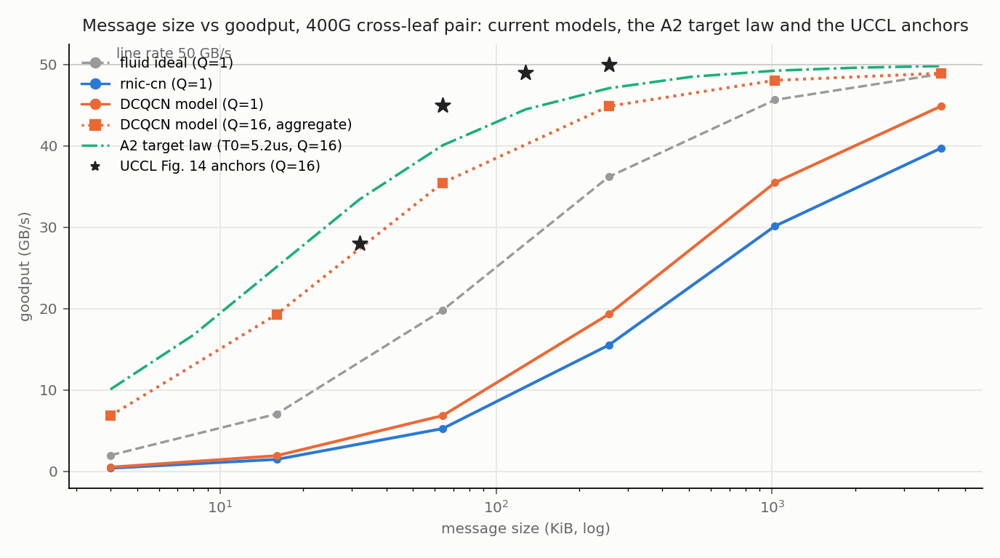
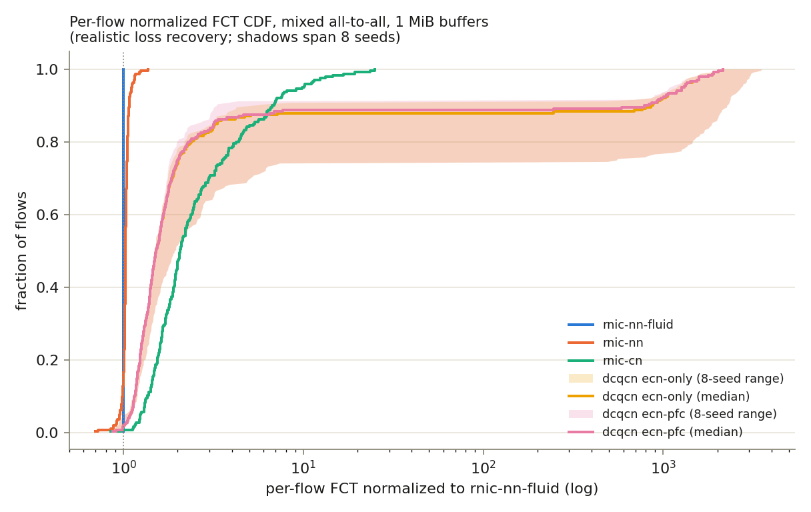

<p align="center">
  
</p>

<h1 align="center">SimLLM</h1>

<h3 align="center">
Network-faithful simulation of LLM serving and training deployments
</h3>

<p align="center">
| <a href="#about"><b>About</b></a> | <a href="#architecture"><b>Architecture</b></a> | <a href="#getting-started"><b>Getting Started</b></a> | <a href="#demo"><b>Demo</b></a> | <a href="#models"><b>Models</b></a> | <a href="#modules"><b>Modules</b></a> | <a href="#development"><b>Development</b></a> | <a href="#contributing"><b>Contributing</b></a> |
</p>

## About

SimLLM predicts the serving performance (TTFT, TPOT, goodput, SLO
attainment) of large LLM deployments **before you buy or reserve the
hardware**, with a packet-level network underneath rather than a
`bytes / bandwidth` estimate.

At 4+ nodes, and especially at 64+, the network stops being a constant:
incast, queue buildup, congestion-control oscillation and head-of-line
blocking reshape TTFT/TPOT distributions in ways no analytic model
captures. SimLLM couples the **real frontend scheduler** of your serving
framework with a simulated GPU executor and a discrete-event,
packet-level network backend (ATLAHS + htsim), so scheduling,
KV/prefix-cache management and the fabric feed back on each other.

Three ideas carry the design:

- **Frontends are real, GPUs are simulated.** The framework's own
  scheduler, batching policy and KV/prefix-cache accounting run
  unmodified (they are CPU-side bookkeeping); only model execution is
  replaced by a calibrated compute-cost model plus simulated network
  time.
- **No forks.** vLLM plugs in through its existing
  `--distributed-executor-backend` flag; SGLang through its own plugin
  framework (inert unless explicitly enabled). Each framework sits
  behind one common scheduler-step interface.
- **The network is simulated at packet granularity.** Every scheduler
  step's collective traffic (tensor-parallel allreduce, MoE all-to-all,
  pipeline activations) runs through htsim RNIC models over a Clos
  fabric, and the simulated completion times can feed back into the
  scheduler's clock.

SimLLM is developed in the open. It is initiated and sponsored by
**OpenFabric** (we design network hardware to enable distributed AI
workloads for the AGI era) and welcomes community contributions.

## Architecture

```
workload model (arrivals, prompt/output lengths, shared prefixes)
        |
        v
real framework scheduler (vLLM / SGLang, unmodified)
        |    scheduler step: which requests, which tokens, cache hits
        v
simulated GPU executor (roofline, profile tables, or trace-driven service)
        |    per-step collectives: TP allreduce, MoE all-to-all, PP
        v
packet-level network simulator (htsim RNIC models on a Clos fabric)
        |
        v
TTFT / TPOT / goodput on a virtual clock
```

Two coupling modes:

1. **Offline (open-loop):** run the frontend fast, record every
   scheduler step, emit one GOAL dependency trace, simulate once,
   report.
2. **Closed-loop:** each step's simulated completion time advances the
   virtual clock the scheduler sees, so congestion changes batching and
   batching changes traffic.

Under the hood, every scheduler step is lowered to a versioned execution
graph with central request/object bookkeeping down to the WQE level;
the current compute stage establishes a trace-driven, replaceable model of
intra-kernel SASS scheduling, SM residency, HBM service and isolated copy
service. Explicit KV lifecycle follows, then CORE-4 composes those pieces
with launch queues, streams, DMA/NCCL queues and shared-NIC contention. The
full design, including the exact vLLM/SGLang integration
seams, the manifest schemas and the GOAL trace format, is in
[docs/architecture.md](docs/architecture.md). The developer map
(module status, contracts, open tasks, development process) is in
[docs/README.md](docs/README.md).

## Getting Started

```bash
git clone https://github.com/openfabric-systems/simllm.git
cd simllm

# Backends (~250 MB). Do NOT use --recursive: ATLAHS carries large nested
# application submodules that are not needed for simulation.
git submodule update --init third_party/atlahs third_party/htsim

pip install -e .

# Build the packet-level network simulator
cmake -S third_party/htsim/htsim/sim -B build/htsim -DCMAKE_BUILD_TYPE=Release
cmake --build build/htsim --parallel

# Run the M1 sanity studies: probes + bandwidth/parallelism sweeps +
# pipeline-parallel TTFT/TPOT on the default 8-node x 8-GPU 400G Clos
python examples/m1/run_m1.py --out runs/m1
```

Pinned backends (details in [docs/modules/backends.md](docs/modules/backends.md)):

| Submodule | Repo | Ref |
|---|---|---|
| `third_party/atlahs` | [ATLAHS-rnic-private](https://github.com/yifeng-ethz/ATLAHS-rnic-private) | `main` (GOAL toolchain + validated RNIC launcher) |
| `third_party/htsim` | [HTSIM-rnic-private](https://github.com/yifeng-ethz/HTSIM-rnic-private) | `2026_08_05/simllm-addon` (UEC htsim + `htsim_rnic`: rnic-nn, rnic-nn-fluid, rnic-cn; WQE bookkeeping) |

## Demo

Every study under [examples/](examples/) is open to users and carries an
`expectations.md`, a run script, an audited `RESULTS.md` and explicit evidence
provenance. New and extended studies freeze expectations in their own commit
before implementation and execution. Start with these:

| Study | Question | Headline result |
|---|---|---|
| [m4](examples/m4/RESULTS.md) | Does the closed loop work end to end? | A live vLLM engine at `tensor_parallel_size=8` runs under the `SimExecutor` with `htsim_rnic` inside the step loop; all 36 pre-registered checks pass, fluid closed forms to 0 ps |
| [dcqcn_micro](examples/dcqcn_micro/RESULTS.md) | **NIC calibration: message size and incast.** How does goodput scale with message size, and is incast bandwidth shared fairly? | Model tracks the real-NIC (UCCL) message-size anchors at saturation but undershoots at 64 to 256 KB (0.79x at 64 KB): WQ completion is BACK-9 and PCIe calibration is BACK-16 atop the landed BACK-10 fabric; persistent post-CNP DCQCN state is HTSIM-5; incast fair share is near-ideal (Jain 0.993 to 1.000 across fan-in 2 to 20) |
| [dcqcn_vs_cn](examples/dcqcn_vs_cn/RESULTS.md) | When does DCQCN collapse, and when does it honestly win? | Buffer-exceeding incast collapses DCQCN by 2 to 3 orders of magnitude (32x64 KiB: p99 slowdown 1161x vs rnic-cn 1.60); buffer-absorbed incast is a registered DCQCN win (1.07 vs 1.68) |
| [cn_ladder](examples/cn_ladder/RESULTS.md) | Does the explicit-rate `rnic-cn` endpoint meet its acceptance bar? | 46 of 49 incast ladder cells within the 20% target of the ideal baseline; under a lossy all-to-all, DCQCN p99 slowdown is 1902x vs rnic-cn 19.3x (lossless, deterministic) |
| [breakdown](examples/breakdown/RESULTS.md) | Where does request time actually go? | Network share of request time rises from 52% (TP=2) to 89% (TP=8) at 400G, 96% at 100G |
| [m1](examples/m1/RESULTS.md) | Standalone core: workload to GOAL to htsim to metrics | Ten runs reproduce their closed forms with 0 ps residual |
| [m5](examples/m5/RESULTS.md) | MoE expert-parallel all-to-all | Pairwise all-to-allv closed forms exact to 0 ps across size and width |
| [core2_lowering](examples/core2_lowering/RESULTS.md) | Execution lowering and WQE bookkeeping | Legacy path, graph-only replay and frozen closed form agree to 0 ps on all rows; flow and WQE ledgers field-identical |
| [rnic_wq_v1](examples/rnic_wq_v1/RESULTS.md) | **RNIC queueing: what do doorbell batches, signaling and network credits change?** | All 11 native C++ sweep cells match their closed forms exactly; batching cuts 32 doorbells to 2, signaling cuts 32 CQEs to 2 independently, and four network credits cut JCT from 16,110 ps to 4,140 ps |
| [rnic_pcie_v1](examples/rnic_pcie_v1/RESULTS.md) | **RNIC PCIe: how do transactions, finite resources and analytical path penalties change completion time?** | All 35 deterministic row oracles and 18 behavioral predicate instances pass; corrected link-queue accounting leaves every JCT unchanged, and ready posted traffic passes a blocked non-posted request in the frozen gap case |

The message-size calibration curve and the definitive comparator figure:

<p align="center">


</p>

The NIC calibration anchors themselves (UCCL, DCQCN, HPCC, Kalia et al.
measurements distilled into parameter sets) are recorded in
[docs/papers/msg-size-vs-bandwidth.md](docs/papers/msg-size-vs-bandwidth.md).
The hardware/CC boundary, mlx5 hook, CX-7 evidence rules and full boundary
campaign are in
[docs/papers/rnic-hardware-calibration.md](docs/papers/rnic-hardware-calibration.md).

## Models

What SimLLM models today and what is planned next. Each task ID links to
the module doc that owns it.

### Network and NIC

RNIC hardware and congestion control are separate model axes. A full-RNIC
comparison holds the hardware profile fixed and swaps only the htsim
transport/CC policy. The analytical fluid baseline keeps an explicit hardware
bypass so closed-form validation remains available.
The native WQ and PCIe slices are currently standalone component models: the
live packet and TTFT/TPOT path still uses htsim's timing-neutral compatibility
ledger until BACK-8 and HTSIM-9 link the native hardware session into the
directly invoked simulator, CORE-4 invokes that composition from the execution
graph, and CORE-5 reduces its completion into `StepResult` and TTFT/TPOT.

#### RNIC hardware

| Model | Status | What it is |
|---|---|---|
| RDMA Work Queue | partial, first native slice available ([study](examples/rnic_wq_v1/RESULTS.md), [BACK-8/9](docs/modules/backends.md)) | SimLLM C++ now models one finite SQ/CQ pair, WR-prefix posting, doorbell batches, ordered retirement, signaling, polling, owner wrap, network backpressure and controlled queue failures; RQ/SRQ, shared CQs and mlx5 encoding remain planned |
| PCIe, MMIO and DMA | available, deterministic transaction slice ([study](examples/rnic_pcie_v1/RESULTS.md), [BACK-16/17](docs/modules/backends.md)) | Shared host-store, MWr/MRd/CplD scheduling with finite credits, tags and buffers, class ledgers and analytical path profiles; measured calibration and optional BlueFlame, ATS/ATC and MSI-X remain planned |
| QP, QPC and context memory | planned ([BACK-11](docs/modules/backends.md)) | QP pairing and state transitions plus QPC, MTT/MPT and WQE-cache residency in a measured device-cache and host-ICM hierarchy |
| TX/RX hardware pipelines | planned ([BACK-12](docs/modules/backends.md)) | Packetization, schedulers, port buffers, ACK/NAK/RNR/retry, CQE completion, PFC gates and location-specific fault injection |
| CX-7 observable state | planned ([BACK-13/14/15](docs/modules/backends.md)) | Versioned driver-visible registers, counters and traces, verbs capture/replay, and Collie-seeded boundary calibration; undocumented internals stay explicit calibrated abstractions |

#### Congestion-control and transport policies

| Model | Status | What it is |
|---|---|---|
| `rnic-nn` | available, hardware adapter planned ([HTSIM-9](docs/modules/backends.md)) | Packetized no-CC policy and the reference for normalized FCT; full-RNIC runs use the same hardware path as physical policies |
| `rnic-nn-fluid` | available | Continuous fluid policy with deterministic closed forms and the explicit hardware-bypass 0 ps anchor |
| `rnic-cn` | available, hardware adapter planned ([HTSIM-6/9](docs/modules/backends.md)) | Explicit-rate policy with deterministic reservations, packet spraying and resequencing, lossless without PFC |
| DCQCN | available, hardware adapter planned ([HTSIM-5/9](docs/modules/backends.md)) | RoCEv2 comparator with per-QP CNP state, rate reduction/recovery and ECN plus optional PFC; DCQCN calibration lands before programmable CC |
| LogGOPSim flow level | planned ([BACK-2](docs/modules/backends.md)) | Fast flow-level sweeps before packet-level runs |

Fabrics are two-tier Clos topologies with detailed switch models (VoQ
traffic manager, request/grant input-buffered). The default reference
configuration is 8 nodes x 8 B100 GPUs, one 400G NIC per GPU; intra-node
traffic rides an NVLink-class path and stays off the fabric.
Slingshot-style adaptive routing is out of simllm scope.

### GPU compute

| Model | Status | What it is |
|---|---|---|
| Roofline | available | Analytical `max(flops/peak, bytes/bandwidth)` per kernel family, dense and MoE geometry, per-GPU envelopes |
| Profile tables | available | Measured (kernel, config, GPU) duration tables; versioned artifact with mandatory provenance and interpolation |
| Trace-driven GPU service | available, bootstrap | Isolated-kernel CTA/SM/warp scheduling, dependency scoreboards, occupancy and HBM service, plus isolated copy descriptors; [22 structural cells](examples/gpu_service_model/RESULTS.md) are exact, A100/H100 seed timing is not yet silicon-validated |
| SASS offline calibration | planned ([COMP-1/5](docs/modules/compute.md)) | Accel-Sim trace-driven replay populates the tables offline for configurations nobody measured; a cycle simulator never sits inside the step loop |
| Service-time distributions | planned ([COMP-9](docs/modules/compute.md)) | Beyond-mean service times for honest p99+ tails |

### Framework (scheduling and KV cache)

| Framework | Real (runs unmodified) | Simulated | Doc |
|---|---|---|---|
| vLLM, pinned v0.26.0 | v1 scheduler, KV-cache manager, block pool, prefix hashing, preemption | Model execution, sampled tokens, step latency | [adapters-vllm](docs/modules/adapters-vllm.md) |
| SGLang, pinned main commit | RadixCache prefix matching, eviction, token/request pool accounting, retraction | Forward results and timing | [adapters-sglang](docs/modules/adapters-sglang.md) |

Planned on this axis: explicit KV-lifecycle capture
([CORE-3](docs/modules/core.md), [VLLM-11](docs/modules/adapters-vllm.md),
[SGL-9](docs/modules/adapters-sglang.md)), device-schedule capture
([VLLM-12](docs/modules/adapters-vllm.md),
[SGL-10](docs/modules/adapters-sglang.md)), and PD-disaggregation /
KV-transfer traffic (M6).

## Modules

Each module has its own doc as the source of truth for design, current
status and numbered open tasks; the README stays a map.

| Module | Purpose | Doc |
|---|---|---|
| `simllm/core` | Virtual clock, scheduler-step records, execution graphs, central bookkeeping, completion contracts | [core](docs/modules/core.md) |
| `simllm/workload` | Arrival processes, length distributions, shared-prefix structure | [workload](docs/modules/workload.md) |
| `simllm/compute` | Pluggable compute-time providers + host initiation model | [compute](docs/modules/compute.md) |
| `simllm/placement` | **The mapper**: placement + fabric manifests, rank-to-endpoint/GOAL-rank resolution | [placement](docs/modules/placement.md) |
| `simllm/traffic` | Semantic collectives to physical flows | [traffic](docs/modules/traffic.md) |
| `simllm/goal` | GOAL dependency-graph trace emission | [goal](docs/modules/goal.md) |
| `simllm/backends` | htsim / LogGOPSim invocation + result parsing, submodule pins | [backends](docs/modules/backends.md) |
| `simllm/adapters/vllm` | `SimExecutor` (pluggable, no fork) + placement exporter | [adapters-vllm](docs/modules/adapters-vllm.md) |
| `simllm/adapters/sglang` | `SimTpModelWorker` + placement exporter | [adapters-sglang](docs/modules/adapters-sglang.md) |

## Development

SimLLM is built in validated stages; every stage ships with
pre-registered studies whose numbers are defended in the open (see
[docs/README.md](docs/README.md) for the process and the stage-by-stage
fidelity plan).

- [x] M0: repo scaffold, backend submodules, CI, per-module docs
- [x] M1: standalone core (workload to GOAL to `htsim_rnic` to metrics)
- [x] M2: vLLM adapter, pinned to v0.26.0, no fork
- [x] M3: SGLang adapter, plugin entry point, no fork
- [ ] M4 (in progress): closed loop and the execution/resource runtime
- [ ] M5 (in progress): MoE all-to-all studies + SASS compute calibration
- [ ] M6: PD-disaggregation and KV-transfer traffic modeling

Everything deeper lives in the developer guide
[docs/README.md](docs/README.md): the open task registry, the full
roadmap and milestone detail, the execution-fidelity order, and the
development workflow (pre-registered studies, audited results, numbered
deferrals).

## Contributing

We welcome contributions of every size; see [CONTRIBUTING.md](CONTRIBUTING.md).
Good first areas: workload generators, compute-cost calibration profiles
for new GPUs, topology configs, metrics/plotting.

## License

SimLLM is licensed under [Apache-2.0](LICENSE). The backend submodules
keep their own permissive licenses (htsim: BSD 2-Clause,
UEC/UCL/UPB/Broadcom; ATLAHS: MIT, SPCL).

## Design & References

- RFC: [Network backend simulation for vLLM](https://discuss.vllm.ai/t/network-backend-simulation-for-vllm/2812)
- ATLAHS: application-centric network simulator toolchain (SPCL, SC'25)
- htsim: packet-level datacenter network simulator (UCL / Broadcom / UEC)
- LogGOPSim: GOAL-driven LogGOPS simulator (Hoefler et al.)
