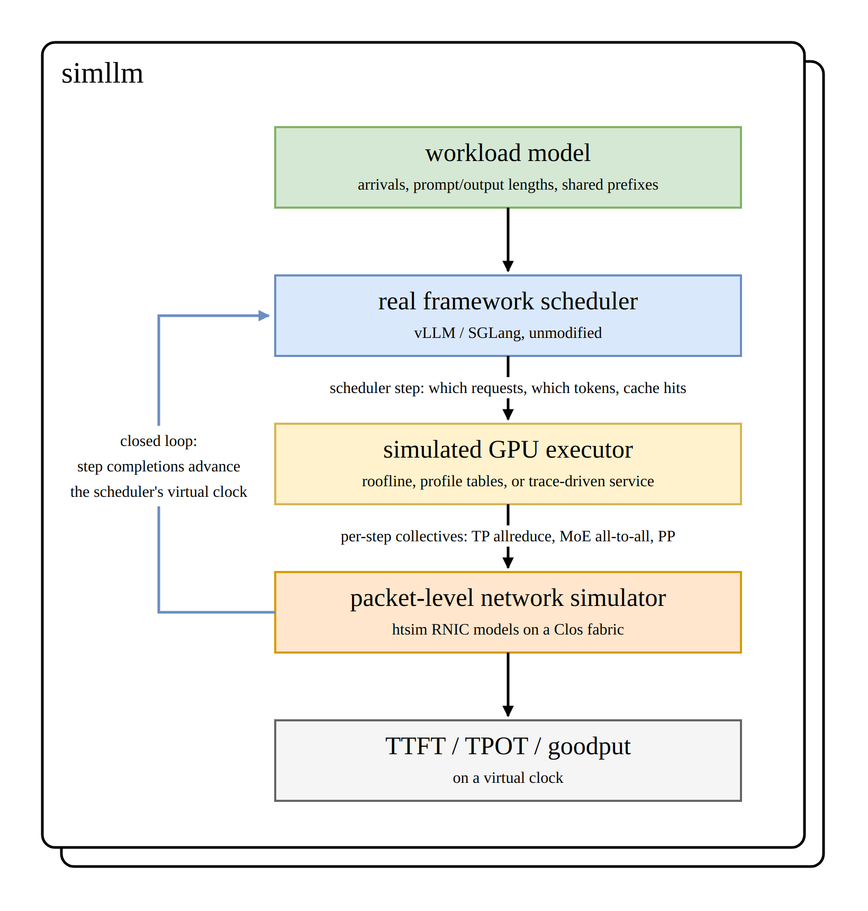
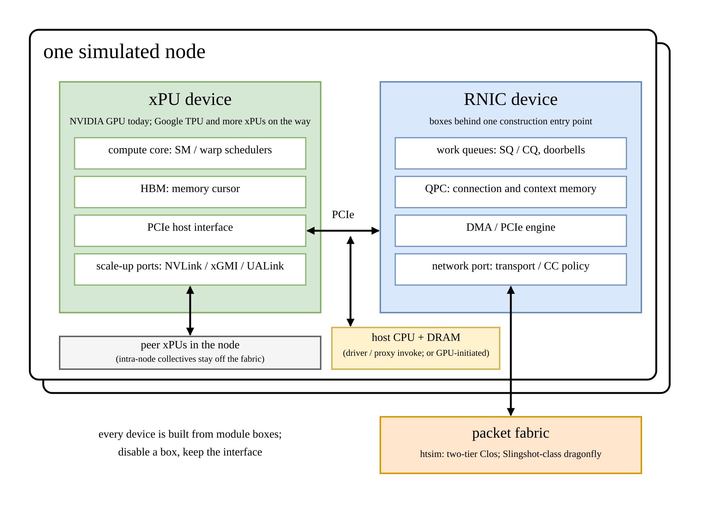

<p align="center">
  
</p>

<h1 align="center">SimLLM</h1>

<h3 align="center">
Network-faithful simulation of LLM serving and training deployments
</h3>

<p align="center">
| <a href="#about"><b>About</b></a> | <a href="#architecture"><b>Architecture</b></a> | <a href="#getting-started"><b>Getting Started</b></a> | <a href="#demo"><b>Demo</b></a> | <a href="#model"><b>Model</b></a> | <a href="#modules"><b>Modules</b></a> | <a href="#development"><b>Development</b></a> | <a href="#contributing"><b>Contributing</b></a> | <a href="docs/README_PRO.md"><b>Pro Guide</b></a> |
</p>

<p align="center">

</p>

## About

SimLLM predicts the serving performance (TTFT, TPOT, goodput, SLO
attainment) of large LLM deployments **before you buy or reserve the
hardware**, with a packet-level network underneath rather than a
`bytes / bandwidth` estimate.

At 4+ nodes, and especially at 64+, the network stops being a constant:
incast, queue buildup, congestion-control oscillation and head-of-line
blocking reshape TTFT/TPOT distributions in ways no analytic model
captures. SimLLM couples the **real frontend scheduler** of your serving
framework with a simulated GPU executor and a discrete-event,
packet-level network backend (ATLAHS + htsim), so scheduling,
KV/prefix-cache management and the fabric feed back on each other.

Four ideas carry the design:

- **GPUs and NICs are the same kind of thing: boxes with ports.** A port is
  one link. PCIe connects boxes inside a machine, NVLink connects NVIDIA GPUs
  to each other (xGMI on AMD ones), and Ethernet goes out to the rest of the
  cluster. The software on top turns each step's shared work into packets, and
  every packet rides one of those ports. SimLLM models the NIC this way,
  and the GPU now composes the same way: its construction entry point with
  typed PCIe and NVLink ports is landed. The
  [packet-device model](docs/design/packet-device-model.md) states the full
  target, and the open tasks name what is not built yet.
- **Frontends are real, GPUs are simulated.** The framework's own
  scheduler, batching policy and KV/prefix-cache accounting run
  unmodified (they are CPU-side bookkeeping); only model execution is
  replaced by a calibrated compute-cost model plus simulated network
  time.
- **No forks.** vLLM plugs in through its existing
  `--distributed-executor-backend` flag; SGLang through its own plugin
  framework (inert unless explicitly enabled). Each framework sits
  behind one common scheduler-step interface.
- **The network is simulated at packet granularity.** Every scheduler
  step's collective traffic (tensor-parallel allreduce, MoE all-to-all,
  pipeline activations) runs through htsim RNIC models over a Clos
  fabric, and the simulated completion times can feed back into the
  scheduler's clock.

SimLLM is developed in the open. It is initiated and sponsored by
**OpenFabric** (we design network hardware to enable distributed AI
workloads for the AGI era) and welcomes community contributions.

### Supported by

SimLLM's architecture, its models and its ongoing maintenance are
developed with the support of ETH Zurich, the Swiss National
Supercomputing Centre (CSCS), the Scalable Parallel Computing
Laboratory (SPCL) at ETH Zurich, Stanford University and the National
Energy Research Scientific Computing Center (NERSC) at Lawrence
Berkeley National Laboratory.

<p align="center"><a href="https://ethz.ch"></a><a href="https://www.cscs.ch"></a><a href="https://spcl.inf.ethz.ch"></a><a href="https://www.stanford.edu"></a><a href="https://www.nersc.gov"></a></p>

### Hardware supported

SimLLM models the accelerators that define today's AI infrastructure.
NVIDIA GPUs, whose NVLink-connected systems set the pace for large-scale
training and serving, are the calibrated first target, with device
models measured directly on real A100 and GH200 nodes. AMD Instinct
GPUs compose behind the same device shape, with xGMI / Infinity Fabric
scale-up ports behind the same port interface
([COMP-35](docs/modules/compute.md#open-tasks)).

<p align="center"><a href="https://www.nvidia.com"></a><a href="https://www.amd.com"></a></p>

### Frameworks supported

SimLLM supports vLLM (pinned v0.26.0) and SGLang as serving frontends.
Each framework's own scheduler, batching policy and KV/prefix-cache
accounting run unmodified; SimLLM plugs in through extension points the
frameworks already ship, with no fork of either project. The support
runs in one direction: SimLLM integrates with vLLM and SGLang, and is
not affiliated with or endorsed by either project.

<p align="center"><a href="https://github.com/vllm-project/vllm"></a><a href="https://github.com/sgl-project/sglang"></a></p>

## Architecture

```
workload model (arrivals, prompt/output lengths, shared prefixes)
        |
        v
real framework scheduler (vLLM / SGLang, unmodified)
        |    scheduler step: which requests, which tokens, cache hits
        v
simulated GPU executor (roofline, profile tables, or trace-driven service)
        |    per-step collectives: TP allreduce, MoE all-to-all, PP
        v
packet-level network simulator (htsim RNIC models on a Clos fabric)
        |
        v
TTFT / TPOT / goodput on a virtual clock
```

Two coupling modes:

1. **Offline (open-loop):** run the frontend fast, record every
   scheduler step, emit one GOAL dependency trace, simulate once,
   report.
2. **Closed-loop:** each step's simulated completion time advances the
   virtual clock the scheduler sees, so congestion changes batching and
   batching changes traffic.

Under the hood, every scheduler step is lowered to a versioned execution
graph, and the GPU itself is modeled rather than assumed. Its service-model
primitive can schedule explicitly submitted compute, memory and NCCL network
kernels together so each finds its own limit, and the coarse DeviceRuntime
(CORE-4) now lowers graph operations into that primitive for the first
coordinated bypass profile and the frozen Tier B fixture. The full
design, including the exact vLLM/SGLang integration
seams, the manifest schemas and the GOAL trace format, is in
[docs/architecture.md](docs/architecture.md). The developer map
(module status, contracts, open tasks, development process) is in
[docs/README_PRO.md](docs/README_PRO.md).

## Getting Started

```bash
git clone https://github.com/openfabric-systems/simllm.git
cd simllm

# Backends (~250 MB). Do NOT use --recursive: ATLAHS carries large nested
# application submodules that are not needed for simulation.
git submodule update --init third_party/atlahs third_party/htsim

pip install -e .
```

Build HTSIM with a C++17 toolchain. On Linux, use GCC or Clang with
CMake 3.16 or newer:

```bash
./scripts/build_htsim.sh build/htsim --test
```

This builds the default `htsim_rnic`. The composed binary that links the
SimLLM RNIC library into htsim, which the `rnic_live_v1` study uses, is built
behind the `HTSIM_ENABLE_SIMLLM_RNIC` option described in
[docs/modules/backends.md](docs/modules/backends.md).

On Windows, install Visual Studio 2022 Build Tools with the **Desktop
development with C++** workload and CMake, then run in PowerShell:

```powershell
.\scripts\build_htsim.ps1 -BuildDirectory build\htsim -RunTests
```

The Windows build uses MSVC and places executables in CMake's
configuration directories, for example
`build/htsim/datacenter/Release/htsim_rnic.exe`. SimLLM automatically
discovers both that layout and the single-configuration Linux layout.
The `SIMLLM_HTSIM_RNIC`, `SIMLLM_HTSIM_DCQCN`, and `SIMLLM_TXT2BIN`
environment variables can override discovery.

The vLLM and SGLang adapters and traffic models are Python code and do
not need a Windows-specific fork; on Windows they invoke the native
HTSIM `.exe` files through the same backend interface.

Run a sanity study after building:

```bash
# Run the M1 sanity studies: probes + bandwidth/parallelism sweeps +
# pipeline-parallel TTFT/TPOT on the default 8-node x 8-GPU 400G Clos
python examples/m1/run_m1.py --out runs/m1
```

Pinned backends (details in [docs/modules/backends.md](docs/modules/backends.md)):

| Submodule | Repo | Ref |
|---|---|---|
| `third_party/atlahs` | [ATLAHS-rnic-private](https://github.com/yifeng-ethz/ATLAHS-rnic-private) | `main` (GOAL toolchain + validated RNIC launcher) |
| `third_party/htsim` | [HTSIM-rnic-private](https://github.com/yifeng-ethz/HTSIM-rnic-private) | `main` (UEC htsim + `htsim_rnic`: rnic-nn, rnic-nn-fluid, rnic-cn; WQE bookkeeping; the composed SimLLM RNIC wrapper behind the `HTSIM_ENABLE_SIMLLM_RNIC` build option) |

## Demo

Every study under [examples/](examples/) is open to users and carries an
`expectations.md`, and every study that has run also carries a run script, an
audited `RESULTS.md` and explicit evidence provenance. Most new and extended
studies freeze expectations in their own commit before implementation and
execution; the ones that could not are labeled post-specified in their own
results. Start with these:

| Study | Question | Headline result |
|---|---|---|
| [rnic_live_v1](examples/rnic_live_v1/RESULTS.md) | **Does the native RNIC model change end-to-end serving metrics?** | Tier A runs the composed htsim binary with the SimLLM RNIC library linked in, and Tier B carries the native completion through the execution graph, runtime and `StepResult` into the first TTFT and TPOT claim affected by that chain; all 8 single-WQE and 4 FIFO rows exact, scoped to one frozen isolated fixture (one request, 4 KiB and 1 MiB payloads, 200 and 400 Gbit/s, doorbell service 0 and 1,000 ps) |
| [m4](examples/m4/RESULTS.md) | Does the closed loop work end to end? | A live vLLM engine at `tensor_parallel_size=8` runs under the `SimExecutor` with `htsim_rnic` inside the step loop; all 36 pre-registered checks pass, fluid closed forms to 0 ps |
| [dcqcn_micro](examples/dcqcn_micro/RESULTS.md) | **NIC calibration: message size and incast.** How does goodput scale with message size, and is incast bandwidth shared fairly? | Model tracks the real-NIC (UCCL) message-size anchors at saturation but undershoots at 64 to 256 KB (0.79x at 64 KB): WQ completion is BACK-9 and PCIe calibration is BACK-16 atop the landed BACK-10 fabric; persistent post-CNP DCQCN state is HTSIM-5; incast fair share is near-ideal (Jain 0.993 to 1.000 across fan-in 2 to 20) |
| [dcqcn_vs_cn](examples/dcqcn_vs_cn/RESULTS.md) | When does DCQCN collapse, and when does it honestly win? | Buffer-exceeding incast collapses DCQCN by 2 to 3 orders of magnitude (32x64 KiB: p99 slowdown 1161x vs rnic-cn 1.60); buffer-absorbed incast is a registered DCQCN win (1.07 vs 1.68) |
| [cn_ladder](examples/cn_ladder/RESULTS.md) | Does the explicit-rate `rnic-cn` endpoint meet its acceptance bar? | 46 of 49 incast ladder cells within the 20% target of the ideal baseline; under a lossy all-to-all, DCQCN p99 slowdown is 1902x vs rnic-cn 19.3x (lossless, deterministic) |
| [breakdown](examples/breakdown/RESULTS.md) | Where does request time actually go? | Network share of request time rises from 52% (TP=2) to 89% (TP=8) at 400G, 96% at 100G |
| [m1](examples/m1/RESULTS.md) | Standalone core: workload to GOAL to htsim to metrics | Ten runs reproduce their closed forms with 0 ps residual |
| [m5](examples/m5/RESULTS.md) | MoE expert-parallel all-to-all | Pairwise all-to-allv closed forms exact to 0 ps across size and width |
| [routed_supply_v1](examples/routed_supply_v1/RESULTS.md) | Does real expert routing change the all-to-all? | Captured granite routing replaces the uniform per-pair share and moves fluid JCT by about -59 percent at 200 Gbit/s and -48 percent at 400 Gbit/s; TRAF-25 later corrected both captured and uniform traffic from 96 to 48 positive flows per step while this study's JCTs and bandwidth deltas remained unchanged |
| [gpu_task_mix](examples/gpu_task_mix/RESULTS.md) | **GPU scheduling: what limits a compute, a memory and an NCCL kernel?** | Compute scales with SMs, memory is pinned to the HBM cursor and gains nothing from more SMs, and a double-buffered ring egress kernel falls from 6.1 times its NVLink bound at one warp per channel to within 2.4 percent at eight warps |
| [core2_lowering](examples/core2_lowering/RESULTS.md) | Execution lowering and WQE bookkeeping | Legacy path, graph-only replay and frozen closed form agree to 0 ps on all rows; flow and WQE ledgers field-identical |
| [rnic_wq_v1](examples/rnic_wq_v1/RESULTS.md) | **RNIC queueing: what do doorbell batches, signaling and network credits change?** | All 11 native C++ sweep cells match their closed forms exactly; batching cuts 32 doorbells to 2, signaling cuts 32 CQEs to 2 independently, and four network credits cut JCT from 16,110 ps to 4,140 ps |
| [rnic_pcie_v1](examples/rnic_pcie_v1/RESULTS.md) | **RNIC PCIe: how do transactions, finite resources and analytical path penalties change completion time?** | All 35 deterministic row oracles and 18 behavioral predicate instances pass; corrected link-queue accounting leaves every JCT unchanged, and ready posted traffic passes a blocked non-posted request in the frozen gap case |

The message-size calibration curve and the definitive comparator figure:

<p align="center">


</p>

The NIC calibration anchors themselves (UCCL, DCQCN, HPCC, Kalia et al.
measurements distilled into parameter sets) are recorded in
[docs/papers/msg-size-vs-bandwidth.md](docs/papers/msg-size-vs-bandwidth.md).
The hardware/CC boundary, mlx5 hook, CX-7 evidence rules and full boundary
campaign are in
[docs/papers/rnic-hardware-calibration.md](docs/papers/rnic-hardware-calibration.md).

## Model

SimLLM ships one composed model, and this section states it as the final
deliverable. The text is deliberately bold and projected: the numbered
open tasks in the [module docs](docs/modules/) carry the exact gap
between this statement and today's tree, so progress is measured in the
task registry, not in hedged status prose here.

A deployment is simulated as nodes of **xPU + RNIC device pairs** on a
packet-level fabric. Every device is a box built from boxes: hardware
modules composed behind one construction entry point, where disabling a
module keeps the same interface (its parameters go inert or are
explicitly rejected), so one entry point serves everything from a bare
core to the full device. A port is one link: PCIe connects boxes inside
a machine, NVLink or xGMI connects accelerators to each other, and the
wire port goes out to the fabric.

<p align="center">

</p>

### The xPU device

The accelerator is modeled the way the NIC is, as boxes already: the
composition entry point with typed PCIe and NVLink ports is landed and
validated through the live metric chain
([device-port study](examples/gpu_device_ports_v1/RESULTS.md)). Its
pluggable subsystems are the hardware scheduler (SM and warp
scheduling, issue budgets), HBM (the memory cursor every memory-bound
kernel is pinned to), the copy engines (DMA), the PCIe host port on the
same shared PCIe fabric as the RNIC, and the scale-up ports (NVLink
today; xGMI / Infinity Fabric and UALink behind the same port
interface, [COMP-35](docs/modules/compute.md#open-tasks)).

```
  hardware scheduler | HBM | copy engines | PCIe port | scale-up ports
  ------------------------------------------------------------------
              common interface: streaming crossbar
    (no NoC on the GPU: point-to-point, contention-free by design)
```

Subsystems stream work to each other over a crossbar rather than a
shared bus; reifying that crossbar as the common interface is
[COMP-49](docs/modules/compute.md#open-tasks), and the ports' packet
emission and measured ceilings are
[COMP-40 and COMP-41](docs/modules/compute.md#open-tasks). Kernel
service times are deterministic constants; latency tails come from the
network, batching and queueing, never from per-kernel stochasticity.
NVIDIA GPUs are the calibrated first target; **Google TPU and further
xPUs are on the way** behind the same device shape, with ICI-class
scale-up ports.

### The RNIC device

At the top level the RNIC is three pluggable subsystems behind one
common interface, all composed by the landed construction entry point
and driven by the work-queue core: the congestion-control algorithm
(CCA) on the network side, the PCIe engine with the DMA controller
toward the host, and QPC management for connection and context state.
The CCA swaps without touching the other two: Data Center Quantized
Congestion Notification (DCQCN), the Null Network (NN) ideal baseline
`rnic-nn` with its fluid closed form, and the explicit-rate `rnic-cn`,
with the composed native chain carrying packet-issue evidence into
TTFT and TPOT.

```
  +----------------+   +--------------------+   +----------------+
  | CCA            |   | PCIe engine (DMA)  |   | QPC management |
  +-------+--------+   +---------+----------+   +-------+--------+
          |                      |                      |
  ========+======================+======================+========
        common interface: signal-slot event bus (NoC-like;
                     contention-free today)
```

The subsystems talk over a Qt-style signal-slot event bus shaped like
a NoC, so bus contention can be priced later; today the bus is
contention-free by construction, and reifying it is
[BACK-53](docs/modules/backends.md#open-tasks). The device feeds a
two-tier Clos fabric with detailed switch models; a Slingshot-class
dragonfly is hosted, with multi-switch adaptive routing owned by
[TRAF-51](docs/modules/traffic.md#open-tasks). The reference
configuration is 8 nodes x 8 B100 GPUs, one 400G NIC per GPU;
intra-node traffic rides the scale-up ports and stays off the fabric.
The remaining device mechanisms are numbered in
[backends](docs/modules/backends.md).

### The serving stack around the devices

The frontends stay real: vLLM (pinned v0.26.0) and SGLang run their own
schedulers, KV/prefix caches and batching unmodified, and their
communicator layers plus the NCCL software stack are simulated behind
the real interfaces down to the RNIC doorbell
([adapters-vllm](docs/modules/adapters-vllm.md),
[adapters-sglang](docs/modules/adapters-sglang.md),
[compute](docs/modules/compute.md)). The CPU pre-play oracle fixes each
request's true output length, stop reason and expert routing offline,
so a replay drives the devices with real model behavior
([preplay](docs/modules/preplay.md)).

## Modules

Each module has its own doc as the source of truth for design, current
status and numbered open tasks; the README stays a map.

| Module | Purpose | Doc |
|---|---|---|
| `simllm/core` | Virtual clock, scheduler-step records, execution graphs, central bookkeeping, completion contracts | [core](docs/modules/core.md) |
| `simllm/workload` | Arrival processes, length distributions, deterministic generation requests, shared-prefix structure | [workload](docs/modules/workload.md) |
| `simllm/compute` | Pluggable compute-time providers, the GPU service model and its concurrent task primitive, host initiation, and the NCCL stack skeleton | [compute](docs/modules/compute.md) |
| `simllm/placement` | **The mapper**: placement + fabric manifests, rank-to-endpoint/GOAL-rank resolution | [placement](docs/modules/placement.md) |
| `simllm/traffic` | Semantic collectives to physical flows | [traffic](docs/modules/traffic.md) |
| `simllm/goal` | GOAL dependency-graph trace emission | [goal](docs/modules/goal.md) |
| `simllm/preplay` | Offline CPU inference oracle: capture, arrival join, vLLM replay and routed-expert supply, with the independent CPU comparison still open | [preplay](docs/modules/preplay.md) |
| `simllm/backends` | htsim / LogGOPSim invocation + result parsing, submodule pins | [backends](docs/modules/backends.md) |
| `simllm/adapters/vllm` | `SimExecutor` (pluggable, no fork), placement exporter, the simulated communicator and the flagged model-runner skeleton | [adapters-vllm](docs/modules/adapters-vllm.md) |
| `simllm/adapters/sglang` | `SimTpModelWorker`, single-GPU MoE geometry, open-loop generate driver and the simulated communicator | [adapters-sglang](docs/modules/adapters-sglang.md) |

## Development

SimLLM is built in validated stages; every stage ships with studies whose
numbers are defended in the open, pre-registered wherever the expectations
could be frozen before implementation and labeled post-specified where they
could not (see
[docs/README_PRO.md](docs/README_PRO.md) for the process and the stage-by-stage
fidelity plan).

- [x] M0: repo scaffold, backend submodules, CI, per-module docs
- [x] M1: standalone core (workload to GOAL to `htsim_rnic` to metrics)
- [x] M2: vLLM adapter, pinned to v0.26.0, no fork
- [x] M3: SGLang adapter, plugin entry point, no fork
- [ ] M4 (in progress): the closed loop and the execution/resource
      runtime. The composed native RNIC path already drives TTFT and TPOT
      for the frozen isolated `rnic_live_v1` fixture; what remains is the
      online stateful session, KV lifecycle, the same-contended-graph
      comparison and calibration against real captures
- [ ] M5 (in progress): MoE all-to-all studies with captured expert
      routing driving the traffic, plus offline calibration. The pre-play
      oracle's capture, join, replay and routed-supply halves are
      validated; target-native device compute calibration and the
      independent CPU comparison half of the oracle remain. Device models
      are measured directly on real GPUs we can reach (A100 and GH200
      nodes) first, with simulator fill reserved for qualified gaps; the
      per-framework, per-model coverage lives in the
      [calibration coverage matrix](docs/design/calibration-coverage.md)
- [ ] M6: PD-disaggregation and KV-transfer traffic modeling
- [ ] M7 (in progress): the rest of the RNIC module set. The composition
      entry point, the PCIe/DMA slice, virtual host memory, the three
      submission shapes including GPU-initiated rings and the flagged
      vLLM model-runner skeleton have landed; QP lifecycle, the TX/RX
      pipelines, the GPU-owned completion queue and the model-runner seam
      under a real GPU worker remain

Everything deeper lives in the developer guide
[docs/README_PRO.md](docs/README_PRO.md): the open task registry, the full
roadmap and milestone detail, the execution-fidelity order, and the
development workflow (pre-registered studies, audited results, numbered
deferrals).

## Contributing

We welcome contributions of every size; see [CONTRIBUTING.md](CONTRIBUTING.md).
Good first areas: workload generators, compute-cost calibration profiles
for new GPUs, topology configs, metrics/plotting.

## License

Copyright 2026 Yifeng Wang.

SimLLM is developed as part of the OpenFabric Systems project and licensed
under [Apache-2.0](LICENSE). See [NOTICE](NOTICE) for attribution. The backend
submodules keep their own permissive licenses (htsim: BSD 2-Clause,
UEC/UCL/UPB/Broadcom; ATLAHS: MIT, SPCL).

## Design & References

- RFC: [Network backend simulation for vLLM](https://discuss.vllm.ai/t/network-backend-simulation-for-vllm/2812)
- ATLAHS: application-centric network simulator toolchain (SPCL, SC'25)
- htsim: packet-level datacenter network simulator (UCL / Broadcom / UEC)
- LogGOPSim: GOAL-driven LogGOPS simulator (Hoefler et al.)
