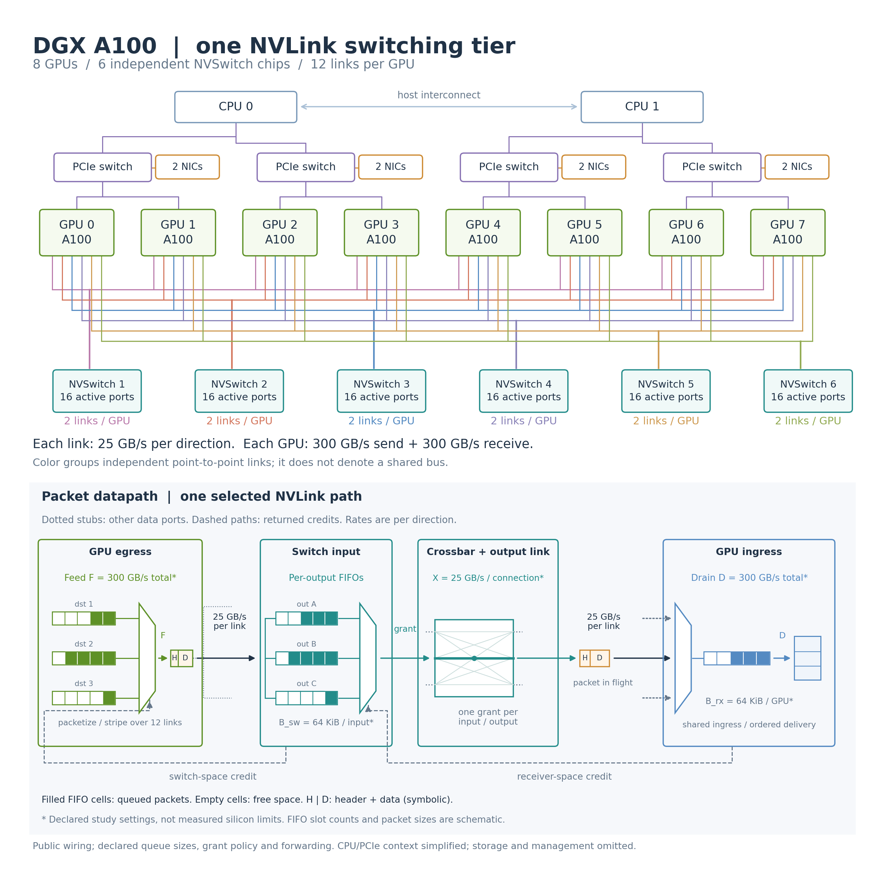

# NVLink domain model

The NVLink domain decomposes one directed peer transfer into three services:
TX, switch and RX. It exposes two mutually exclusive authorities. The v1
compatibility authority preserves every merged consumer byte. The v2 aligned
authority models generation-scoped flits, link acknowledgement and replay,
explicit traffic classes and virtual channels, receiver-owned credit release,
ordered visibility, and NVSwitch input ports, virtual output queues and
crossbar outputs. This note records both authorities, the exact analytic and
direct-mesh bypasses, the frozen A100 identification map and the evidence class
of every claim. The public-document mechanism boundary is established in
[NVLink mechanism reverse-engineered from public documents](nvlink-mechanism-reverse-engineering.md).
Public architecture evidence does not promote an undocumented numeric
candidate or substitute for a run on this repository's NV4 node.

## Model and evidence at a glance



*Figure 1. The stable TX, switch and RX module boundary in
`simllm.backends.htsim_nvlink`. The aligned authority deepens these same boxes;
it does not create a parallel timing surface. Numeric credit, buffer, endpoint
and arbitration defaults remain DECLARED CANDIDATES unless their existing
parameter-specific evidence says otherwise.*

The diagram uses the same module palette as the README device view: green for
the endpoint TX side, orange for the intervening fabric service and blue for
the endpoint RX side. The switch is always present in the composition. Its
selected A100 mode is an identity operation rather than an omitted box.

## Authorities and scope

Three merged surfaces are authoritative for this domain:

- `simllm/backends/htsim_nvlink.py` defines the TX, switch and RX contracts,
  their composition, the timestamps and the analytic bypass.
- `examples/a100_nvlink_packet_v1/candidate-profile.json` binds the A100
  candidate values and preserves the frozen expectations digest
  `212a7a26f54e444c9b18f1e528bd0d00b5a28e4f9e005b0dc137f477ad642571`.
- `examples/nvlink_mechanism_alignment_v1/expectations.json` freezes the
  aligned physical oracles, consumer pins and void rules before the v2
  implementation and first run.

The profile schema is `simllm-htsim-nvlink-candidate-profile-v1`. The scored
profile carries parameter-specific TRAF-70 evidence: the two endpoint rates
and three ordering or direction fields are measured, the direct-mesh switch is
structural, and the credit and buffer fields remain declared candidates.

This module is an additive htsim-style handoff. It is not the default
intra-node timing authority. The active traffic path still uses the analytic
per-endpoint serializer unless a caller explicitly selects the candidate. The
candidate can support component studies and downstream integration work, but
that does not make its parameters measured or put them on the live TTFT and
TPOT chain.

## Composition and queue boundaries

`NvlinkDomainService.serve` applies the modules in one fixed order and selects
one authority for the whole run:

```text
NvlinkTransfer
    -> TX packetization, link reliability and bonded-link service
    -> switch pass-through or port, VOQ and crossbar service
    -> RX ingress buffering, credit release and ordered visibility
    -> NvlinkDomainResult or NvlinkAlignedDomainResult
```

The result carries a stable packet ledger, request and response payload and
wire-byte totals, the last delivery time and the maximum observed RX
occupancy. Logical bytes are counted from the input extents. Wire bytes are
counted after packet headers have been added. This separation prevents a
packet overhead hypothesis from silently changing the application payload.

`serve` defaults to the explicitly pinned compatibility authority for every
merged study.
Its default is the former static-interleave behavior, named by
`LEGACY_NVLINK_FLOW_POLICY`. New incast studies use `serve_arbitrated`, whose
explicit default is `DEFAULT_NVLINK_ARBITRATION_POLICY`, release-aware round
robin. It accepts static interleave and greedy capture as alternatives. This
separation keeps the merged ledger byte-identical while making the physical
contention policy visible at every new call site.

`serve_aligned`, or `serve` with `NvlinkMechanismAuthority.ALIGNED`, selects
the v2 authority. A run cannot select both. The compatibility ledger remains
the sole mutable authority when v2 is disabled; the receiver-buffer, link,
ordering and switch ledgers are the sole mutable authorities when v2 is
enabled.

The module timestamps are htsim-style local evidence, not core `QueueVisit`
records. Their mapping is:

| Boundary | Representation | Meaning |
|---|---|---|
| Logical release | `released_at_ps` | The extent, and then each packet, may enter TX |
| TX grant | `tx_started_at_ps` | Destination credit, selected link and endpoint egress are all available |
| TX release | `tx_finished_at_ps` | Wire serialization on the selected bonded link completes |
| Link acknowledgement | `acknowledged_at_ps` | The final error-free transmission is acknowledged and its replay buffer entry can release |
| Switch grant and release | `switch_started_at_ps`, `switch_finished_at_ps` | Present only for the queued mode; absent under pass-through |
| RX buffer admission | `rx_buffer_accepted_at_ps` | Receiver-owned capacity accepts the packet |
| RX release | `rx_buffer_released_at_ps` | Downstream ingress frees the owned buffer capacity |
| Credit availability | `credit_available_at_ps` | The receiver release plus the declared return transport reaches the sender |
| Ordered visibility | `visible_at_ps` | The packet and all required prior sequence members are consumer-visible |

There is no separate `eligible_at` field and no emitted core `QueueVisit` in
this candidate module. Downstream work must map these boundaries to the shared
queue-visit contract before using them in an additive critical-path metric.

## TX module

The TX service is per endpoint. It owns staging, packetization, the shared
endpoint egress cursor, physical-link selection, acknowledgement and replay
state. Under the aligned authority, credit capacity is consumed here but is
released only by the owning downstream receiver buffer.

### Per-destination staging

Each extent is packetized into an ordered packet group. The composition helper
round-robins ready groups in caller order, while link cursors and credit slots
are keyed by `(source, destination)`. That is the v1 per-destination staging
contract. It is represented by deterministic packet ordering and keyed state,
not by a separately exported queue record.

All destinations at one source also meet one endpoint egress cursor. Its
declared rate is 300 GB/s. A destination therefore has its own bond and credit
window while still contending for the source endpoint's total egress service.

### Packetization and direction

The compatibility authority retains the merged maximum payload of 256 bytes
and the exact `payload_bytes + 16` wire equation. The aligned authority uses a
generation-scoped 16-byte flit. It records the header, optional address
extension, optional byte enable, payload flits and padding separately. A
256-byte packet occupies 17 flits without an optional field and 18 flits with
one optional field. Short final payloads round to whole flits. The documented
Pascal family format anchors this structure; its continuity to A100 remains a
declared candidate, not a product fact.

Direction is a transaction property, separate from endpoint orientation:

- a peer write emits its data packets from source to destination as requests;
- a peer read first emits a zero-payload request packet from the initiating
  source, then emits data packets in the reverse endpoint direction as
  responses.

Request and response payload and wire bytes remain separate fields in the
domain result. The direction rule is declared candidate policy, not an
observation from the void hardware capture.

### Link and virtual-channel credits

Public documents confirm link flow control and multiple virtual channels, but
they do not publish the A100 virtual-channel count, credit quantum, pool depth,
or return encoding. A public NVIDIA switch embodiment uses independent
destination-per-virtual-channel credits and makes capacity returnable when the
destination buffer frees. It does not identify the A100 link-credit numbers.

The compatibility authority retains one implicit virtual channel and the
unchanged 256-slot, 272-byte surrogate on every physical link. The aligned
authority instead carries a traffic-class enum, a named virtual channel and an
ordering domain on every packet. It separates variable wire-flit occupancy
from credit consumption. Its default one-packet credit accounting, one active
`vc0`, link-destination-virtual-channel pool scope, 256-slot depth and 272-byte
candidate quantum are all labeled `DECLARED_CANDIDATE` with TRAF-79 provenance.
None claims the physical A100 virtual-channel count or wire-credit encoding.

The v1 compatibility abstraction keeps its original timer so inherited study
bytes do not move. The aligned authority never frees sender capacity from TX.
It records RX buffer admission and release, then makes the corresponding
credit sender-visible only after the declared return transport. The coupled
solver advances until TX choices and receiver releases reach a fixed point.
Error-free link acknowledgement adds zero bytes and time. Explicit injected
errors retain the packet in the replay buffer and add nonnegative retransmit
bytes and delay. The acknowledgement encoding, timer and replay-buffer depth
remain unidentified product parameters.

These values and the one-modeled-virtual-channel scope are not hardware
measurements. With four links, the declared aggregate window is 278,528 wire
bytes or 262,144 payload bytes. One link takes 2,785,280 ps to serialize its
256 packets, which is longer than the declared 200,000 ps return. The candidate
therefore predicts no nominal credit stall. A hardware sweep that sees no knee
leaves the unit, window and return unidentifiable rather than confirming them.

## Physical contention and arbitration

Credits protect independent receive buffers on each incoming link. They are
not the cross-sender sharing mechanism at incast. The contended service is the
destination ingress and memory-acceptance path; when an NVSwitch is present,
the crossbar output port is an additional contended service.

The declared default candidate is release-aware round robin because independent
per-link credits feed a shared downstream service and round-robin or dual
round-robin scheduling is a physically plausible crossbar mechanism. NVIDIA
patent disclosures include round-robin and least-recently-used arbiters, but
they do not bind one algorithm to the direct A100 receiver or a named NVSwitch
generation. Static interleave remains the deterministic fixed-cycle
alternative. Greedy capture is the unfair work-conserving alternative in which
the first full-rate input wins whenever it is ready. All three policies are
selectable. Their product-specific evidence classes remain declared
candidates, not measurements.

That three-policy seam belongs to the compatibility NV4 receiver studies. The
aligned NVSwitch seam has a separate identity off policy and a declared
round-robin candidate policy object. Mandatory route legality, output
availability and virtual-output-queue head selection happen before the policy.
Identity ignores traffic-class labels and chooses the first legal candidates
in baseline order. A grant interval uses any input port and any output port at
most once. Permuting class labels under identity changes no timestamp, byte,
random draw or completion order.

The frozen simulation matrix passes all 15 policy and degree instances with
all 105 fatal guards intact. At physical degree 3, release-aware round robin
predicts raw wire shares of 87.159, 59.921 and 59.921 GB/s; static interleave
predicts 60.000 GB/s per source with unused receiver service; greedy capture
predicts 99.760, 53.621 and 53.621 GB/s. These are behavioral predictions for
the registered hardware discriminator, not policy-identification evidence.

The cited source chain and the boundary between vendor disclosure, patent
embodiment, academic assumption, and repository measurement live in the
[reverse-engineering document](nvlink-mechanism-reverse-engineering.md). No
public value is recorded as a captured value. TRAF-80 aligns the model with
the documented structure. TRAF-73's registered NV4 cells decide the remaining
effective window, pool scope and arbitration policy on the actual node.

### Four-link bonding

Each directed peer pair has four link cursors, each at a declared 25 GB/s.
For every packet, TX chooses the link with the earliest cursor; a tie chooses
the lowest link index. The start time is the maximum of logical release, that
link cursor, the source endpoint cursor and the selected credit-slot return.
The link cursor advances by wire serialization at 25 GB/s, while the endpoint
cursor advances by serialization at 300 GB/s.

This is earliest-available packet striping. It is not round-robin striping,
and the four physical links are scoped per directed peer pair rather than
globally across the endpoint. Public documents confirm four links per peer,
25 GB/s in each direction per link, and spraying over ganged links. They do
not identify earliest-available selection or the low-index tie break.

## Switch module

The switch is one parameterized module with two explicit modes.

### A100 direct-mesh pass-through

The A100 `NV4` candidate selects `pass_through`. `NvlinkSwitch.forward`
returns the exact packet tuple it received. It adds no packet, byte, timestamp,
reordering, queue visit or service delay. The behavior is therefore
byte-identical and object-identical to direct TX-to-RX composition.

Pass-through refuses FIFO placement, service rate, buffer capacity,
arbitration and head-of-line fields. That refusal matters: the absence of a
physical switch in the direct mesh cannot accidentally acquire a queue through
a default value. The identity is a structural topology invariant, not an A100
hardware measurement.

### NVSwitch-class queued parameterization

The same `NvlinkSwitch` box supports `queued`. The compatibility call retains
the old flat placement cursor only for its pinned authority. The aligned call
maps source and destination endpoint identities to input and output ports. It
queues each `(input port, virtual channel, output port)` combination in a
separate virtual output queue. Queue occupancy is explicit and bounded by the
declared candidate capacity.

At each event time, the switch exposes only legal, arrived queue heads whose
input and output are free. The policy object chooses a maximal two-sided
crossbar match. Every grant records input, output, virtual channel, start,
finish and policy. Independent input-output pairs can serialize concurrently;
one input or output cannot appear twice in the same grant interval. This
structure prevents a packet blocked on one destination from hiding a ready
packet for another destination behind a flat input FIFO.

No H100 or GH200 queue depth, grant interval, route table or product arbiter is
shipped. Service rate and capacity remain explicit profile inputs. The
round-robin implementation is a declared discriminator, while identity is the
off policy. Architecture-specific profiles must identify their values instead
of inheriting the A100 direct-mesh candidates.

## RX module

The RX service is per endpoint and keyed by packet destination. It owns ingress
serialization, the finite buffer ledger, credit release, sequence enforcement
and consumer visibility.

### Ingress FIFO and occupancy

The compatibility authority retains its one destination occupancy queue. The
aligned authority keys occupancy by destination and virtual channel. On
arrival, it retires only capacity whose receiver-owned release has occurred.
When the buffer is full, admission waits for the earliest owning release. A
release record names the packet, physical link, virtual channel, capacity
units, buffer-release time and later sender-visible credit time. The result
reports maximum occupancy across these explicit pools.

RX rate and capacity are independent declarations. Equal TX and RX endpoint
rates do not make them one parameter and do not let evidence for one identify
the other.

### Extent sequence and delivery

The compatibility authority preserves its exact extent-sequence delivery. The
aligned authority may accept packets in physical arrival order, then groups
them by destination and ordering domain. Consumer visibility advances in
sequence order and cannot precede RX finish. A packet that arrives early waits
at the visibility boundary for every required earlier sequence member. The
domain completion is the latest visibility event.

The aligned result exposes packet, credit-release, switch-grant and visibility
projections. Logical payload, original request and response wire bytes, replay
wire bytes, acknowledgement count and total wire bytes form its conservation
surface. These projections never become a second timing authority.

## Analytic-bypass contract

No profile means no packet-domain side effect. `NvlinkDomainService` returns
the caller's `analytic_result` by Python object identity, not a copy or a
numerically reconstructed equivalent. Thus enabling the service seam with no
candidate selected cannot change bytes, timestamps, ordering, provenance or
any other field held by the analytic result. This holds for both authority
selectors.

With a profile selected, `include_switch=False` is a module-level diagnostic
bypass. It passes the transmitted packet tuple directly to RX. For the A100
pass-through profile, including or excluding the switch is exact tuple
identity under compatibility and exact canonical-result identity under the
aligned policy seam. This is distinct from the profile-absent analytic bypass, which
returns before packetization and preserves the caller's original result.

## Frozen case-to-parameter identification map

The merged freeze is
`examples/a100_nvlink_packet_v1/expectations.json`, with the SHA-256 recorded
above. Its 80 cases are five families of 16. Case names describe interventions;
they do not confer an evidence class. A parameter is identified only if the
required observed counters, ordering records, controls and frozen decision
rules are satisfied.

| Frozen family | Cases | Parameters the freeze can identify |
|---|---|---|
| Packetization | `CORNER_NVPKT_001` to `016` | TX maximum payload, header and packet granularity; request and response direction in the peer-write, peer-read and producer controls; RX reassembly; switch pass-through byte identity |
| Bond and wire | `CORNER_NVBOND_017` to `032` | Links per peer, per-link rate, earliest-available bonding, endpoint egress and direction independence; destination fan-in also separates RX ingress from TX egress; switch identity |
| Incast and destination FIFO | `CORNER_NVINC_033` to `048` | TX destination-credit scope; RX ingress rate, effective buffer or merge scope and delivery order; switch identity |
| Credit depletion and return | `CORNER_NVCRD_049` to `064` | TX credit unit, destination window and destination scope; RX return latency and effective capacity; request and response controls; switch identity |
| FIFO partition and head of line | `CORNER_NVHOL_065` to `080` | TX egress-queue scope and bond policy; RX ingress-queue or merge scope and delivery order; same-pair, other-peer, incast, direction and memory-region controls localize blocking; switch identity |
| Direct-mesh invariant | all 80 cases | Switch pass-through may only retain exact bytes, time and order; no A100 case can identify a physical switch FIFO, virtual-channel count, arbitration rule or buffer depth |

The first hardware execution completed all 86 scheduled cells, including the
80 isolated cases, five ordered corner frames and the all-corners frame. Its
row schema did not record the observed per-row raw and data deltas, per-link
and per-direction counters, recovery and replay deltas, destination-byte
checksum or ordering ledger required by the freeze. Several sweep controls
were parsed but not applied. Under the frozen fatal-guard rule, the whole
capture is `COMPLETE_VOID_86_OF_86` and identifies no TX or RX parameter.

## Current evidence-class table

| Surface | Current value or claim | Evidence class today | Consequence |
|---|---|---|---|
| TX packet geometry and direction | Generation-scoped 16-byte flits; explicit header, optional fields, payload flits and padding; write data in request; read control in request and read data in response | **PUBLIC PASCAL FORMAT plus DECLARED A100 GENERATION BINDING**; measured direction evidence remains separate | A100 field continuity and optional-field selection stay open without weakening the explicit mechanism |
| TX bond and rates | Four links per peer; 25 GB/s per link; effective endpoint egress; earliest-available packet striping | **PUBLIC PHYSICAL LINK COUNT AND RATE plus MEASURED EFFECTIVE ENDPOINT RATE plus DECLARED BOND POLICY** | Public evidence fixes physical bounds but not the internal endpoint service or stripe selector |
| TX and RX credits | Variable packet occupancy; explicit virtual channel and pool scope; receiver-owned release before return transport; 256 slots and one-packet accounting remain defaults | **PUBLIC RECEIVER-OWNERSHIP MECHANISM plus UNDOCUMENTED NUMERIC CANDIDATES**, not a public A100 value | TRAF-73 identifies effective quantum, scope, depth and return behavior |
| Incast arbitration | Compatibility receiver policies plus aligned identity and round-robin NVSwitch policy objects | **PUBLIC PATENT DESIGN SPACE plus DECLARED PRODUCT POLICY CANDIDATES**, not product identification | TRAF-73 retains the sustained unequal-offer discriminator |
| A100 switch | Exact pass-through with zero byte and time effect | **STRUCTURAL DIRECT-MESH INVARIANT, NOT MEASURED** | It stands because the selected topology has no switch, not because TRAF-65 measured it |
| NVSwitch-class switch | Input ports, destination and virtual-channel VOQs, output ports, two-sided crossbar grants and persistent policy state | **PUBLIC STRUCTURAL MECHANISM, NO SHIPPED PRODUCT VALUES** | H100 and GH200 still need architecture-specific queue, route, service and arbiter evidence |
| RX ingress and delivery | Effective ingress, explicit buffer ownership and release, return transport, reorder and visibility events | **MEASURED RATE plus PUBLIC STRUCTURE plus DECLARED NUMERIC CANDIDATES** | Buffer depth, return encoding and exact visibility latency remain unidentified |
| Ordered-pair envelope | 94.056 GB/s composed candidate against 94.00 to 94.07 GB/s measured | **PUBLISHED-MEASUREMENT CHECK, NOT IDENTIFICATION** | Passes the registered envelope check; cannot distinguish packet overhead from copy-engine coalescing |
| Three-way fan-out envelope | 281.699 GB/s composed candidate against 281.65 GB/s measured | **PUBLISHED-MEASUREMENT CHECK, NOT IDENTIFICATION** | Passes the registered envelope check; does not identify endpoint or ingress queue service |
| TRAF-65 hardware capture | `COMPLETE_VOID_86_OF_86` | **VOID CAPTURE, NO MEASUREMENT EVIDENCE** | Candidate values and classes remain unchanged; TRAF-65 remains open |
| TRAF-70 corrected capture | `COMPLETE_VALID_86_OF_86` | **PARAMETER-SPECIFIC MEASURED, DECLARED AND STRUCTURAL EVIDENCE** | It identifies two rates and three direction or ordering fields; credit, buffer and arbitration stay declared |

The two envelope checks use 524,288 payload bytes per destination. The
composed candidate reaches 94.05638991723997 GB/s for one ordered pair and
281.6991815868504 GB/s for three-way fan-out, within the registered 10 percent
relative-error limit against the measurements published before TRAF-65. Those
checks validate only that the declared composition falls inside the known
envelope. They do not select the composition's internal explanation.

## Nonclaims and next gate

The TRAF-73 simulation matrix performs a scored comparison of the three
declared policies and preserves every fatal guard. It does not change TRAF-65,
TRAF-70 or the candidate profile. It also does not treat the H100 or GH200
switch path as populated.

The TRAF-80 sanity result selects the aligned authority for one fixed 1 MiB
job. Repeated 17-flit packets reach the exact 94.117647 GB/s four-link payload
ceiling and repeated 18-flit packets reach 88.888889 GB/s. The optional flit
raises the link serialization term by 5.882352941176471 percent at both link
rates. Every conservation, receiver-ownership, replay, ordering and identity
guard passes. All inherited consumers remain on their explicit compatibility
or analytic authority with signed shift +0 at every published coordinate.

This alignment does not identify the A100 credit quantum, pool scope,
virtual-channel count, buffer depth, credit-return encoding, stripe selector or
product arbiter. TRAF-73 remains their measurement owner. H200 packet
integration and architecture-specific NVSwitch profiles remain separately
registered work; the A100 structural alignment does not close them.
