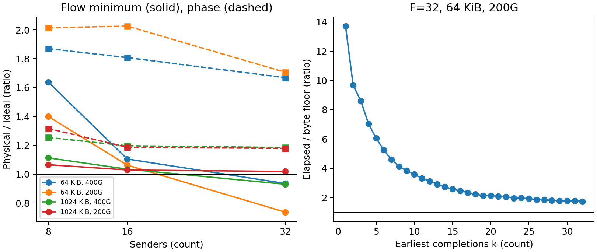

# Aligned baseline: controlled receiver service

## What ran

Expectations-only commit: `7078cc5704cd90e15430e8a8d99aeb58438d5517`.
Pinned htsim `617ce20`: 16 two-flow cells, 24 many-to-one cells and
16 isolated controls, at 400/200 Gbit/s with rnic-nn and rnic-cn.
All 56 attempts use fresh external bulk storage and identical GOAL phases.

## What came out

Before these observations: each flow has floor bytes*8000/rate_Gbps
+ path propagation in ps. Propagation is 2,000,000 ps for ideal or
same-leaf traffic, 4,000,000 ps for remote physical traffic. The
physical ceiling is unbounded. The frozen ideal packet envelope is
(total_payload/4096+2)*4160*8000/rate_Gbps+2,000,000 ps.

Decision under the frozen rule: **H-sched**; status **complete**.
Completion-prefix rows: 496; failures: 0.
Physical prefixes: 248, with minimum slack 7022080 ps.
Fatal guard violations: 0.
Physical per-flow ratios below one: 10/248.
Minimum per-flow ratio: 0.737139669.
Minimum phase ratio: 1.179048472.
Isolated controls with a below-one ratio: 0.

Numbers below are ps except dimensionless ratios. p50 is nearest rank
within each cell, with the selected median flow's own floor beside it.
For two unequal flows, p50 is the earlier completion, not an average.

| Cell | NN p50 / floor | CN p50 / floor | CN phase / NN | Minimum flow ratio |
|---|---|---|---|---|
| pair-f2-b262144-local-400g | 12649600 / 7242880 | 33465600 / 7242880 | 1.397392 | 1.397392 |
| pair-f2-b1048576-local-400g | 44598400 / 22971520 | 58918400 / 22971520 | 1.285137 | 1.285137 |
| isolated-f1-b65536-local-400g | 3414400 / 3310720 | 10332800 / 3310720 | 3.026242 | 3.026242 |
| isolated-f1-b1048576-local-400g | 23382400 / 22971520 | 32300800 / 22971520 | 1.381415 | 1.381415 |
| pair-f2-b262144-remote-400g | 12649600 / 7242880 | 35132800 / 9242880 | 1.429607 | 1.429607 |
| pair-f2-b1048576-remote-400g | 44598400 / 22971520 | 56758400 / 24971520 | 1.270667 | 1.270667 |
| isolated-f1-b65536-remote-400g | 3414400 / 3310720 | 12336000 / 5310720 | 3.612933 | 3.612933 |
| isolated-f1-b1048576-remote-400g | 23382400 / 22971520 | 34384000 / 24971520 | 1.470508 | 1.470508 |
| incast-f8-b65536-spread-400g | 12400000 / 3310720 | 21238400 / 5310720 | 1.870068 | 1.638399 |
| incast-f8-b1048576-spread-400g | 172144000 / 22971520 | 203027200 / 24971520 | 1.254309 | 1.113080 |
| incast-f16-b65536-spread-400g | 22716800 / 3310720 | 31299200 / 5310720 | 1.807992 | 1.105037 |
| incast-f16-b1048576-spread-400g | 342204800 / 22971520 | 385145600 / 24971520 | 1.196823 | 1.034769 |
| incast-f32-b65536-spread-400g | 43350400 / 3310720 | 59590400 / 5310720 | 1.668767 | 0.935525 |
| incast-f32-b1048576-spread-400g | 682326400 / 22971520 | 750147200 / 24971520 | 1.184761 | 0.930288 |
| pair-f2-b262144-local-200g | 23299200 / 12485760 | 46944000 / 12485760 | 1.540798 | 1.540798 |
| pair-f2-b1048576-local-200g | 87196800 / 43943040 | 104851200 / 43943040 | 1.233636 | 1.202466 |
| isolated-f1-b65536-local-200g | 4828800 / 4621440 | 18489600 / 4621440 | 3.829026 | 3.829026 |
| isolated-f1-b1048576-local-200g | 44764800 / 43943040 | 64246400 / 43943040 | 1.435199 | 1.435199 |
| pair-f2-b262144-remote-200g | 23299200 / 12485760 | 44784000 / 14485760 | 1.579777 | 1.579777 |
| pair-f2-b1048576-remote-200g | 87196800 / 43943040 | 113840000 / 45943040 | 1.252986 | 1.252986 |
| isolated-f1-b65536-remote-200g | 4828800 / 4621440 | 20656000 / 6621440 | 4.277667 | 4.277667 |
| isolated-f1-b1048576-remote-200g | 44764800 / 43943040 | 65251200 / 45943040 | 1.457645 | 1.457645 |
| incast-f8-b65536-spread-200g | 22800000 / 4621440 | 36454400 / 6621440 | 2.014455 | 1.400082 |
| incast-f8-b1048576-spread-200g | 342288000 / 43943040 | 414518400 / 43943040 | 1.316880 | 1.065589 |
| incast-f16-b65536-spread-200g | 43433600 / 4621440 | 63078400 / 6621440 | 2.026378 | 1.062721 |
| incast-f16-b1048576-spread-200g | 682409600 / 43943040 | 764128000 / 45943040 | 1.186190 | 1.029275 |
| incast-f32-b65536-spread-200g | 84700800 / 4621440 | 107846400 / 6621440 | 1.706787 | 0.737140 |
| incast-f32-b1048576-spread-200g | 1362652800 / 43943040 | 1502278400 / 45943040 | 1.179048 | 1.018718 |

## Deciding rows and bounds

`results.json` is the authority for every per-flow FCT and ratio, every
k-prefix byte count, elapsed time, floor and slack, and each phase bound.
Its command argv uses SIMLLM_* substitutions; the bulk command.json
retains the exact executed argv. Manifests verify physical quiescence.

The minimum ratio belongs to `incast-f32-b65536-spread-200g-rnic-cn`, source 43 to 0, tag 1000: physical 63417600 ps / ideal 86032000 ps. Its phase ratio is 1.706787297.
All sub-one rows occur in three F=32 incasts (5, 2 and 3 flows).
Every two-flow small ratio is above one, so the pair experiment alone
is nondiscriminating. The larger shared matrix separates the predictions.
No isolated or F=8/16 flow beats its ideal completion.

The two-flow ideal uses packet reservations, not the exact fluid FCT.
The table exposes both sizes; fluid points remain the frozen reference
and per-flow packet-minus-fluid residuals are retained in JSON.

| S bytes | Rate Gbit/s | Fluid small / large ps | Packet NN small / large ps | CN local small / large ratio | CN remote small / large ratio |
|---|---|---|---|---|---|
| 262144 | 400 | 12485760 / 28214400 | 12649600 / 28707200 | 2.645586 / 1.397392 | 2.777384 / 1.429607 |
| 262144 | 200 | 22971520 / 54428800 | 23299200 / 55414400 | 2.014833 / 1.540798 | 1.922126 / 1.579777 |
| 1048576 | 400 | 43943040 / 106857600 | 44598400 / 108579200 | 1.321088 / 1.285137 | 1.272656 / 1.270667 |
| 1048576 | 200 | 85886080 / 211715200 | 87196800 / 215158400 | 1.202466 / 1.233636 | 1.305552 / 1.252986 |

Behavioral relations: 92 instances, 0 misses. These envelope and direction checks are separate from fatal guards.

## What it changes

BACK-68's shared-flow lower-bound refutation is resolved by H-sched
under the registered decision rule. simllm/backends/fct.py supplies
normalized_phase_makespan and earliest_completion_byte_floors, used
by this report and the fresh width-tail rerun. normalized_fct retains
its existing behavior; unshared aligned handoffs retain their bound.
Only orchestrator integration closure remains in BACK-68: remove its
entry while regenerating the protected task-progress projection.
The width-tail guard amendment is frozen separately at `3d818f7`.
Its [rerun report](../collective_width_tail_v1/RESULTS.md) records the
unchanged original ideal values and the two surviving void cells.

## What it does not change

A finite set of endpoint completion floors cannot exclude every hidden
credit defect or establish packet-level causality. This experiment tests
the two registered explanations on the specified cells. No native backend or
third_party source is changed. No production request-tail calibration,
COMP-9 closure, BACK-38 state preservation or HTSIM-40 fix is claimed.

## Reproduction

```bash
. ./.env.local.sh
.venv/bin/python examples/aligned_baseline_v1/run_study.py --publish
```

Set SIMLLM_DATA_ROOT, SIMLLM_HTSIM_BUILD, SIMLLM_HTSIM_RNIC and
SIMLLM_TXT2BIN first. The runner rejects an existing evidence directory.
Use --summarize-only to project retained raw evidence without simulation.


