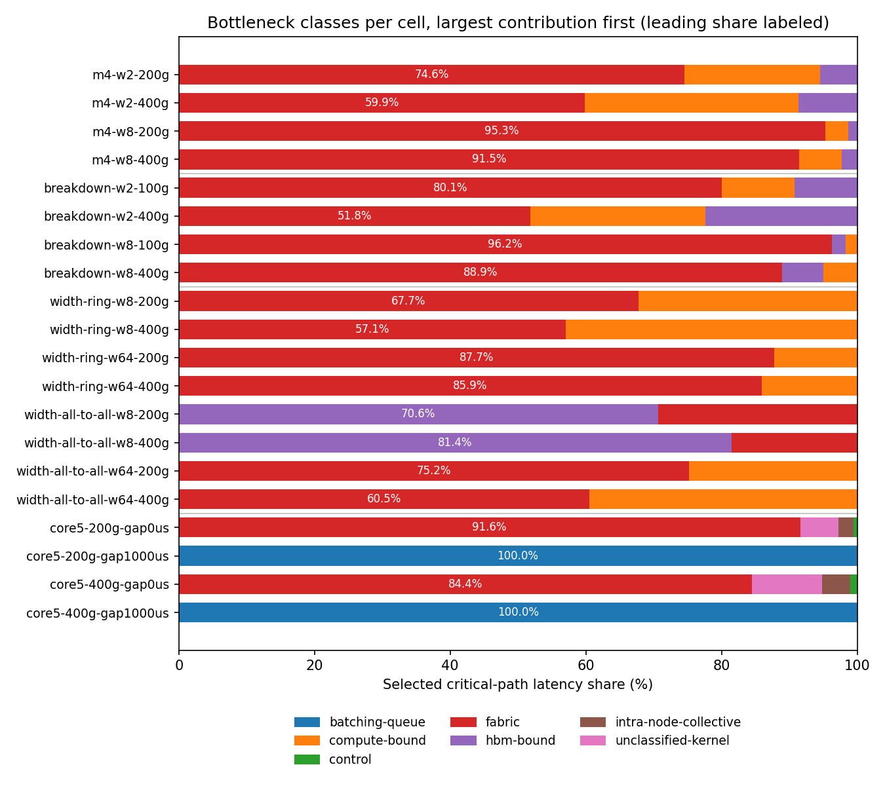

# Bottleneck report v1 results

What ran: 16 packet configurations and four coarse-runtime configurations exercise the optional selected-path report beside time to first token (TTFT) and time per output token (TPOT).

What came out: HELD. Every conservation and timing-identity comparison has 0 ps error. At width 64 and 400 Gbit/s, fabric contributes 85.892285% (ring) and 60.515011% (all-to-all). Behavioral relation misses: 0.

What it changes: CORE-67 meets its functional study acceptance, and its entry is removed for integration. Strict step and request bottleneck records, packet flow-tail diagnostics and the exact kernel name/config/GPU measurement join are implemented. The orchestrator must reconcile the task index before merging.

What it does not change: no runtime service, default, packet byte, TTFT or TPOT changes. COMP-90 measurements retain their evidence and void state; no kernel calibration, physical fabric calibration, or new deployment validity is claimed.

Frozen expectations commit: `525b74e`. The freeze precedes implementation and the first study run. Existing published outcomes informed the predictions.

## Evidence classes

| Class | Result |
|---|---|
| Run configurations | 16 packet, 4 coarse |
| Exact published component oracle rows | 4 held |
| Behavioral relation instances | 32 evaluated, 0 misses |
| Fatal structural, physical and identity guards | Held, unscored |
| GPU or network-dependent test executables | None |

These counts are separate evidence classes, never a combined score. A fatal guard failure voids the study. Inherited void measurements are diagnostic only.

## Ranked cells

| Cell | First class | Share (%) | Total (ps) |
|---|---|---:|---:|
| m4-w2-200g | fabric | 74.557973 | 59085857280 |
| m4-w2-400g | fabric | 59.852202 | 37443248640 |
| m4-w8-200g | fabric | 95.256096 | 85165290240 |
| m4-w8-400g | fabric | 91.456760 | 47290725120 |
| breakdown-w2-100g | fabric | 80.053310 | 110227731200 |
| breakdown-w2-400g | fabric | 51.765408 | 45583020800 |
| breakdown-w8-100g | fabric | 96.223701 | 171655897600 |
| breakdown-w8-400g | fabric | 88.924484 | 58527654400 |
| width-ring-w8-200g | fabric | 67.716275 | 309753600 |
| width-ring-w8-400g | fabric | 57.058840 | 232876800 |
| width-ring-w64-200g | fabric | 87.709915 | 813664000 |
| width-ring-w64-400g | fabric | 85.892285 | 708832000 |
| width-all-to-all-w8-200g | hbm-bound | 70.618277 | 141606400 |
| width-all-to-all-w8-400g | hbm-bound | 81.431103 | 122803200 |
| width-all-to-all-w64-200g | fabric | 75.156613 | 402521600 |
| width-all-to-all-w64-400g | fabric | 60.515011 | 253260800 |
| core5 200G gap 0 ps | fabric | 91.589099 | 356680 |
| core5 200G gap 1000000000 ps | batching-queue | 99.964345 | 1000356680 |
| core5 400G gap 0 ps | fabric | 84.443062 | 192840 |
| core5 400G gap 1000000000 ps | batching-queue | 99.980720 | 1000192840 |

Packet table totals sum the disjoint steps of each declared cell. The coarse rows show the first request's TTFT. Each underlying step and sampled request has its own strict report in the bulk run. The figure orders contributions within each row by descending share.



## Physical interpretation

The GPU must fetch bytes and execute arithmetic before releasing the next communication phase. Prefill reuses weights across many tokens and its arithmetic work binds the ideal roof. Decode reuses them less and memory bandwidth binds it. The record compares declared arithmetic intensity with the device ridge point; it does not infer the measured cause of a slow kernel. All named serving cells have absent-by-design measured fractions because no matching measured kernel/config cell is supplied.

The packet floors use payload bytes divided by link rate and propagation per dependent ring hop. The expert floor uses bytes received from all remote peers. The ideal ceilings serialize the declared packet slots conservatively. Each row retains the limits computed before execution. All observations lie inside their bounds, and the four published breakdown component tuples agree exactly. The fixed 100-microsecond width compute interval exceeds its declared-work roofline floors: 9.250770 microseconds for rings, 27.066368 for width-8 expert work and 40.568240 for width-64 expert work.

The core5 chain is two 4096-byte handoffs plus 20000 ps kernel, 8000 ps collective and 1000 ps control. Its service is 356680 ps at 200G and 192840 ps at 400G. Adding 1000000000 ps of declared admission shifts only TTFT by that amount; it makes batching queue the first class without changing service or TPOT.

Flow completion time (FCT) tail share is `(maximum FCT - minimum FCT) / maximum FCT` within each selected fabric artifact. It is a spread diagnostic, not a sum of flow waits and not a switch queue measurement. Full packet rows remain in bulk. Replay retains actual witness rows for extrema and counts, not the full FCT distribution.

The m4 source uses distinct prefill and decode request identities. This replay declares all arrivals at zero, so the decode requests correctly attribute the preceding prefill to batching delay in their TTFT. The m4 fabric-first prediction concerns each executed step. Request rankings conserve the declared request history independently; they do not copy the step winner.

These are model-side classifications. Matching a deterministic service model is not evidence of deployment token throughput. No hardware number or new calibration is inferred from this study.

## Integration gate

The numerical study holds, but the repository merge gate is blocked by the generated task index in `docs/README_PRO.md`: core has 26 open tasks and backends has 51, while the index still says 27 and 52. The backend difference is inherited from BACK-69. The worker contract forbids editing that file and reserves cross-file reconciliation for the orchestrator. Closure bookkeeping for CORE-67 and BACK-69 also belongs in `docs/task-ledger.json` during integration.

The configured wave binaries also differ from the historical hashes required by two optional collective-floor study checks. Those checks are separate from this study's frozen backend cells. Ordinary continuous integration leaves those machine-specific binary selections unset and skips the historical identity checks; the retained-data checks remain enabled. No numerical guard is relaxed, and a passing study is not presented as a green repository gate.

## Using the record

Set `emit_bottleneck_report=True` on `HtsimStepSinkConfig` or `DeviceRuntimeStepSink`. Their `bottleneck_reports` list publishes only completed calls. The coarse sink includes request rankings directly. For packet requests, pass the step report as `bottleneck_report=` to `HtsimRequestMetricReducer.consume`; its own `bottleneck_reports` then includes TTFT and TPOT. The persistent packet sink publishes reports only when a prepared call is consumed.

`bottleneck_step_to_json(result, report)` writes the optional field beside the original result. `bottleneck_step_from_json(payload)` returns the result and report, or `None` for a legacy absent report. The strict report codec also works independently. Measured cells use `bottleneck_kernel_cells`, keyed exactly like profile calibration by `(kernel.name, kernel.config, gpu.name)`. Each value is `KernelEvidence` with the original ledger cell identity, work, measured duration, roofs, evidence class and void state. A missing exact key remains absent-by-design; no family-only or cross-GPU fallback occurs.

## Identity and reproduction

Default absence and explicit false regenerate the identical GOAL plan and replay the same retained authoritative backend output. Their original StepResult, outcome, locality and request metric bytes match the enabled run after omitting only the optional report. GOAL, binary GOAL and native completion CSV bytes also match. Runtime records use exact integer picoseconds; TPOT divides cumulative class spans by the same exact interval count as the metric.

```bash
. ./.env.local.sh
.venv/bin/python examples/bottleneck_report_v1/run_study.py --live
.venv/bin/python examples/bottleneck_report_v1/run_study.py --replay
```

Bulk output defaults to `SIMLLM_DATA_ROOT/bottleneck_report_v1`. Backend binaries use `SIMLLM_HTSIM_RNIC` and `SIMLLM_TXT2BIN`, configured from `SIMLLM_HTSIM_BUILD`. Tracked text uses LF bytes. Replay accepts LF-normalized source digests and requires no native backend, GPU or network.
