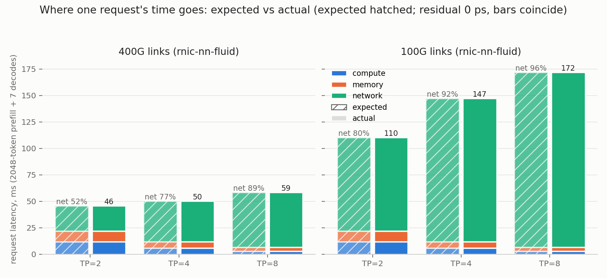
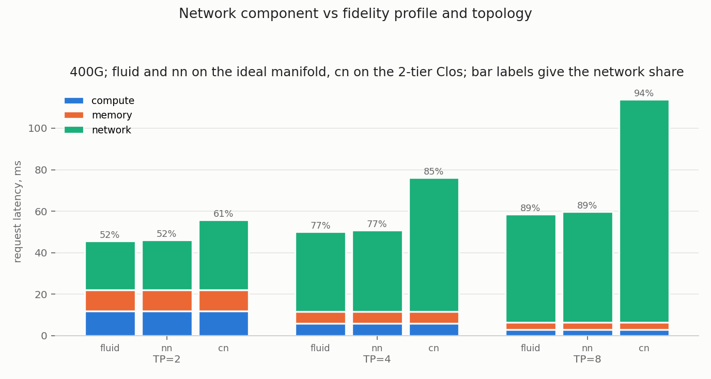

# Request-time breakdown: results against pre-registered expectations

Runs of 2026-08-04, one `run_breakdown.py` invocation (22 check rows in
`summary.csv`, per-step data in `steps.csv`, per-config sums in
`components.csv`). The raw GOALs and completion CSVs remain outside Git in
the machine-local directory used for the historical run; its resolved historical path is
intentionally omitted. New runs default to
`${SIMLLM_DATA_ROOT}/breakdown`. The backend binary was `htsim_rnic` from
a machine-local HTSIM-rnic-private build pinned at `c03e1f2`, as in
examples/m4; its resolved historical build path is intentionally omitted. Current
reproductions select the build root with `SIMLLM_HTSIM_BUILD`. GOAL conversion
used the prebuilt `txt2bin`; the simllm code revision is the commit this study
lands in.
Backends deterministic, every number reproduces exactly. The registered
predictions are in [expectations.md](expectations.md) (kept frozen;
deviations are disclosed here, never edited there). An external
third-party review (2026-08-04) reconciled six table cells against the
raw completion CSVs to 0 ps, found no defect, and required the
disclosure additions marked "review note" below.

Verdict: **21 of 22 registered checks pass; the single FAIL (Q3 at TP=2)
is a mis-registered threshold, not a simulator deviation, ledgered
below.** All 6 F cells are exact to 0 ps in every component, all 3 N
cells match the generalized point form to 0 ps (including the two
sub-packet cells), and every qualitative direction check (Q1, Q2, Q4/C)
holds.

## Q1: bound structure

At every TP the prefill step is compute-bound and all seven decode steps
are memory-bound (roofline classification), so the compute component is
exactly the prefill kernel and the memory component exactly the decode
kernels. Pass at TP 2, 4, 8.

## F: fluid components, exact

All six (TP, link) cells reproduce the frozen table with a residual of
0 ps in every component and the total. Each component compares against a
frozen literal, which pins the runtime roofline's kernel terms too (a
drifted cost model would break the compute and memory residuals); unlike
examples/m4 there is no additional per-cell match column, so
"separately checks" in expectations.md overstates the mechanism (review
note; the anchoring itself is equivalent). Pass.

| TP | link | compute ms | memory ms | network ms | total ms | net share |
|---|---|---|---|---|---|---|
| 2 | 400G | 11.78 | 10.21 | 23.60 | 45.58 | 52% |
| 2 | 100G | 11.78 | 10.21 | 88.24 | 110.23 | 80% |
| 4 | 400G | 5.89 | 5.76 | 38.47 | 50.12 | 77% |
| 4 | 100G | 5.89 | 5.76 | 135.43 | 147.08 | 92% |
| 8 | 400G | 2.95 | 3.54 | 52.05 | 58.53 | 89% |
| 8 | 100G | 2.95 | 3.54 | 165.17 | 171.66 | 96% |

## Q2: network share vs parallelism

Strictly increasing in TP on every profile column, as registered. Pass.

| profile, link | TP=2 | TP=4 | TP=8 |
|---|---|---|---|
| fluid, 400G | 0.5177 | 0.7675 | 0.8892 |
| fluid, 100G | 0.8005 | 0.9208 | 0.9622 |
| nn, 400G | 0.5221 | 0.7710 | 0.8915 |
| cn (Clos), 400G | 0.6057 | 0.8471 | 0.9431 |

Review note on the registered "both kernel components shrink roughly as
1/TP": the memory component shrinks only 2.89x from TP=2 to TP=8
(10.21 to 3.54 ms) because the deliberately unsharded LM head (about 37
percent of the TP=8 weight traffic) does not shard; "roughly" carries
that weight. The direction claim is unaffected.

## Q3: link speed touches only the wire term

Kernels bit-identical across 400G/100G at every TP, and the prefill
network ratio is about 3.9x (wire-dominated) at every TP: both pass. The
decode ratio bar FAILS at TP=2: measured max decode ratio 1.118 against
the registered "less than 1.1".

Ledger (mis-registration, M1-F3 pattern): the registered bound was an
arithmetic slip in the registration itself. Its own stated reasoning
(wire at most 4096 * 80 ps against P = 2 us) gives a per-round ratio of
(2,000,000 + 327,680) / (2,000,000 + 81,920) = 1.1180 at TP=2, which is
exactly what was measured; the "10 percent" figure was rounded down
carelessly when the sentence was written. TP=4 (1.060) and TP=8 (1.030)
sit under the sloppy bar only because their chunks are smaller. The
physics claim (decode network time is propagation-dominated and nearly
link-speed-invariant, in stark contrast to prefill's 3.9x) is correct and
visible in the left figure; the registered constant was wrong. FAIL as
registered, cause closed.

## N: rnic-nn network component, banded point form

All three cells match the generalized per-round point form
`wire_bytes * 20 + 83,200 + P` with 0 ps deviation, inside the band, and
never below fluid. Pass. Notable: the two sub-packet cells (TP=4 chunk
2048 B, TP=8 chunk 1024 B) also landed exactly on the point form; the
partial-packet wire-byte term (payload + 64 B header) plus one
store-and-forward slot fully describes a lone partial-packet round on
this profile. The M1-ladder slot-calendar caution applies to contending
flows, which a serial ring round never has.

## C: rnic-cn on the two-tier Clos, directional

All registered directions hold at every TP. Pass.

| TP | cn total ms | >= fluid | prefill infl. | decode infl. | decode > prefill | cn/nn | delta per flow us |
|---|---|---|---|---|---|---|---|
| 2 | 55.77 | yes | 1.189 | 4.263 | yes | 1.212 | 4.97 |
| 4 | 76.19 | yes | 1.246 | 4.277 | yes | 1.497 | 2.12 |
| 8 | 113.98 | yes | 1.352 | 4.283 | yes | 1.909 | 0.97 |

The registered claim, that cn's per-flow control overhead inflates the
tiny decode rounds far more than the wire-dominated prefill rounds, is
confirmed with a wide margin: decode-phase network time is about 4.3x
fluid at every TP while prefill-phase inflation stays at 1.19 to 1.35.

Review notes on the attribution (the cn column changes protocol AND
topology at once, so the mechanism claim needs both facts): first, path
latency cancels in the cn/fluid ratios by construction, because the
one-leaf Clos path is up plus down at 1000 ns each
(clos_64_400g.topo), numerically equal to the manifold's P = 2 us, so
the inflation is protocol overhead, not distance. Second, the raw cn
completion CSVs show the additive signature the mechanism predicts: the
per-round overhead over fluid is nearly constant in chunk size (6.75 /
6.69 / 6.63 us at 4096 / 2048 / 1024 B), which is exactly why decode
inflation is flat (4.263 / 4.277 / 4.283) across TP. This ~6.7 us
per-round figure is a different quantity from the M1-F2 ~28.5 us
per-flow control overhead cited in the registration's rationale: F2
measured whole-flow registration overhead at that study's flow sizes,
while a ring round here is one small established-schedule transfer; the
two are not comparable constants and neither is registered as a model
parameter.

Report-only observations: cn never beat nn here (1.21 to 1.91x), and the
crude per-flow delta (cn minus fluid over the flow count) shrinks with TP
because the flow count grows faster than the added time; it is not the
M1-F2 per-DECLARE constant and is not registered as one.

## Method notes and limitations

- Scope (review note, the two caveats that matter most before
  generalizing the shares): this is ONE request at batch 1 with an
  8-token generation, which puts decode arithmetic intensity at its
  floor and makes the 52 to 96 percent network shares an upper-bound
  what-if, not a serving-fleet statement (real decode batches raise the
  compute share); and the GOAL chain is strictly serial with no
  communication/compute overlap (TRAF-7), so "network" here is the full
  un-overlapped collective latency.
- The compute/memory attribution assigns each step's whole kernel time to
  its binding roofline resource (the `max()` semantics); the shadowed
  resource is not co-charged. A finer overlap model is a compute-module
  concern, not registered here. The calc flooring loss (E minus the
  charged kernel, at most about 0.15 us per request here) lands in no
  bucket and is negligible at 4 ppm of the total.
- On cn the identity makespan = kernel + network is exact only to the
  simulator's reporting quantum: the recorded cn makespans are quantized
  by up to a few hundred ns against the last flow completion (review
  note), a bounded wobble of at most 3e-4 of the network component,
  immaterial to every check. On fluid and nn the identity is exact.
- The cn runs place the TP group on the last node's GPUs (`ranks 64-TP to
  63`) so the GOAL pads to the topology's 64 nodes; rnic-cn enforces that
  the resolved GOAL layout matches the topology node count. This study
  predates the explicit `HtsimStepSinkConfig.num_goal_ranks` knob and retains
  its historical workaround so the frozen artifacts remain comparable.
- Sub-packet decode chunks at TP 4 and 8 are exactly the regime the M1
  incast ladder flagged under contention; here every round is contention
  free by construction, which is why the point form is exact.
