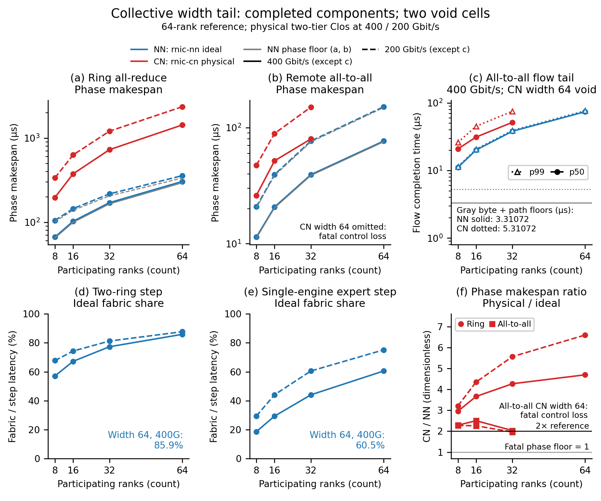

# Collective width tail: completed components and two void cells

## What ran

The full 64-cell matrix ran fresh after the BACK-68 guard amendment.
Original expectations-only commit: `aae9adf0d29c875bdf2c7aeb49dbf2f8c2ec966a`.
Amendment-only commit: `3d818f7df7204b577e8eaaa20db3f61ef426c591`.
Backend pin remains `617ce20`; hashes and GOAL identities are in results.json.
No old bulk results were reused. The reference ring/all-to-all payloads,
rail-major placement, 400/200 Gbit/s rates, profiles, exact points and
behavioral bands are unchanged. The supported expert step retains the
already corrected source-major ordering of the same selected ranks.

Standalone: 30/32 complete, two physical width-64 all-to-all control-loss exits. Supported step attempts: 16/32 complete, all ideal;
all 16 physical steps are rejected by BACK-38 with null timing and shares.
Raw populations: 54,432 standalone flows and 42,980 step-artifact flows. These are flow
populations within configurations, not independent request-tail samples.

## What came out

Study status: **component-evidence-with-survivable-voids**.
The two HTSIM-40 cells are still fatal, void and unscored. Their exact
control-loss signature was declared survivable before the rerun, so
completed components retain interpretable evidence. No failed guard is
included in a behavioral score and no missing completion is synthesized.

All 54,432 receiver completion-prefix floors pass. The minimum physical prefix slack is 6,926,720 ps.
All 14 completed physical phases satisfy physical makespan >= ideal
makespan, and all original individual byte-plus-propagation floors pass.
Exact oracles: 24 rows, 12 misses. Behavioral relations: five families, 95 instances, 14 misses in completed components.
These denominators are separate from fatal guards and coverage gaps.

Preservation against the tracked morning record at `80eef42`: all 800 numerical fields in 32 ideal configurations reproduce exactly;
all 24 original exact-oracle records are identical, including their failures.
GOAL digests and completion statuses also reproduce. The source record
digest and a zero-mismatch comparison are stored in morning_reproduction.

## Physical bounds before headline numbers

At 400G, byte service costs 20 ps/byte; at 200G, 40 ps/byte. Every
flow floor is its own payload service plus 2 us ideal propagation or
4 us for the physical remote Clos path. These floors appear beside every
p50 below. No finite physical ceiling follows from link capacity under
queueing and flow control. The frozen packetized ideal envelopes remain
the conditional ceilings in results.json, not relaxed oracle tolerances.

For a ring, the dependency-depth floor is 2(W-1)*(S/W*ps_per_byte+P).
At W=64 and 400G the ideal phase interval is [293.287680, 314.899200] us;
the physical floor is 545.287680 us and its ceiling is unbounded.
For all-to-all, each receiver has D=7F/8 remote senders and floor
D*65536*ps_per_byte+P. At F=64 and 400G the ideal interval is
[75.400320, 4773.104000] us. The physical floor is 77.400320 us,
with no valid phase completion because of control loss.

The fixed compute service has floor and ceiling 100 us by input.
Step bounds add that service to twice the corresponding network bounds.
Shares have floor 0 and ceiling 1, tightened per cell in JSON. At width
64 and 400G the ring step is bounded by [686.575360, 729.798400] us,
and the expert step by [250.800640, 9646.208000] us. Their fabric share
floors are 85.435% and 60.128%, respectively. This compute denominator
is a synthetic control, not calibrated GPU throughput.

The independent ring transfer factor 2(W-1)/W implies 6.779 GB/s per
rank at W=64, 400G from the ideal phase, below the 50 GB/s endpoint
capacity. This checks work and units, not a measured deployment tail.

## Standalone flow and phase measurements

All times below are us. Quantiles are nearest rank within each cell.
NN is rnic-nn; CN is rnic-cn. Each floor includes the profile's path
propagation. CN width-64 all-to-all stays void. Physical ceilings are unbounded.

### ring

| Width | Gbit/s | NN floor | NN p50 / p99 | CN floor | CN p50 / p99 | NN phase | CN phase |
|---|---|---|---|---|---|---|---|
| 8 | 400 | 4.621440 | 4.745600 / 4.745600 | 6.621440 | 13.832600 / 14.331800 | 66.451400 | 196.387200 |
| 8 | 200 | 7.242880 | 7.491200 / 7.491200 | 9.242880 | 23.653400 / 24.642200 | 104.889800 | 336.604800 |
| 16 | 400 | 3.310720 | 3.414400 / 3.414400 | 5.310720 | 12.411800 / 12.667800 | 102.461000 | 375.027200 |
| 16 | 200 | 4.621440 | 4.828800 / 4.828800 | 6.621440 | 20.821400 / 21.487000 | 144.893000 | 630.035200 |
| 32 | 400 | 2.655360 | 2.748800 / 2.748800 | 4.655360 | 11.666200 / 11.912600 | 170.486600 | 727.532800 |
| 32 | 200 | 3.310720 | 3.497600 / 3.497600 | 5.310720 | 19.324800 / 19.823000 | 216.912200 | 1206.534400 |
| 64 | 400 | 2.327680 | 2.416000 / 2.416000 | 4.327680 | 11.253400 / 11.496600 | 304.541000 | 1429.404800 |
| 64 | 200 | 2.655360 | 2.832000 / 2.832000 | 4.655360 | 18.495000 / 18.991000 | 356.957000 | 2354.476800 |

### all-to-all

| Width | Gbit/s | NN floor | NN p50 / p99 | CN floor | CN p50 / p99 | NN phase | CN phase |
|---|---|---|---|---|---|---|---|
| 8 | 400 | 3.310720 | 11.152000 / 11.401600 | 5.310720 | 20.902400 / 26.083200 | 11.401600 | 26.083200 |
| 8 | 200 | 4.621440 | 20.304000 / 20.803200 | 6.621440 | 37.500800 / 47.366400 | 20.803200 | 47.366400 |
| 16 | 400 | 3.310720 | 20.137600 / 20.720000 | 5.310720 | 31.324800 / 45.203200 | 20.720000 | 51.827200 |
| 16 | 200 | 4.621440 | 38.275200 / 39.440000 | 6.621440 | 58.390400 / 84.934400 | 39.440000 | 89.078400 |
| 32 | 400 | 3.310720 | 38.192000 / 39.356800 | 5.310720 | 51.718400 / 75.555200 | 39.356800 | 79.891200 |
| 32 | 200 | 4.621440 | 74.384000 / 76.713600 | 6.621440 | 100.310400 / 141.302400 | 76.713600 | 150.342400 |
| 64 | 400 | 3.310720 | 74.300800 / 76.630400 | 5.310720 | void | 76.630400 | void |
| 64 | 200 | 4.621440 | 146.601600 / 151.260800 | 6.621440 | void | 151.260800 | void |

## Refutations and their limits

There are 2,592 aligned flow pairs. 122 physical flows remain below the ideal FCT:
47 at F=32, 400G and 75 at F=32, 200G. Their minima remain 0.759090
and 0.575342. The latter is source 0 to 8, tag 1000. The corresponding
phase ratios are 2.029921 and 1.959788, both above their fatal floor 1.
The [controlled experiment](../aligned_baseline_v1/RESULTS.md) finds
sub-one shared-flow ratios with every byte prefix and phase floor intact,
and none in isolated controls. This resolves the BACK-68 convention
refutation as scheduling under the registered decision rule. It does not
prove the absence of every possible hidden credit defect.

Shared per-flow ratios are now diagnostic. The unshared initial ring
round retains its aligned per-flow lower bound. Later ring starts differ
across profiles, so those flows retain raw FCT and compare by full phase.
The two conservation floors remain fatal in every completed cell.

The unchanged per-flow 2x target still misses: 304 aligned pairs exceed it, maximum 6.646328.
The 1.2x diagnostic remains separately recorded. Fairness corrections
do not repair a slow physical tail or relax any upper behavioral band.

At width 64 the physical backend again exits 2 with `fabric dropped
control lifecycle` at both rates. The 1,048,576-byte buffer default
and control policy are unchanged. Raw error.txt files remain in bulk.
HTSIM-40 still owns recovery. Partial CSVs are never treated as completed phases.

TRAF-89 is unchanged: standalone ideal ring points miss their frozen
prediction by exactly (2W-3) ns: 13, 29, 61 and 125 ns at either rate.
The earlier study attributed this to zero-cost GOAL joins executed as
1 ns. This rerun preserves that observation and the four rate-relation
misses; it does not revise the frozen oracle. Supported ring step points
and rate relations still match exactly because their ordered artifact
execution has a different schedule boundary.

## Supported critical-path contribution

The real HtsimRequestMetricReducer and attribute_step_detail partition
each supported step's ordered artifacts. All 16 ideal steps conserve
the partition and TTFT. Collective and fabric shares coincide here.
Local expert service is masked by the larger fabric service; its work
remains separate in JSON. Times are us; shares are fractions of the step.

| Width | Gbit/s | Ring step / TTFT | Ring fabric share | Expert step / TTFT | Expert fabric share |
|---|---|---|---|---|---|
| 8 | 400 | 232.876800 | 57.059% | 122.803200 | 18.569% |
| 8 | 200 | 309.753600 | 67.716% | 141.606400 | 29.382% |
| 16 | 400 | 304.864000 | 67.198% | 141.440000 | 29.299% |
| 16 | 200 | 389.728000 | 74.341% | 178.880000 | 44.097% |
| 32 | 400 | 440.851200 | 77.317% | 178.713600 | 44.045% |
| 32 | 200 | 533.702400 | 81.263% | 253.427200 | 60.541% |
| 64 | 400 | 708.832000 | 85.892% | 253.260800 | 60.515% |
| 64 | 200 | 813.664000 | 87.710% | 402.521600 | 75.157% |

## What it changes

BACK-68 acceptance is met: controlled pair and incast experiments, a
corrected shared-flow convention with reusable live metrics, a pre-run
guard amendment, and a fresh full matrix preserving the original ideal
numbers exactly. Its backends.md entry now retains only orchestrator
integration closure: remove the entry and regenerate the protected
README_PRO task-progress projection together. The worker cannot edit
that projection; removing the entry alone fails the repository's progress
consistency gate. No numerical or backend work remains under BACK-68.

## What it does not change

COMP-9 still needs held-out request-tail and removal-of-contention
validation. BACK-38 still blocks physical multi-artifact steps. BACK-69
still owns packet-level critical-path segments; these sinks do not emit
CriticalPathBreakdown or per-visit queue waits. HTSIM-40 control loss
and TRAF-89 join timing remain unresolved. No task IDs are registered,
and neither BACK-69 nor HTSIM-40 registry text is changed. No README,
native backend, backend pin, compute default or third_party source changes.



The PNG and PDF project results.json. Panels (a) and (b) show phase
makespans and gray ideal phase floors. Panel (c) shows the within-cell
50th and 99th percentile flow completion times (p50 and p99) at
400 Gbit/s: solid circles denote p50, dotted hollow triangles p99.
Its gray solid and dotted lines are the ideal and physical byte-plus-path
floors. Panels (d) and (e) show ideal fabric shares of the supported step.
Panel (f) compares complete physical and ideal phase makespans; circles
denote ring and squares all-to-all. Its unit line is the fatal phase
floor; the 2x line is a visual reference, not the per-flow acceptance test.
Outside (c), solid and dashed lines denote 400 and 200 Gbit/s.
Time axes in (a) to (c) are logarithmic. Missing physical width-64
all-to-all points denote void cells, not zero times. Whole fabric shares
are not excess-tail attribution.

## Reproduction and validation

results.json is the numerical authority; this report and both figure
formats are projections. Per-cell GOALs, manifests, raw completions and
receiver_prefix_floors.csv remain under the external bulk root.

```bash
. ./.env.local.sh
.venv/bin/python examples/collective_width_tail_v1/run_study.py --out "$SIMLLM_DATA_ROOT/collective_width_tail_back68_v1" --publish
```

Use a fresh --out for simulation. --summarize-only projects existing
evidence, checking expectation and executable provenance. Tracked text
digests accept LF normalization; generated text artifacts use LF bytes.
Exit 2 means an undeclared fatal or incomplete matrix. The two declared
void cells remain explicit even when the completed-component run exits 0.
The first full test gate found two unrelated older-study executable-hash
mismatches when this wave's native binary variables were inherited, and
a stale protected progress projection after removing BACK-68. The final
offline gate omits those native variables and keeps the truthful integration
residual entry; no tests or historical artifact hashes were weakened.
Final ruff, full pytest and module-format gate output is retained in the
wave handoff. Offline tests exercise early-prefix overcredit, phase-only
failure, scheduler order, identity/multiplicity drift and survivable voids.
