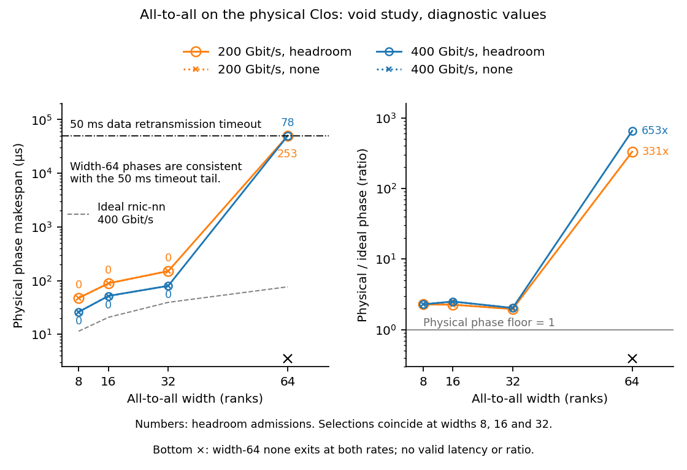

# Control recovery: void study with a completed control mechanism

The 118-configuration control recovery replay is **void**: all six previously
fatal pipeline cells now pass the control-loss point and then exhaust the
unchanged **eight-attempt data retry limit**. The width-64 all-to-all completes
at both rates, but its phase takes about 50 milliseconds rather than the
predicted roughly twofold ideal time. Every completed legacy physical CSV is
preserved byte for byte with recovery off and on.

HTSIM-40 remains open for backend integration and the exposed data recovery
findings. TRAF-88's 4:1, expert-width-32 remainder stays blocked. The
orchestrator owns backend review, the pin bump and both consumer study reruns.
No task closes and no milestone moves from this void run. This result does
not validate physical request tails, change defaults, or supply the physical
multi-artifact request execution retained by BACK-38.

## Frozen record

The study expectations-only commit is
`e936f5d1ceb85be53d7d1448e276d2462a6fc5b6`.
The backend control contract was frozen separately at
`10f66f57ce79830a7d5a39de5de45f08f1a8f007`.
Both precede control implementation and the first new simulation. Neither
freeze was amended after measurements.

The final backend is `60930252edbe0b3aaf0ecd928deb4c075da38d64`.
Its executed binary SHA-256 is
`e22696be186e812d9efdd015a0e5396aeacd070723d828aea8ae4b0b7f801870`.
The untouched `617ce20` binary has SHA-256
`803a0188b35ecee97c34e4d94431388ab8c99fac06a2a0551fa7978c502df00e`.
Per-cell input hashes, execution-source hashes and completion hashes are in
[results.json](results.json). Raw logs and source snapshots remain in bulk.
The report-source hash is separate from each executed runner's hash.

The fresh collective reference directory is
`collective_width_tail_back68_v1`. The brief's shorter directory name is
absent; the available provenance identifies the same `617ce20` pin and its
BACK-68 guard amendment. The pipeline reference is `pp_rail_contention_v1`.
The assigned checkout has no pipeline study directory, and its supplied bulk
root has no RESULTS.md. Its saved GOAL inputs, topology files, completion CSVs,
pre-run bounds and six control-loss logs are the available reference evidence.
Both reference roots were read only.

## Physical mechanism and bounds

Eight active receivers on a width-64 leaf have 56 incoming flows each. One
4160-byte data packet from each flow offers 1863680 bytes against the
1048576-byte shared pool. A control packet arriving at full memory is lost
before its higher service priority can help. Offered burst work is not the
same as instantaneous occupancy; draining and interleaving determine the latter.

The opt-in reserve gives each output another 131072 bytes for controls that
would otherwise fail base-pool admission. Data keeps its old thresholds.
The declared sizing envelope is `H >= F*M*C`, with 32 outstanding controls
per flow and 64 wire bytes per control, admitting fan-in 64 per output.
This is a conditional buffer envelope, not a proof of transport completion or
a measured hardware allocation. Each admitted packet retains its route,
serialization, queue order and single lifecycle. The hardware-source basis and
limits are in the backend control contract. No endpoint retry policy changed.

The following physical bounds were written in the freeze before reading the
new measurements. At width 64, one receiver takes 56*65536 payload bytes.
Dividing those bytes by link rate and adding four microseconds of propagation
gives phase floors of **77.400320 us at 400 Gbit/s** and **150.800640 us at
200 Gbit/s**. Both measured phases are above those floors. The complete
physical/ideal phase ratio has floor 1; measured ratios are also above it.
The smallest receiver-prefix byte-floor ratios at width 64 are 1.730039 and
1.705605, respectively. No receiver's earliest k completions beat their
cumulative byte floor.

Physical phase and flow ceilings are unbounded: finite control storage does
not bound data retries, timers or scheduling. A single 65536-byte flow has
payload-plus-propagation floors of 5.310720 and 6.621440 us at the two rates;
all observed medians and 99th percentiles exceed them. Pipeline floors use
receiver serialization and the saved causal/cut bounds. Failed pipeline cells
have no valid completion against which to compare those bounds.

Three independent checks explain the limits. Endpoint serialization checks
units and impossible early completion. Separate control storage explains why
small feedback survives a full data pool, while its occupancy counters rule
out reserve exhaustion here. The long tail aligns with the existing
50000000000-ps sender watchdog: at 400G, retransmissions exceed received gap
requests by eight; at 200G, by 63. The native source arms that watchdog only
after a physical retry has serialized. These facts support a watchdog-tail
interpretation; they do not establish a calibrated deployment latency or a
complete root cause for every late data packet.

## All-to-all measurements

Times are microseconds. FCT means flow completion time. Percentiles are
nearest-rank statistics over flows within one cell, not request percentiles.
NN denotes the ideal endpoint profile; CN denotes the physical Clos. For
widths 8 through 32, both selections give exactly the row shown. At width 64,
only headroom completes; `none` retains the control-loss exit at both rates.

| Width | Gbit/s | CN phase | FCT p50 | FCT p99 | CN/NN phase | Headroom admissions |
|---|---|---|---|---|---|---|
| 8 | 400 | 26.083200 | 20.902400 | 26.083200 | 2.287679 | 0 |
| 8 | 200 | 47.366400 | 37.500800 | 47.366400 | 2.276880 | 0 |
| 16 | 400 | 51.827200 | 31.324800 | 45.203200 | 2.501313 | 0 |
| 16 | 200 | 89.078400 | 58.390400 | 84.934400 | 2.258580 | 0 |
| 32 | 400 | 79.891200 | 51.718400 | 75.555200 | 2.029921 | 0 |
| 32 | 200 | 150.342400 | 100.310400 | 141.302400 | 1.959788 | 0 |
| 64 | 400 | 50039.587200 | 110.876800 | 149.523200 | 652.999165 | 78 |
| 64 | 200 | 50082.390400 | 215.446400 | 50050.806400 | 331.099600 | 253 |

At width 64, the 400G reserve admissions are 42 GRANT_UPDATE and 36 GAP_NACK;
at 200G they are 142 and 111. The other five control kinds need no reserve
admission in those two cells. Peak use is only 192 bytes per output at either
rate. Native injection fixtures cover all seven kinds, including those absent
from this particular burst. Counters count switch admissions, not retries:
a control protected at two switches contributes two admissions.

The frozen ratio prediction `[1.5, 3.0]` is refuted at width 64. Halving link
rate changes that phase by only **1.000855 times**, outside the frozen
`[1.6, 2.2]` band. The three smaller widths remain inside that scaling band.
Width growth remains positive, but the width-32-to-64 jump is hundreds of
times, not a smooth extension of the previous ratios. These are diagnostic
relations from a void study, not a behavioral pass fraction.

## Pipeline findings

All six headroom cells end on data retry exhaustion at attempt eight. Their
makespan, FCT percentiles and CN/NN ratio remain null. No partial completion
is presented as a valid phase. The old and candidate `none` arms retain their
control-loss exit class. Peak reserve use stays far below 131072 bytes.

| Attachment | Pipeline depth | Admissions before failure | Peak reserve bytes per output |
|---|---|---|---|
| node-local | 2 | 9855 | 1728 |
| node-local | 4 | 27262 | 3648 |
| node-local | 8 | 18813 | 2176 |
| rail | 2 | 63507 | 5888 |
| rail | 4 | 61913 | 4928 |
| rail | 8 | 68818 | 5696 |

Per-kind counters, the exact native error and per-ingress switch drop lines
for every cell are retained in results.json. The remaining failure is not a
full control reserve. Increasing that reserve does not address the reported
eight-attempt data failure, and neither the retry budget nor the receiver's
late-arrival rule was changed to obtain a completion.

## Evidence classes and execution history

The final run contains 118 configurations: 96 complete, 16 expected off-mode
control-loss exits, and six fatal enabled-mode exits. A single fatal enabled
exit voids closure; the six failures are findings, not lost score points.
Eight ideal all-to-all reference phases and the other saved ideal references
are read-only inputs, not additional new simulator executions.

Exact legacy oracles comprise 88 candidate CSV comparisons across 44 previously
completed physical configurations, plus six untouched-pin comparisons. Every
comparison is byte-identical. They are conservation and compatibility evidence,
not scored behavioral relations. Three behavioral families have 12 instances;
their values are recorded, but no behavioral score is interpretable after the
fatal completion guard fails.

The first backend implementation was `48851d1`, binary SHA-256
`79e38e6346f9abbfe4b167be309a8364d4dda33371ec9cc251687a06f1c4165c`.
One rail attempt reached a 600-second host execution limit. Three longer
replays subsequently remained CPU-bound while simulated time advanced.
Debugger snapshots identified a whole-table retry-deadline cancellation scan.
Those incomplete attempts and all completed earlier evidence were retained;
the superseded long processes were stopped after the final sweep finished.
They contain no valid timing oracle.

A separate expectations-only commit,
`0adaf7e400d029480e9ffd636b24edcc2032c10d`, precedes the timeout lookup index.
That index references the existing time-ordered queue; it changes no deadline,
retry rule or event. The final indexed runtime preserves all 90 completed
pre-index candidate CSVs byte for byte and the 11 available protocol-failure
outcomes. The three interrupted rail attempts are excluded from that identity
comparison because interruption is not a modeled failure. Their final indexed
runs reach the actual eight-attempt exception. No history was rewritten and no
predictive band was relaxed.



Both vertical axes are logarithmic; the left shows phase makespan in
microseconds and the right shows the dimensionless physical-to-ideal ratio
at the same link rate. Blue denotes 400 Gbit/s and orange 200 Gbit/s. Open
circles and solid lines denote headroom; crosses and dotted lines denote
`none`. The two selections coincide at widths 8, 16 and 32. Color-matched
numbers count headroom admissions, including 78 and 253 at width 64. The
gray dashed left-panel curve is the ideal rnic-nn reference at 400 Gbit/s;
the gray right-panel line marks the ratio floor of 1. The black dash-dot
line marks the 50 ms data retransmission timeout, consistent with the
width-64 tail; the corresponding ratios round to 653 and 331. Bottom black
crosses mark width-64 `none` control-loss exits at both rates, with no valid
latency or ratio; their vertical positions are not data values. The figure
is a diagnostic projection of a void study. A vector PDF accompanies the PNG.

## Reproduction

Configure `SIMLLM_HTSIM_SOURCE`, `SIMLLM_HTSIM_BUILD`, `SIMLLM_HTSIM_RNIC`,
`SIMLLM_HTSIM_RNIC_BASE`, `SIMLLM_DATA_ROOT`,
`SIMLLM_CONTROL_COLLECTIVE_REFERENCE` and `SIMLLM_CONTROL_PIPELINE_REFERENCE`
in gitignored local configuration. The optional `SIMLLM_CONTROL_PRIOR_CANDIDATE`
points to the retained pre-index candidate evidence for its separate identity
check. Use a fresh external output directory:

```sh
. ./.env.local.sh
.venv/bin/python examples/control_recovery_v1/run_study.py --publish
```

Exit 2 reports a void study. `--resume` verifies binary and input identities
before reusing cells; text digests accept raw or LF-normalized bytes. An
incomplete operational attempt is archived before retrying. `--workers`
controls independent host processes without changing affinity or model inputs;
`--timeout-s` controls only the host wall-clock limit. `--summarize-only`
regenerates projections and figures without executing a simulator. Tracked
text is written as LF bytes, and completion CSV comparisons remain exact.

An older deployment-frontier test froze the entire Python wrapper source.
Its existing historical-source pattern now also covers `htsim_rnic.py`, so
that original source digest and every protected study artifact remain intact.
The new default-command and physical CSV tests check the current wrapper.

## Validation

Final worktree gates pass without a GPU or external service dependency:

```text
.venv/bin/ruff check .
All checks passed!
.venv/bin/pytest -q
4340 passed, 29 skipped in 372.51s (0:06:12)
.venv/bin/python scripts/check_docs_format.py
OK: 11 module doc(s) match docs/modules/FORMAT.md
ctest --test-dir "$SIMLLM_HTSIM_BUILD" --output-on-failure
100% tests passed, 0 tests failed out of 479
Total Test time (real) = 5.73 sec
```

The native suite includes every control kind under forced admission loss,
reserve exhaustion, data threshold identity, exact sizing, byte-identical
no-loss completion CSVs and retry-index cancellation/timeout coexistence.
Offline Python tests exercise typed selection, manifest parsing, byte locks,
LF/CRLF handling, receiver-prefix floors and void handling. The PNG was
visually inspected after layout correction. Green code gates do not change
the numerical study's void verdict or close HTSIM-40.
