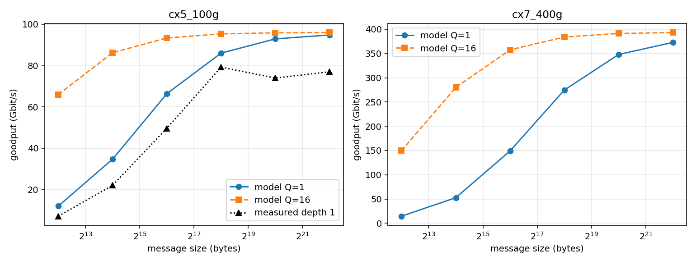
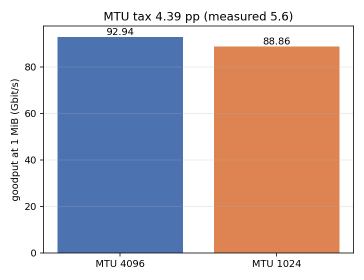
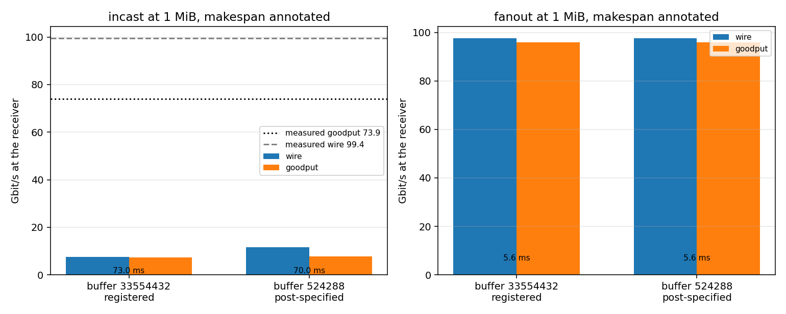

# CX-5 message-size calibration: results against pre-registered expectations

Run of 2026-09-01, one `run_cx5.py` invocation (19 check rows in
`summary.csv`, plus `latency.csv`, `msg.csv`, `mtu.csv` and `incast.csv`).
Registrations are in [expectations.md](expectations.md), frozen in commit
`1dc6eb8` before any run of this study; the profile the flags are rendered
from landed in `8b9deaf`. Disclosure: that freeze commit was amended after the
run to spell the ASCII plus-minus sign as words and to rewrap three lines,
because the repository's path-portability check reads that glyph as a
filesystem path. No band, value, check or sweep entry changed, and the
committed text is the text every number below was scored against. Binary:
`htsim_dcqcn_atlahs` at htsim `1dcbfec` with `txt2bin` from the same build.
Raw artifacts, including the per-run completion CSVs and sender state traces,
stay outside Git under `SIMLLM_DATA_ROOT`; the curated per-experiment CSVs are
committed next to this file.

Verdict: **9 of 12 scored checks pass. All eight M-checks that could run pass,
so the retuned configuration is self-consistent; three of the four scored
T-checks fail, and three registered cells are void on a fatal configuration
guard. One FAIL was registered as expected (T1), one failed in the opposite
direction to its registration (T4), one was registered as a PASS and is the
study's real surprise (T5), and one registered expected FAIL passed for a
reason that confirms rather than weakens the underlying finding (T2). Nothing
here is a simulator defect. The headline is a structural boundary: the packet
path can be configured to the measured latency floor or to the measured
message offset but not to both, and it converts incast loss into 67 ms latency
stalls where the hardware converts it into a 26 percent bandwidth tax.**

## E-MSG: message size vs goodput, both profiles

- **M1 PASS**: every Q = 1 point of both profiles sits within **0.02 percent**
  of its own profile's fitted fixed-offset law, against a registered
  10 percent band. The worst cell is `cx7_400g` at 64 KiB. After the retune
  the comparator is still exactly a fixed-offset law.
- **M2 PASS, both profiles**: the fitted `C` is **95.485 Gb/s** against a
  rendered link rate of 97 Gb/s (ratio 0.9844) for `cx5_100g`, and
  **381.938 Gb/s** against 388 Gb/s (ratio 0.9844) for `cx7_400g`, inside the
  registered 3 percent band. The 1.56 percent shortfall is exactly the 64 B
  wire header on a 4096 B packet, as registered. The 4 MiB Q = 1 points that
  anchor the fits are 94.834 and 372.844 Gb/s.
- **M3 PASS**: the 2 B message completes in **2.0813 us** against the measured
  2.08 us floor, a ratio of 1.0006 inside the registered 15 percent band. The
  515 ns per hop was derived from the route construction before the freeze and
  predicted 2.0814 us; the run reproduces that to four digits, which is the
  evidence that the hop-count derivation in the registration is the right one.
- **M4 PASS**: `cx7_400g`'s fitted `C` is **4.00x** `cx5_100g`'s, exactly, and
  its fitted `T_eff` is **2.143 us** against 2.409 us, a ratio of 0.8895
  inside the registered 15 percent band. The 11 percent difference is the
  registered one: only the propagation half of the offset is rate-independent.
  Scaling therefore does produce the same curve four times faster, which is
  what "the same architecture at a higher rate" has to mean for this path.
- **T1 FAIL, as registered**: the fitted `T_eff` is **2.409 us** against the
  measured 4.48 us, a ratio of **0.538**. This is the study's headline. The
  offset in this path is entirely topology, and the topology was calibrated to
  the other measured anchor, the 2.08 us latency floor. The two cannot both be
  held: reaching 4.48 us needs about 1120 ns per hop, which would put the 2 B
  floor at 4.5 us, more than twice the measured value. Nothing in the flag
  vector can separate them, because the model charges no per-message endpoint
  cost. This is BACK-54's whole content, and the number to beat.
- **T2 PASS, registered as an expected FAIL**: the modeled Q = 16 to Q = 1
  ratio at 64 KiB is **1.407** against the measured send-queue-depth ratio of
  1.573, inside the registered 20 percent band. It passes for a reason that
  confirms the registration's mechanism rather than refuting it: the companion
  diagnostic registered alongside it shows the Q = 16 aggregate at 64 KiB
  matching the Q = 1 point at 16 x 64 KiB to **0.5 percent**, so sixteen
  concurrent messages behave exactly like one message of sixteen times the
  size and the per-message cost is measurably zero. The band was simply wide
  enough for the law's own 64 KiB to 1 MiB ratio to land near the hardware's
  depth ratio at this one size. The registered prediction that the modeled
  ratio keeps rising with Q instead of saturating against a separate ceiling
  is unaffected, and HTSIM-34 still owns it.
- **T3 reported, no bar**: the `cx5_100g` Q = 1 curve sits **above** the
  measured depth-1 rows at every size, as registered, with ratios
  1.69, 1.58, 1.34, 1.09, 1.26, 1.23 from 4 KiB to 4 MiB. Median over the four
  like-for-like sizes at or below 256 KiB: **1.46**. The gap closes as the
  message grows, which is the signature of an offset that is too small: at
  4 KiB the model is 11.9 Gb/s against 7.04 measured, at 256 KiB 86.0 against
  79.2. The 1 MiB and 4 MiB measured rows (73.95 and 77.03 Gb/s) sit in the
  loss equilibrium the comparator has no mechanism to enter, so their ratios
  are not a calibration signal; the plot shows the measured curve turning down
  there while the model keeps climbing.

## E-MTU: MTU tax at 1 MiB

- **M5 PASS**: 92.936 Gb/s at MTU 4096 against 88.859 Gb/s at MTU 1024, a tax
  of **4.39 percentage points** against the measured 5.6, inside the
  registered 2 point band. The arithmetic prediction in the registration was
  4.4 points, so the model hit its own prediction to two digits. This is the
  one measured axis the configuration reproduces for the right reason: the
  header fraction is expressed directly, and nothing else is involved.

## E-INCAST: 2 to 1 fan-in and 1 to 2 fan-out at 1 MiB

Three registered cells are void. The comparator's configuration guard
requires the switch egress buffer to exceed `ecn_kmax_bytes`, and the
registered small-buffer arm pairs a 262016 B buffer with the registered
409600 B Kmax, so **the arm cannot be configured at all**: `M8`,
`T4-b262016` and `T5-b262016` are void rather than failed, and the run is not
charged for them. This is a registration slip, caught by the runtime and not
by the freeze: the measured ConnectX-5 lossy pool is smaller than the ECN
Kmax the 100 G vendor row declares, so the two cannot be combined in this
comparator. A post-specified diagnostic arm at 524288 B, the smallest round
buffer above the registered Kmax, is reported below and is scored nowhere.

- **M6 PASS**: the two senders' shares of delivered goodput are **50.000 /
  50.000** in every runnable 2 to 1 cell, all three seeds, against the
  registered 2 point band and the measured 50.4 / 49.6.
- **M7 PASS**: the 1 to 2 fan-out delivers **95.995 Gb/s** aggregate,
  **1.0013x** the E-MSG Q = 16 reference of 95.866 Gb/s at 1 MiB against a
  registered floor of 0.95, splits **50.000 / 50.000**, and has **zero** drops
  and **zero** retransmissions in every cell and seed.
  Measured: 97.83 Gb/s, 50.000 / 50.000, every counter still. Fan-out is free
  in the model exactly as it is on the wire.
- **M8 VOID**: see above.
- **T4 FAIL, in the opposite direction to its registration**: the 2 to 1
  receiver goodput is **7.351 Gb/s** against the measured 73.9, a ratio of
  **0.0995**. The registration predicted a FAIL because the model would be
  too high; it is ten times too low instead.
- **T5 FAIL, the registered surprise**: the receiver wire rate is
  **7.55 Gb/s**, **7.78 percent** of the rendered link rate, against the
  measured 99.4 percent and a registered expectation of PASS. The registered
  reasoning was that a saturated fan-in keeps the bottleneck link busy whether
  or not the bytes are useful. It does not, and the reason is the same one
  behind T4.

### Why the fan-in collapses instead of paying a tax

The mechanism is in the counters, not in the goodput. A 2 to 1 episode moves
64 MiB and should take 5.6 ms; the simulated makespan is **73.0 ms**, and the
median flow completion is **73.0 ms** as well, so this is not a tail: every
flow finishes after one **67 ms silent retransmission timeout**. The run
records **38 silent RTOs against 13 go-back-N NACKs**, and **179
retransmitted packets against 16704 sent**, or 1.06 percent of the wire.

The reason the timeout path dominates is structural. Each GOAL message is its
own flow with no state shared with any other, so with 64 concurrent messages
each one holds only a few packets in flight. A drop is then usually the last
outstanding packet of that flow, nothing follows it to arrive out of order at
the receiver, no NACK is generated, and the sender waits the full timeout. The
hardware, running the same 67 ms local ACK timeout, keeps a deep per-QP
pipeline behind every loss and so almost always recovers by retransmission
instead. That is the difference between a 26 percent bandwidth tax and a
tenfold latency collapse, and it is owned jointly by HTSIM-34 (no finite
outstanding work, so a per-message flow has no window to speak of) and the
already-open HTSIM-5 (no per-QP state across messages).

### The amplification identity, on both sides

The literal registered identity `goodput_tax = loss_rate x message_bytes /
packet_bytes` does not hold anywhere, and the registration said so with the
arithmetic: at 1 MiB and 4096 B packets that factor is 256, so the measured
1.65 percent loss would predict a goodput tax above 100 percent against a
measured 25.7 percent. The measured implied amplification is **15.6 packets
of waste per lost packet**. The model's, at the post-specified 524288 B arm,
is **0.48**, with **0.46 retransmitted packets per drop**. The comparator
re-sends about half a packet per loss where the hardware re-sends about
sixteen, a factor of thirty-three, and it pays for the difference in timeouts
instead. The registered substitute band was a factor of two; the model misses
it by an order of magnitude, in the direction the registration named.

### Disclosed deviation from a registered definition

The registration defined delivered wire bytes as offered minus dropped at
4096 B each. That estimator is unsound and was replaced before any number was
read off it. `ns_tm3_dropped_packets` is switch-wide and counts control
packets: the large-buffer cell reports **316 drops against 179
retransmissions** while all 64 flows complete, which is arithmetically
impossible if every drop were a data packet. The reported wire rate is
instead the upper bound consistent with the counters, all payload-carrying
packets plus every retransmitted duplicate, with the lower bound carried
beside it in `incast.csv` as `wire_gbps_lower`. Both bounds are far below the
measured 99.4 percent, so the T5 verdict does not depend on the choice. The
same accounting puts the fan-out aggregate at 97.52 Gb/s against a 97 Gb/s
egress link, a 0.5 percent overshoot that is this estimator's tolerance on a
makespan that excludes some pipeline overlap.

## What the configuration buys, and what it does not

Landed by configuration alone, with evidence: the link rate and its 4 MiB
asymptote, the packetization and its MTU tax, the latency floor, fair sharing
under fan-in, free fan-out, and a ConnectX-7 arm that is the ConnectX-5 curve
scaled by four with the same offset. Not landed, with the numbers that say so:
the message offset (2.41 us against 4.48), the send-queue-depth law (perfect
amortization against a measured 1.57x at 64 KiB that saturates), and the loss
regime (a tenfold latency collapse against a 26 percent bandwidth tax). Those
three are BACK-54, HTSIM-34 and HTSIM-35 respectively, and the packet-rate
ceiling that HTSIM-36 owns was not exercised here at all.

Two process notes for the next registration in this series. A frozen sweep
value can be refused by the runtime rather than merely missed, so a freeze
should state which guards its arms have to clear; here the measured port
buffer and the declared ECN Kmax were individually defensible and jointly
inexpressible. And an episode has to be long against the timeouts it can
trigger: 32 messages per sender is 5.6 ms of work against a 67 ms retransmit
timeout, so the registered goodput metric measured one stall rather than a
congestion response, and the completion distribution reported beside it is
what shows that.
