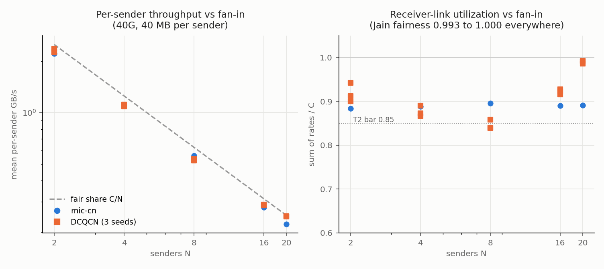
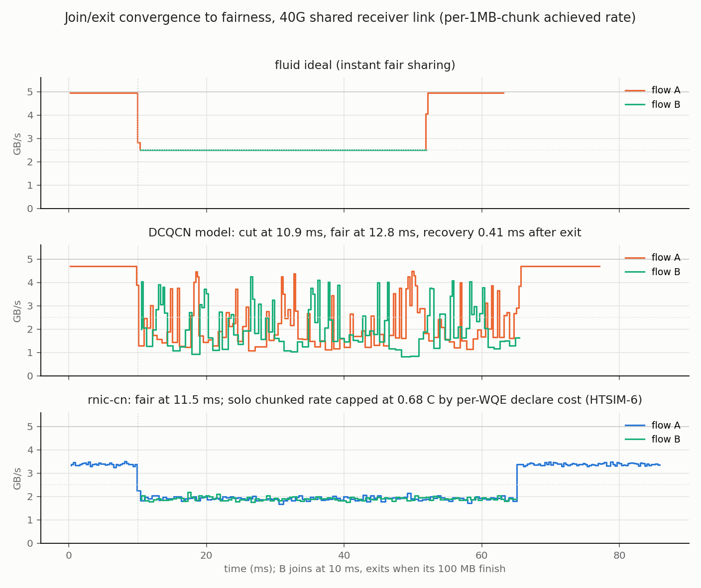
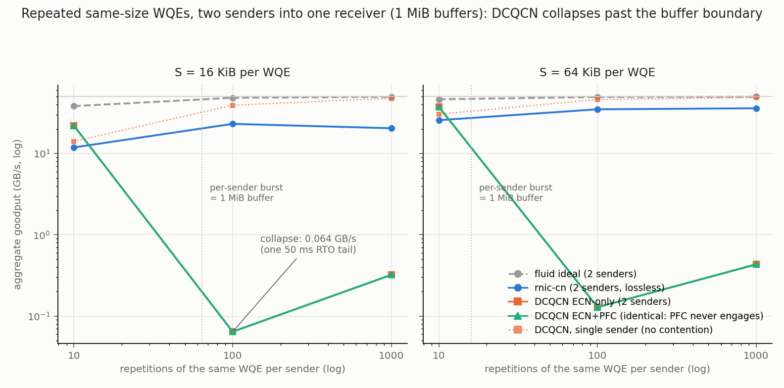

# DCQCN micro-behavior validation: results against pre-registered expectations

Runs of 2026-08-05, one `run_micro.py` invocation (9 check rows in
`summary.csv`; `msg.csv`, `incast.csv` and `join-*.csv` rate series).
Those artifacts remain outside Git in the machine-local directory used for
the historical run; its resolved historical path is intentionally omitted. New runs
default to `${SIMLLM_DATA_ROOT}/dcqcn_micro`. Binaries: `htsim_rnic` and
`htsim_dcqcn_atlahs` at `c03e1f2`; DCQCN runs use the binary's default
ECN/buffer settings (recorded caveat: those defaults are not rescaled
for the 40G experiments). The registered predictions are in
[expectations.md](expectations.md), frozen before the first run and
untouched since; the harness's M6 lower bound was found transcribed as
0.0005 ms against the registered 0.5 ms and fixed before any verdict was
published (the deterministic rerun is bit-identical).

Verdict: **5 of 9 registered checks pass; the 4 FAILs split into two
registration slips (M2, M7's recovery threshold), one band-setting slip
that is also a genuine calibration signal (M6), and one marginal
calibration gap (T2). None is a simulator defect; every FAIL feeds the
HTSIM-5/HTSIM-6 calibration record.** The objectivity conclusion the
study was commissioned for, in its review-corrected form: the comparator
reproduces DCQCN's qualitative micro-behaviors (ECN cut on join,
near-C/N incast sharing at excellent fairness, oscillation around the
fair share), its post-congestion timer behavior is faster and more
forgiving than paper or vendor DCQCN (which biases the collective
comparisons in DCQCN's favor on that axis), and its message-size curve
undershoots the real-NIC anchors at 64 to 256 KB (a deviation whose
direction in the dcqcn/cn ratios is not established here). The full
per-axis accounting is in the closing section.

## E-MSG (400G)

- M1 PASS: the DCQCN Q=1 curve follows the fixed-offset law
  B = S/(8.3 us + S/C) within 10 percent at every size.
- M2 FAIL, registration arithmetic ledger: the frozen bar compared the
  Q=16 aggregate at message size S against the 4 MB single-flow
  asymptote, but 16 concurrent WQEs behave exactly like one flow of 16S
  (measured: Q=16 at 64 KB gives 35.46 GB/s, and Q=1 at 1 MB gives
  35.48), so the correct reference is the law at the aggregate size,
  which the measurement matches. The spirit of the claim (the offset is
  paid once and amortizes perfectly across concurrent WQEs, i.e. the
  current model has no per-WQE cost) is what the data shows; the
  registered formula was wrong. Third registration-arithmetic slip in
  this study series; the M1-F3 ledger discipline stands.
- T1: the registered prediction was a mismatch with the UCCL anchors,
  and it is confirmed. Review-corrected reading: the model sits at or
  below EVERY anchor (0.99x at 32 KB via the verified aggregate law,
  0.79x at 64 KB, about 0.85x at 128 KB and 0.90x at 256 KB), with a
  flatter shape than the anchors: its only small-message cost is
  topology serialization paid once per batch, where real NICs pay
  per-WQE host costs that 16 in-flight WQEs only partly hide. The A2
  law straddles the anchors (about 19 percent above at 32 KB, 6 to 11
  percent below at 64 to 256 KB) rather than upper-bounding them as
  the first draft claimed; it remains the HTSIM-5 calibration target
  with the digitization band as its tolerance.

## E-INC (40G, the DCQCN paper's regime)

- M3 PASS: Jain fairness 0.9928 to 1.0000 across every N, engine and
  seed; the per-sender throughput tracks C/N across the full decade
  (left figure), matching the DCQCN paper's Figure 8 equal-share
  result.
- M4 PASS: mean per-sender throughput within [0.84, 0.99] x C/N at
  every cell (review correction: the first draft understated the upper
  end; the N=20 DCQCN cells reach 0.99), inside the registered band.
- T2 FAIL (marginal): minimum DCQCN utilization 0.839 at N=8 against
  the registered 0.85 bar. The utilization curve is N-shaped (0.90 to
  0.94 at N=2, dipping to 0.84 at N=8, rising to 0.99 at N=20), which
  is a marking-threshold artifact: the binary's default ECN thresholds
  are not rescaled for the 40G link, so mid fan-in oscillates deepest.
  The threshold attribution is confirmed at the source level (the
  binary's ECN defaults are fixed bytes independent of the link rate:
  Kmin 64 KB, Kmax 640 KB, Pmax 0.25, against the paper's 40 KB with
  Pmax 1 at 40G), though the N-shape mechanism itself is inferred, not
  queue-trace established. Review metric caveat: the registered
  sum-of-rates metric inflates when FCTs spread, so the N=20 reading of
  0.99 corresponds to an episode utilization (total bytes over C times
  the last FCT) of 0.92 to 0.93; the N=8 dip is real in both metrics.
  Calibration evidence for HTSIM-5 (threshold scaling belongs to the
  same parameter work); a 1.3 percent miss, not a collapse.

## E-JOIN (40G, the paper Figure 10 analog)

- M5 PASS: after B joins at 10 ms, A's rate is cut below 0.65 C within
  0.92 ms, and fairness is reached at 12.8 ms under the harness bar,
  inside the registered 40 ms deadline. Review disclosures: (1) the
  harness's fairness tolerance diverged from the registered wording
  (raw A samples within 20 percent of link capacity, instead of
  smoothed rates within 20 percent of each other); under defensible
  readings of the registered wording the fairness time ranges from
  1.35 ms (3-chunk-smoothed A vs B's windowed mean) to 33 ms (strict
  raw samples within 20 percent of B), all inside the 50 ms deadline,
  so the verdict is robust but the first draft's "2.8 ms, 7 to 10x
  faster than the paper" headline does not survive the strict reading,
  which lands inside the paper's own 20 to 40 ms band (itself a plot
  digitization, and confounded: the paper traces a persistent flow
  while this probe restarts per chunk, and the marking configs
  differ). (2) "fairness" is convergence in the mean only: per-chunk
  rates oscillate between about 1 and 4.5 GB/s around the 2.5 fair
  share for the entire coexistence (middle figure), the classic DCQCN
  oscillation, never settling the way the paper's fluid model does.
  (3) The review located the actual mechanisms in the backend source:
  the comparator's additive increase is R_AI = C/20 with hyper
  increase C/10 (dcqcn.cpp:48-49), 50x the paper's fixed 40 Mbps at
  40G, and every send op constructs a fresh DCQCN source at line rate
  with no cross-WQE QP rate state (dcqcn_atlahs_runtime.cpp:398), so
  chunked streams restart at line rate every chunk. Both are now
  HTSIM-5 work items with these citations.
- M6 FAIL: post-exit recovery took 0.41 ms, below the registered lower
  band edge of 0.5 ms. With the review's source finding, the primary
  cause is not aggressive recovery machinery but the per-chunk
  line-rate restart (each chunk is a fresh flow, so "recovery" is the
  next chunk starting unthrottled); the R_AI = C/20 increase makes any
  genuine recovery fast as well. Either way the comparator's
  post-congestion behavior is faster than paper or vendor DCQCN, so
  the timer axis of the collective comparisons is generous to DCQCN.
- M7 FAIL, in two unequal halves. Fairness: cn reaches fairness 1.48 ms
  after the join (the registered claim is 2 windowed RTTs; the harness
  enforces a 2 ms operational ceiling that generously upper-bounds it,
  disclosed as weaker than the registered wording) and holds it with no
  oscillation whatsoever (bottom figure), the deterministic-ledger
  contrast the check wanted. Recovery: the 0.9 C threshold is
  structurally unreachable, a registration slip on two counts: cn paces
  at a 0.9 C basis by design, and, more importantly, cn's solo chunked
  stream only reaches 3.39 GB/s = 0.68 C on this schedule because every
  1 MB chunk is a fresh WQE paying the full declare cost at 40G. Under
  the corrected lens (recovery to its own pre-join steady rate) cn
  recovers immediately: the first post-exit chunk is back at the
  steady band (post-exit peak 3.49 vs pre-join mean 3.39). The 0.68 C
  ceiling is the direct measurement of what HTSIM-6 (same-destination
  link-table reuse plus 1 RTT WQE-queue pre-declaration) exists to
  remove, and the acceptance bar for that landing should be this exact
  probe: cn solo chunked rate rising from 0.68 C toward the 0.94 C the
  DCQCN model achieves on the identical schedule.

## Objectivity statement

The maintainer's criterion for this study was: if the micro plots match
the papers, the collective-pattern comparisons are objective. Measured:
the comparator matches the papers' qualitative structure (no slow
start, ECN-driven cut on join, fair sharing under incast at Jain >=
0.99, oscillation around the fair share). The quantitative deviations
split by direction (review-corrected): on the timer/recovery axis the
comparator is faster and more forgiving than paper or vendor DCQCN
(R_AI = C/20, per-WQE line-rate restart, sub-millisecond
post-congestion behavior), which biases the collective comparisons in
DCQCN's favor on that axis; on the message-size axis the model
undershoots the real-NIC no-loss anchors at 64 to 256 KB in absolute
terms, and since rnic-cn carries an even larger per-batch offset
(11 us vs 8.3 us), the direction of that deviation in the dcqcn/cn
RATIOS of the collective studies is not established here. The honest
summary: qualitative structure validated, every quantitative gap
catalogued with its mechanism and citation, and the HTSIM-5 parameter
sets (A2 fixed latency, D1 to D3 ramps, threshold rescaling, per-QP
persistent rate state) are the closure path, with this study's tables
as their frozen anchors.

## Addendum (2026-08-05): repeated-WQE streams, single-pair and contended

Registrations: [expectations-rep.md](expectations-rep.md) (single-pair
grid, frozen before its first run) and
[expectations-rep2.md](expectations-rep2.md) (contended grid, frozen
before its own first run and motivated by the single-pair grid's
mechanism finding). Data in rep.csv, rep2.csv and rep-summary.csv /
rep2-summary.csv under the same runs directory. Process note: the
single-pair grid's first invocation piped its output through a filter
that swallowed a crash traceback and reported a false success; the rule
adopted is that background runs are never stderr-filtered, and the
harness was made timeout-tolerant before the full rerun.

### Addendum 1: single-pair repetition (3 of 8 checks pass)

The registered premise failed in an instructive way: a single source
can never inject faster than its own access link, so same-pair
repetition alone produces no congestion anywhere in this topology
model. P1 and the cn determinism check pass; P5 passes but its premise
(an RTO tail to amortize) never materialized, the observed monotonicity
is plain fixed-offset amortization. The FAILs:

- P4 and P6 (the finding): zero drops and zero pauses in every cell,
  including 10,000 x 64 KiB; DCQCN holds 39 to 49 GB/s throughout. The
  overflow the maintainer asked for requires convergence, which is what
  addendum 2 registers.
- P3, registration slip: the within-25-percent-of-fluid bar ignored
  that at a 160 KiB aggregate the engines' different fixed offsets
  dominate (DCQCN 14.1 vs fluid 31.0 GB/s at n = 10, zero congestion
  events); the no-drops half of the check held.
- P2, two causes: the 10k cn cells are unmeasured, rnic-cn makes no
  visible progress on 10,000 simultaneous same-pair flows within a
  600 s budget (now HTSIM-7); and the measured band was violated at
  16 KiB (cn 0.36 to 0.42 C), because cn's control cost scales with
  flow count rather than bytes, which the registered floor mis-derived.
  Zero recovery events everywhere cn ran.
- P7, substantive reversal: with no congestion present, DCQCN (39 to
  49 GB/s) beats cn (17.8 to 36.4), the uncontended-boundary result of
  the earlier studies appearing again at stream scale.

### Addendum 2: contended repetition, the collapse (4 of 7 checks pass)

Two same-leaf senders stream n repeated WQEs into one receiver: 2 C
offered into a C bottleneck for the burst duration.

| S | n | fluid | rnic-cn | DCQCN ECN-only | DCQCN ECN+PFC |
|---|---|---|---|---|---|
| 16 KiB | 10 | 38.3 | 11.9 | 21.9 | 21.9 |
| 16 KiB | 100 | 48.5 | 23.2 | **0.064** | **0.064** |
| 16 KiB | 1000 | 49.8 | 20.5 | 0.32 | 0.32 |
| 64 KiB | 10 | 46.5 | 25.7 | 37.6 | 37.6 |
| 64 KiB | 100 | 49.6 | 35.0 | **0.128** | **0.128** |
| 64 KiB | 1000 | 50.0 | 36.0 | 0.43 | 0.43 |

(GB/s, aggregate; DCQCN seed 1, seed 2 agrees to three digits.)

- Q4 PASS, the headline: every overflow cell drops (449 to 80,279
  packets plus 116 to 3,752 silent RTOs) and the n = 100 goodput is
  0.064 / 0.128 GB/s = 0.0013 / 0.0026 C, matching the registered RTO
  derivation (3.2 MB over one 50 ms tail = 0.064 GB/s) to the digit.
  The maintainer's predicted collapse beyond about 100 repetitions is
  measured exactly.
- Q6 PASS: rnic-cn beats the better DCQCN mode by 84 to 360x at the
  overflow cells while staying lossless (zero recovery counters), and
  Q1/Q3 PASS (fluid at line rate, absorbed cells clean).
- Q2 FAIL, band only: cn is lossless and complete everywhere, but at
  0.41 to 0.46 C (16 KiB) and 0.70 to 0.72 C (64 KiB) against the
  registered 0.75 floor: the per-flow declare cost again, now
  quantified under contention. These are direct HTSIM-6 acceptance
  anchors (queue lookahead should lift the 16 KiB stream toward the
  64 KiB one and both toward the 0.9 C basis).
- Q5 FAIL, a finding: PFC never engages. The ECN+PFC runs are
  bit-identical to ECN-only including their drops; at this
  buffer/threshold configuration (1 MiB shared pool, fixed-byte ECN
  defaults) the pause threshold is never reached before shared-pool
  drops, so the "lossless" mode loses packets. Threshold-interplay
  evidence for the HTSIM-5 parameter work.
- Q7 FAIL, registered escape hatch invoked: goodput heals with stream
  length (0.32 vs 0.064 at 16 KiB, a 5x rise where the bar allowed
  2x). Drops do recur throughout the stream (13,852 at n = 1000
  against 585 at n = 100), so the renewal premise was half right, but
  the fixed RTO tail amortizes over the longer stream and dominates
  the goodput arithmetic. The registered fallback reading applies:
  recovery amortization, not overload healing.

### Interpretation

Under the maintainer's WQE-as-new-flow premise (which this comparator
implements literally), repeated small WQEs across any converging
bottleneck collapse DCQCN by two to three orders of magnitude while
rnic-cn stays lossless at its control-cost-limited rate, and the
single-sender case shows the collapse is a property of convergence,
not of repetition itself. The interpretation boundary registered in
expectations-rep2.md stands: a real single-QP hardware stream would
settle near the fair share instead, so this axis is harsher than
hardware for same-pair streams; choosing the semantics (per-WQE
restart vs per-QP state, and where between them mlx5 sits) is the
HTSIM-5 decision, now bracketed by measurements on both sides.
