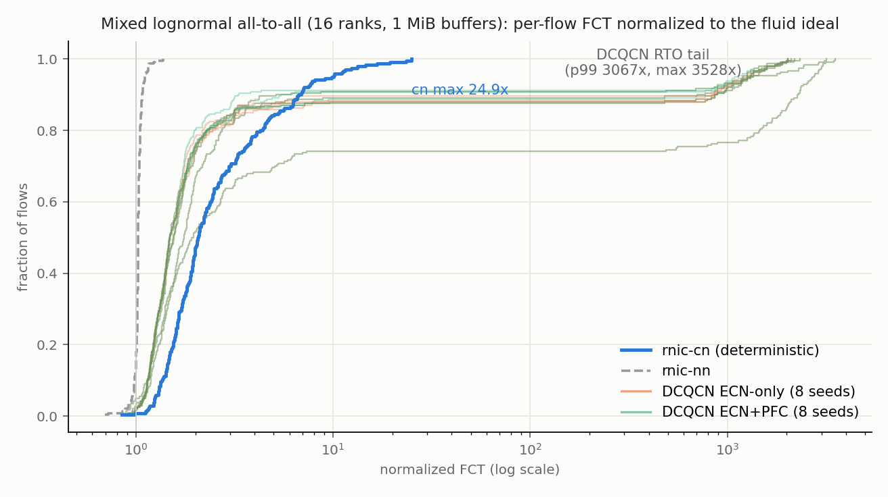
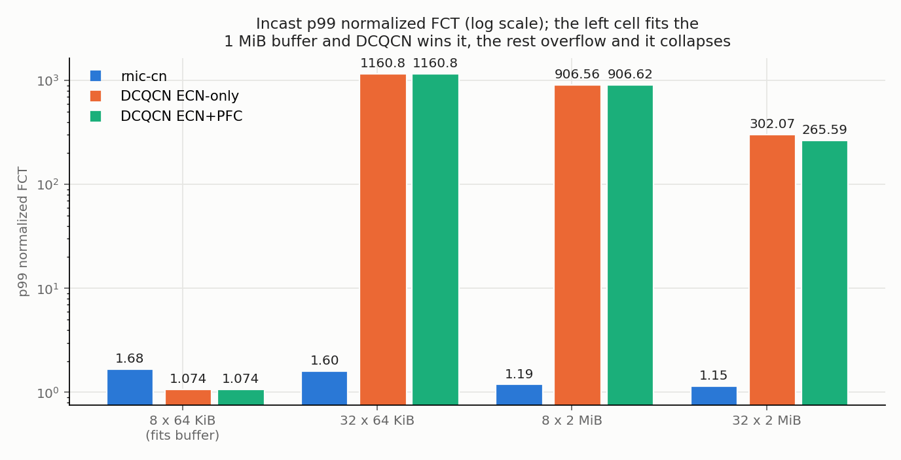
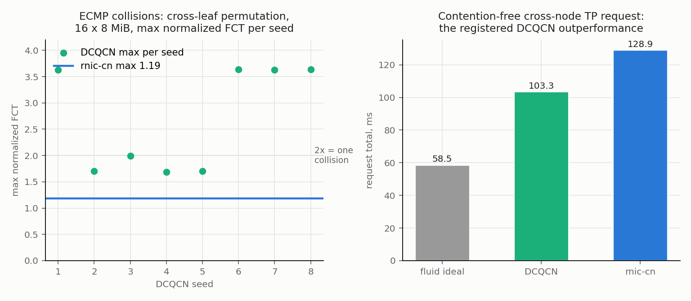

# DCQCN vs rnic-cn: results against pre-registered expectations

Runs of 2026-08-04, one `run_study.py` invocation (23 check rows in
`summary.csv`, per-flow distributions in `distributions.csv`, request
totals in `tp_totals.csv`, per-run mechanism counters in `counters.csv`,
raw GOALs and completion CSVs). Those artifacts remain outside Git in the
machine-local directory used for the historical run; its resolved historical path is
intentionally omitted. New runs default to
`${SIMLLM_DATA_ROOT}/dcqcn_vs_cn`. Binaries `htsim_rnic` and
`htsim_dcqcn_atlahs` came from a machine-local HTSIM-rnic-private build pinned
at `c03e1f2`; its resolved historical build path is intentionally omitted. Current
reproductions select the build root with `SIMLLM_HTSIM_BUILD`. The simllm
code revision is the commit this study lands in (it uses the M5
`render_step_goal`). The registered
predictions are in [expectations.md](expectations.md), frozen at the
first simulation run (R5 was added before that point, as its section
states); deviations are disclosed here, never edited there.

External review note: an independent reviewer reproduced every table
number bit for bit from the raw CSVs, re-ran archived GOALs to recover
counters, and found one harness defect plus several disclosure gaps, all
folded here. The defect: the first draft's cn-recovery counter keys were
phantom names matching nothing (the same bug class the merged cn_ladder
study once fixed), so the "cn reports zero recovery" checks were vacuous
as executed even though the reviewer's own re-runs confirmed the claim
physically. The keys are fixed, the study rerun (bit-identical results,
the backends are deterministic), and every run's manifest counters are
now persisted in `counters.csv`: all rnic-cn recovery counters are zero
in every cell, now checked for real.

Verdict: **18 of the 20 checked rows pass (the other 3 of the 23
summary rows are registered report-only); the two FAILs are one finding
appearing in both DCQCN modes: a registration slip in which DCQCN
outperforms where the registration universally predicted it worse,
ledgered below.**

## R1: incast

| cell | cn p99 | DCQCN p99 (worst seed, ECN-only / ECN+PFC) | verdict |
|---|---|---|---|
| 8 x 64 KiB | 1.68 | 1.07 / 1.07 | **FAIL** (both modes), ledger below |
| 32 x 64 KiB | 1.60 | 1160.8 / 1160.8 | PASS |
| 8 x 2 MiB | 1.19 | 906.6 / 906.6 | PASS |
| 32 x 2 MiB | 1.15 | 302.1 / 265.6 | PASS |

Mechanism signatures (counters.csv): at 32 x 2 MiB ECN-only every seed
drops packets (59,954 to 64,998) and in ECN+PFC mode every seed emits
pause frames (67 to 75); rnic-cn's recovery counters are zero in every
cell. R1b and R1c PASS.

Ledger for the 8 x 64 KiB FAIL: the registered R1a claimed DCQCN worse
in every incast cell; the mechanism boundary is the switch buffer.
8 x 64 KiB = 512 KB fits inside the 1 MiB shared buffer, so the incast
is absorbed: no drop, no pause, and only 8 ECN marks (review
correction: marks did occur, and they are what lifts the DCQCN max in
that cell to 1.34 over its 1.07 median, a stray CNP rate cut on an
otherwise uncongested run). Store-and-forward DCQCN with no protocol
overhead lands near ideal while rnic-cn pays its control overhead on
sub-BDP flows (1.68, the known corner regime). Every cell whose
aggregate exceeds the buffer collapses DCQCN by two to three orders of
magnitude. The corrected claim for future studies: DCQCN loses incast
whenever the aggregate exceeds the buffer; whether serving incasts
always do is a domain judgment imported from outside this study, not
something these four scenarios measure. The registration slip is the
word "every"; expectations.md is left untouched.

## R2: ECMP collision

- R2a PASS: rnic-cn is bit-deterministic across repeated runs and its
  max normalized FCT is 1.185 (per-packet spraying, no collision
  possible).
- R2b PASS as registered: 7 of 8 seeds exceed the frozen 1.7 bar and
  the ensemble max 3.64 dwarfs cn's 1.185. Two ledger corrections from
  the review, both about interpretation, not the verdict:
  1. The registration's collision-probability model miscounted. Both
     flows of a pair share the same source leaf and the same destination
     leaf, so "shared uplink" and "shared spine downlink" are one event
     (both picking the same spine), probability 1/8 per pair over 8
     pairs: P(any collision) = 1 - (7/8)^8, about 0.66, not the
     registered 0.88 from 16 double-counted opportunities.
  2. The counter evidence separates two populations the 1.7 bar
     conflates. The four seeds near 3.6 carry 203 to 229 ECN marks
     (sustained collision queues plus CNP rate cuts that outlast the
     collision; a three-way collision is topologically impossible here,
     and drops and pauses are zero); the 1.68 to 1.99 band carries only
     9 to 17 marks, the profile of sporadic single-mark rate cuts on
     transient queues, on both sides of the bar. So the unambiguous
     collision count is 4 of 8 (consistent with the corrected 0.66
     model; 7 of 8 was an artifact of the bar sweeping the sporadic
     population in). The sporadic population is itself a reportable
     DCQCN pathology: isolated marks halving an uncontended flow's
     rate, no collision required.

## R3: mixed lognormal all-to-all (the established operating point)

- R3a PASS (both modes): DCQCN ensemble p99 3066.6x vs cn 16.6x (184x
  worse) and max 3527.5x vs cn 24.9x (141x worse). The ensemble max
  reproduces the merged cn_ladder study (about 3528x); the p99 does not
  reproduce digit for digit (3067 here vs 1902 there, a different seed
  ensemble), and the registered 10x/20x bars hold either way with an
  order of magnitude to spare.
- R3b PASS: every ECN-only seed shows loss recovery (1,871 to 2,774
  drops plus silent RTOs); rnic-cn recovery counters are zero (checked
  for real after the key fix).
- R3c (report only, as registered): the DCQCN median 1.519 beats the cn
  median 2.062, unchanged from the merged study. The stranded tail is
  the price: 9 to 13 percent of flows past 100x in seven seeds and 25.8
  percent in the worst seed (its 0.74 plateau is the visible flat line
  in the CDF figure).

Two disclosures the review required: several ECN-only and ECN+PFC runs
are bit-identical (all 64 KiB incast pairs; a2a seeds 1, 4 and 5,
including the worst seed that supplies both modes' headline numbers)
because PFC at these thresholds barely engages: zero pause frames in
ECMP and the 64 KiB incasts, 0 to 7 in a2a against 2,000+ drops (the
"lossless" mode is not lossless here), and meaningful pausing only at
32 x 2 MiB. And the tail magnitudes are quantized by the comparator's
50 ms silent-RTO constant (`silent_loss_rto_ps`): the 1160.8 cell is
essentially every flow sitting out one RTO over a 43 us ideal FCT, and
the 3527.5 max is one RTO over a small flow's ideal, so these headline
ratios scale directly with that config constant.

## R4: contention-free cross-node TP request (the registered win)

- R4a PASS: DCQCN 103.35 ms < rnic-cn 128.88 ms, both above the fluid
  ideal 58.53 ms, and the DCQCN seed spread is exactly 0. The review
  strengthened the argument from empirical to structural: the
  unidirectional ring over one rank per leaf gives every round pairwise
  distinct source leaves and destination leaves, so no two flows can
  share a link under any spine assignment; there is nothing for ECMP to
  decide and nothing to congest, so DCQCN pays only store-and-forward
  while cn pays its deterministic per-round control overhead.
- R4b PASS: cn bit-deterministic.

## R5: the maintainer's large-flow calibration rule

- R5a PASS: ECMP permutation (16 x 8 MiB), cn JCT / nn JCT = 1.166
  (bar 1.25).
- R5b PASS: 2 MiB incasts, cn p99 / nn p99 = 1.174 (fan 8) and 1.132
  (fan 32).
- R5c (report only): a2a16 cn p99 / nn p99 = 14.28. The lognormal's
  sub-BDP tail is the known cn corner regime (the slot-calendar backlog
  recorded in examples/cn_ladder/RESULTS.md and the htsim algorithm
  book); the rule's scope, flows at or above BDP, holds with margin and
  nothing needed debugging.

## Reading of the whole study

rnic-cn buys determinism: identical results across runs, zero recovery
events everywhere (now verified through real counters), a bounded
factor over ideal in every scenario (worst observed here: 24.9x on the
sub-BDP a2a tail, 1.19x on large flows). DCQCN's envelope is unbounded
in both directions: it undercuts cn wherever the network is not
actually stressed (buffer-absorbed incast, contention-free serial
rings, the a2a median) and detonates wherever it is (up to 1160x p99 on
buffer-exceeding incast, collision-plus-rate-cut inflation to 3.6x on
ECMP, 3528x max with a quarter of flows stranded in the worst a2a
seed). Treating the stressed cases as the serving operating regime is a
domain judgment this study inherits from the roadmap rather than
measures; within the four scenarios, the answer to "is DCQCN worse in
all cases" is: no at the uncontended boundary, and catastrophically yes
everywhere the network is actually exercised.
