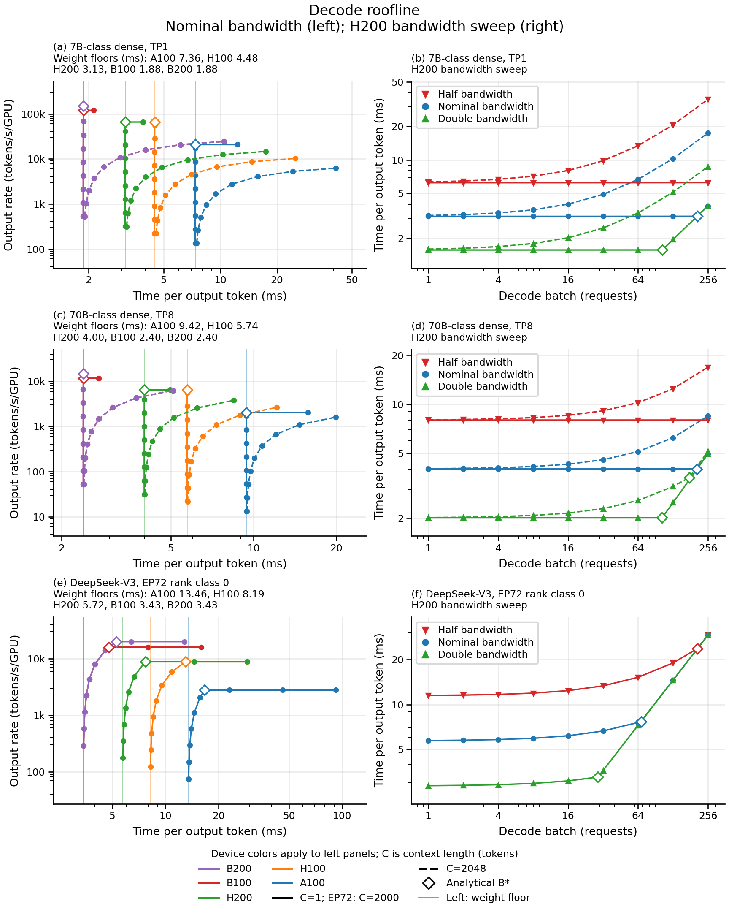

# Decode HBM crossover v1 results

What ran: the installed decode roofline priced 675 sweep configurations,
105 integer crossover probes and one matched external H200 configuration.

What came out: **PASS, non-void, maximum timing error 0 ps against all 781
frozen integers.** Memory traffic, including cached keys and values, explains
why a flat low-batch region can turn into a rising memory-bound curve without
ever reaching an arithmetic crossover. At nominal bandwidth the 7B-class
geometry at context 2048 has no finite compute crossover on any of the five
devices. The matched H200 floor is 5.380 ms against a retained external
estimate of 9.179 ms.

What it changes for the project: DEPLOY-4 gains a reproducible analytical map
of decode batch behavior and exact checks through the installed pricing
surfaces. It remains open for measured service coverage and held-out accuracy.
DEPLOY-5 remains open because its prefill surface is outside this decode study.
No task closes and no milestone gains a calibrated or live-runtime claim.

What it does not change: no production implementation, device envelope,
measured profile, default, unsupported-width rejection, prefill model or
communication model changes. Neither deployment feasibility nor hardware
accuracy is established by these curves.

## Frozen authority and reproduction

The expectations-only commit is
`5d353fb89695c7fb72e4af39e269495a9cd2fa43`. It contains only
[expectations.md](expectations.md), [expectations.json](expectations.json)
and [expected_cells.csv](expected_cells.csv), and precedes both implementation
and the first pricing call. The first pricing run used implementation commit
`0fa00ff`. It passed on attempt 1. Subsequent changes improve figure rendering,
standalone test discovery and checks of already-frozen width and crossover
fields; they change no prediction or priced result. No expectations were
amended after observation and no history was rewritten.

Use the worktree environment and configure the bulk output directory:

```bash
.venv/bin/python examples/decode_hbm_crossover_v1/run_study.py \
  --out "$SIMLLM_S2_BULK_ROOT" --plot
.venv/bin/pytest -q tests/test_decode_hbm_crossover_study.py
```

The runner writes complete cell data, a summary, parameterized relation
instances and the figure to that directory. Only compact
[results.csv](results.csv), [results.json](results.json) and the figure are
retained here. The result is deterministic; tests replay the installed pricing
and compare both retained result files exactly. All figure coordinates come
from the retained table and its analytically computed crossover values.

## Why the curves bend

Each batch reads one copy of the rank's resident weights. Every additional
request then contributes its own cached keys and values and its own
arithmetic. Write W for weight bytes, K for cache bytes per request, F for
operations per output token, H for HBM bytes/s and P for operations/s.
The step time is `T=max((W+B*K)/H, B*F/P)`. F already includes two operations
per multiply-accumulate; it is never multiplied by two a second time.

The crossover is `B*=W*P/(F*H-K*P)` when the denominator is positive.
When it is nonpositive, additional requests add memory traffic at least as
fast as they add arithmetic service, so memory remains the bottleneck.
Nominal-bandwidth crossovers below are analytical batch counts, verified
against the provider at their frozen integer neighbors. "None" means no
finite compute crossover, not an unobserved or failed probe.

| Geometry and context | A100 | H100 | H200 | B100 | B200 |
|---|---:|---:|---:|---:|---:|
| 7B-class TP1, C=1 | 153.221 | 296.137 | 206.518 | 225.443 | 281.942 |
| 7B-class TP1, C=2048 | None | None | None | None | None |
| 70B-class TP8, C=1 | 153.066 | 295.559 | 206.236 | 225.108 | 281.419 |
| 70B-class TP8, C=2048 | 417.094 | None | 1528.068 | 4278.254 | None |
| DeepSeek-V3 EP72, C=2000 | 46.244 | 114.490 | 67.882 | 76.524 | 106.043 |

TP means tensor parallelism: the group produces B shared output tokens.
Its output rate per graphics processing unit (GPU) is B/(TP*T), so TP8
throughput divides by eight. EP72 means expert parallelism across 72 ranks;
this declared DeepSeek projection gives each rank B local requests and uses
B/T. The dense geometries retain the full replicated output head, as declared
in the freeze. These are model classes, not exact checkpoint parameter counts.

Across all bandwidth arms, 53 of the 75 geometry/context/device/bandwidth
combinations have finite crossovers; the other 22 do not. These are
configuration counts, not a behavioral pass fraction. On H200, the short
7B-class crossover moves from 413.781 to 206.518 to 103.166 as HBM bandwidth
moves from half to nominal to double. DeepSeek's corresponding values are
208.100, 67.882 and 28.916: cache growth makes the relation nonlinear.

The short-context 7B-class cache traffic is only 0.224 percent of weight
traffic even at batch 256, which explains the nearly flat memory segment.
At context 2048 it is 457.845 percent. The corresponding TP8 values are
0.055 and 111.766 percent. An exact flatness claim is therefore refuted by
the declared cache term, as anticipated before the run; the frozen affine
memory relation passes. Throughput saturation alone cannot identify an
arithmetic bottleneck because cache reads also impose an asymptotic rate.

## Physical and external sanity

Floor: streaming W resident bytes requires at least W/H seconds, regardless
of batch reuse or available arithmetic units.
Ceiling: for this ideal model, serial memory-plus-arithmetic service is
(W+B*K)/H + B*F/P; it is not an upper bound on real serving latency.
The stronger per-cell floor is the larger of the full memory and arithmetic
terms. Both that floor and the serial ceiling were frozen before pricing.

The nominal weight-only floors, in milliseconds, are:

| Geometry | A100 | H100 | H200 | B100 | B200 |
|---|---:|---:|---:|---:|---:|
| 7B-class TP1 | 7.361117 | 4.480393 | 3.126941 | 1.876165 | 1.876165 |
| 70B-class TP8 | 9.423299 | 5.735554 | 4.002939 | 2.401763 | 2.401763 |
| DeepSeek-V3 EP72 | 13.460835 | 8.193028 | 5.718051 | 3.430830 | 3.430830 |

For H200, 7B-class batch 1 at context 1 has a 3.126941 ms weight floor and
a 3.142137 ms serial ceiling. Its 3.126968 ms price sits inside that interval,
on the full memory floor. At batch 256 and context 2048, memory alone requires
17.443499 ms, arithmetic requires 4.160817 ms and the serial ceiling is
21.604316 ms. The provider returns 17.443499 ms, still memory-bound. That
cell represents 83,728,793,600 bytes of weights plus cache; the shipped
`GpuSpec` has no capacity surface, so this is not a certified feasible point.

At the declared BF16 arithmetic peak, DeepSeek on H200 at batch 128 needs
at least 14.529885 ms for its operations and 9.465891 ms for its bytes,
with a 23.995776 ms serial
ceiling. Its 14.529885 ms price is arithmetic-bound. H100 and H200 have the
same shipped arithmetic peak, so both converge to 8809.430 output tokens/s/GPU
in that regime despite different memory bandwidths. That is an aggregate
rate across requests, not an individual request's token rate. DeepSeek's
weight bytes come from the existing quantized inventory, but this sweep keeps
the earlier deployment study's BF16 arithmetic envelope. Its compute plateau
is conditional on that envelope; it is not a physical limit for faster FP8
kernels or a calibrated mixed-precision deployment prediction.

For the external angle, the retained
[frontier comparison row 4](../frontier_comparison_v1/RESULTS.md) uses
Qwen3-32B FP8, four-way tensor parallelism, batch 64 and context 4250 on H200.
Its memory floor is 5.379516 ms, arithmetic floor 0.589191 ms and ideal serial
ceiling 5.968707 ms. The installed price is exactly 5,379,515,733 ps, or
58.606773 percent of the external 9,179,000,000 ps. The external value exceeds
the ideal serial ceiling, which is compatible with operation service below
peak rates and additional serving costs. This comparison does not identify
which omitted cost causes the gap. It is consistent with the roofline's
role as an optimistic floor, and is not evidence of calibrated accuracy.

The external row is an offline estimate from aiconfigurator 0.11.0 and its
h200_sxm trtllm 1.3.0rc10 performance database. The upstream
[project documentation](https://github.com/ai-dynamo/aiconfigurator) describes
using collected target-machine and framework data; this is not a fresh
measurement of a live serving deployment. No value was fitted here. The
comparison uses that record's FP8 arithmetic peak, twice the installed BF16
peak, and identical HBM bandwidth. Its retained attention-projection
inconsistency under COMP-81 does not change the binding memory term.

## Evidence ledger

| Evidence class | Outcome |
|---|---|
| Configurations | 675 main, 105 additional knee probes, 1 external match |
| Exact-oracle rows | 781 matched; maximum TPOT residual 0 ps |
| B1, bandwidth response | 429 instances passed: 395 memory pairs, 34 transition pairs |
| B2, affine memory growth | 541 instances passed |
| B3, linear arithmetic growth | 27 instances passed |
| B4, frontier direction | 600 instances passed |
| B5, crossover brackets and reported value | 75 instances passed |
| B6, context response | 270 instances passed |
| Fatal guards | No violations; pricing subprocess attempts 0 |
| Inactive-bandwidth identities | 21 enforced, unscored |
| External plausibility comparison | Roofline below external row, unscored |

No sum mixes these evidence classes. A fatal violation voids the run and
suppresses behavioral scores. Mutation tests exercise missing and duplicate
cells, work corruption, throughput and width corruption, provenance failure,
physical-floor violations, attempted subprocess creation, digest failure and
partial-run retention. A 1 ps API mismatch fails even inside the independent
physical rounding allowance. Crossover-label drift also fails.

Six timings are 1 ps below the rational integer floor, all from binary
floating arithmetic followed by truncation: EP72 batch 32 on B100 at scales
0.5 and 1; EP72 batch 31 on B100 at scale 2; EP72 batch 32 on B200 at all
three scales. The exact API oracle predicted every one. Sixteen of the 27
arithmetic doubling comparisons show minute throughput decreases due solely
to this integer representation, all within the frozen 2/T2 relative bound.
Neither rounding observation adds to a behavioral score.

## Figure



[Vector PDF](figures/decode-hbm-crossover.pdf). The left column shows output
rate per graphics processing unit (GPU) against time per output token (TPOT)
at nominal high-bandwidth memory (HBM) bandwidth. Thin vertical lines mark
each device's weight-only floor, listed in milliseconds in the panel titles;
B100 and B200 share a floor. The short-context memory segments are nearly
vertical here, corresponding to nearly flat TPOT against batch on the right.
Cache reads make these segments rise slightly above the weight-only floor.
The right column holds the device at H200: downward triangles, circles and
upward triangles denote half, nominal and double bandwidth. At a fixed batch,
doubling bandwidth halves TPOT while both arms remain memory-bound. Arms
converge only when both become arithmetic-bound: all three DeepSeek arms
meet by batch 256, whereas the dense short-context half-bandwidth arm has
not yet crossed, and the 7B-class long-context arms remain separated.
Device colors in the bottom legend apply only to the left column. Solid
lines mean context C=1 for dense models and C=2000 for DeepSeek; dashed
lines mean C=2048. Circles on the left and bandwidth-specific markers on
the right mark the nine swept batches. Hollow diamonds mark analytical
crossovers, and lines pass through those exact knees. Left panels also
include short-context knees slightly beyond batch 256; right panels stop
at batch 256. Large-context knees beyond the sweep are listed above.
Coincident B100/B200 memory curves and H100/H200 arithmetic plateaus are
expected. Both axes in every panel are logarithmic; k denotes thousands.
These are conditional model curves, not capacity-screened or calibrated
deployment predictions.
