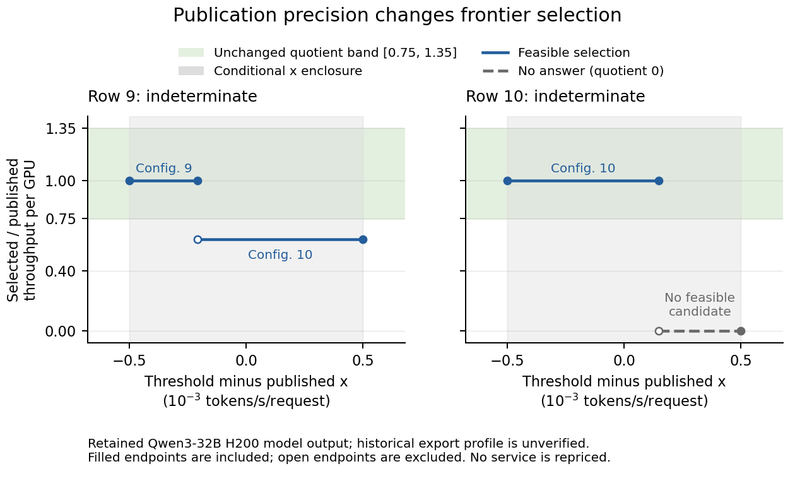

# Frontier publication precision result

DEPLOY-13's representation boundary qualifies: every one of the 40 frozen
parameter cases returns the expected complete set of frontier choices.
Two fresh Python processes evaluate the installed comparison over publication
precision and coordinate position. Their complete records are byte-identical;
all 15 boundary oracles and ten historical exact-threshold oracles also pass.
There are no fatal findings.

The change makes uncertainty explicit without moving a service, changing a
candidate or weakening the throughput quotient band [0.75, 1.35]. An exact
threshold keeps its original meaning: a candidate must be at least that fast,
and the highest-throughput feasible candidate wins. A declared interval
returns every resulting choice and any range without a feasible candidate.
The immutable result records exact endpoints, endpoint ownership, source
identity and discrete quotient choices. It cannot be rebuilt through the
public constructor or ordinary dataclass replacement with fabricated choices.

This closes DEPLOY-13's representation task. DEPLOY-26 remains open for exact
source coordinates or verified export provenance sufficient to resolve the
historical comparison. No old study is rescored, no GPU calibration changes
and no DeepSeek-V3 or Kimi K3 deployment frontier is qualified here.

The [compact record](results.json) retains the conditional historical
comparisons and all raw artifact hashes. The expectations-only commits are
`88e9496dfd1092b60f58ba12ef0094752bdec049` and the final completeness amendment
`d88c52005be7e0b9a9a0ae2142f099ee640d5f04`. Both precede implementation and the
first study run. The accepted implementation source, including the qualified
serving composition, is `1cd4b501c60dfe354e4b28852017340ac54ed7ad`.

The first component study also passed at
`5bf34397a81572d82807d129ebb554f3a33ed423`, but its full software gate rejected
an edited source file pinned by the older decode memory study. The new
publication comparison now lives in `simllm/deploy/frontier_publication.py`;
`simllm/deploy/frontier.py` is restored byte for byte. The unchanged-freeze
successor returns the same complete evaluation digest. Both runs and the
failed software gate remain in the evidence record. No older hash or result
was relaxed to admit the extension.

Before those freezes, the former acceptance premise was withdrawn explicitly:
a configuration cannot remain selected throughout an interval that extends
above its own speed. Preserving that premise would require changing exact
feasibility. The new contract preserves feasibility and reports its complete
consequences. DEPLOY-26 was registered in the initial freeze, before any new
result was observed. The old F-2-09 refutation remains unchanged.



The [vector figure](figures/publication-boundaries.pdf) shows only the retained
constant-selection segments. The horizontal axis is the queried speed minus
the published speed, in thousandths of a token per second per request. The
vertical axis divides selected throughput per GPU by published throughput per
GPU. Filled endpoints belong to the segment; open endpoints do not. The gray
region is the conditional publication enclosure, and green is the unchanged
acceptance band. No interpolation fills the gap between distinct quotients.
The last segment's zero is an explicit no-answer convention, not a measured
zero-throughput deployment.

The historical findings are separate from study qualification:

| Historical row | Possible selected configurations | Discrete quotient choices | Conditional agreement |
|---|---|---|---|
| 1 | 1, 2 | 0.999986613494, 0.988204705008 | PASS |
| 2 | 2, 3 | 0.998013012277, 0.841593217236 | PASS |
| 3 | 3, 4 | 0.999985578864, 0.933311272069 | PASS |
| 4 | 4, 5 | 0.997987869433, 0.896979787626 | PASS |
| 5 | 5, 6 | 0.997969860631, 0.812891182809 | PASS |
| 6 | 6, 7 | 0.998022294164, 0.876367649038 | PASS |
| 7 | 7, 8 | 0.999986613494, 0.888876989773 | PASS |
| 8 | 8, 9 | 0.999985966850, 0.750183466979 | PASS |
| 9 | 9, 10 | 0.997958209824, 0.607495219355 | INDETERMINATE |
| 10 | 10, no answer | 0.998085814935, 0 | INDETERMINATE |

Row 9 preserves the previously reported failing quotient and adds the other
selection allowed by the declared coordinate precision. Row 10 reveals a
separate limit: some allowed thresholds exceed the fastest retained candidate.
Neither row becomes an agreement pass. Row 8's lower choice is only
0.000183466979 above the unchanged acceptance floor. The complete exact
fractions, original decimal text and source-row joins remain in the record.

The qualification is deliberately conditional. The pinned external source
rounds its worker summary before serving composition and rounds its final
frame again. Its copied x coordinate admits a conservative binary64 enclosure
under the explicitly declared arithmetic and decimal-export assumptions in
[the freeze](expectations.md#source-precision-and-interpretation). The archive
does not verify that complete profile. Every historical row therefore carries
`historical_profile_verified=false`. The enclosure is not a recovered exact
rounding preimage, and this x-only reasoning is not transferred to throughput
y or first-token time.

Three independent reviews constrain the result. First, exact threshold
geometry determines winner regions from the candidate priorities; an
independent reconstruction matches all 65 retained comparisons, including
singletons and open endpoints. Second, every historical speed is exactly
`10^12 / decode_step_ps`, and throughput is exactly
`request_capacity * 500 / used_gpus`, bounded by the decode pool's own service
capacity. All 20 prefill and decode stamps join their candidate and retained
service. Third, the conditional rounding enclosure follows the declared
binary64 arithmetic bounds without consulting a modeled coordinate. These
checks establish a faithful comparison, not new hardware accuracy.

The evidence classes are not summed:

| Class | Outcome |
|---|---|
| Prospective parameter behavior | 40 checks pass across two centers, four precisions and five fixed coordinate offsets |
| Boundary exact oracles | 15 pass, including the disconnected-quotient case |
| Historical exact-threshold oracles | Ten original answers and quotients are unchanged |
| Fatal structural and source guards | All 468 hold; unscored |
| Historical agreement disclosures | Eight conditional passes, two indeterminate; excluded from the behavioral score |
| Preserved historical files | All 58 retain their original hashes |

The synthetic grid contains six agreement passes, six failures and 28
indeterminate answers. Reproducing those expected states is the 40-check
behavioral result. A hull that crosses the acceptance band is insufficient:
when both actual discrete choices lie outside the band, the result is FAIL.
GPU-runtime imports and backend processes are absent. Original source points
and estimator stamps remain reader-owned; the comparison holds immutable
identity and coordinate projections checked against those inputs.

Reproduce into a fresh directory outside the repository:

```bash
python -m examples.frontier_publication_precision_v1.run_study \
  --output-root "$SIMLLM_FRONTIER_PRECISION_EVIDENCE_ROOT"
python -m examples.frontier_publication_precision_v1.plot_study
```

The driver requires committed clean source, checks unchanged freeze ancestry,
compares two complete evaluations and retains malformed or failed workers as
void evidence. Process identity and elapsed wall time remain outside the
compared object. The evaluation digest is
`4dcd753ef3dae9cf7a147e681fc4796f6d5b1956a3becbbbb08d4b691ff3953a`;
the summary digest is
`d04eafc20e14007837fbd860aa439d7bf2864094e017c1fa81d48fbfac4d2f9f`.

The complete software gate passes with 5,647 tests passed and 31 skipped.
The first gate retained 18 failures caused by the older study's pinned source
hash; all are resolved by preserving that file. Both gate logs and their
hashes are recorded separately from numerical evidence in the compact record.
