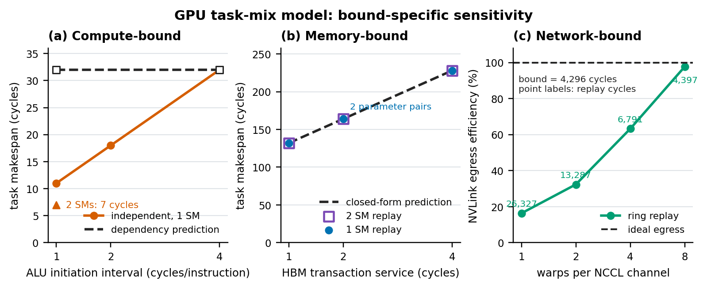
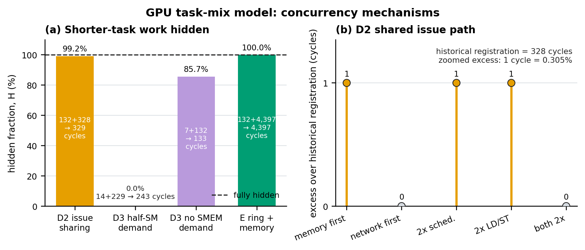

# GPU task-mix results

Initial run: 2026-08-06. Reproduced: 2026-08-07.

There is no public expectations-only ancestor, so this is a post-specified
regression study, not preregistration. The active suite executes 38 distinct
deterministic run configurations through 46 replay invocations. Its evidence
classes are reported separately:

| evidence class | result | scoring |
|---|---:|---|
| exact-oracle rows | 36/36 pass | scored rows |
| behavioral relation families | 6/6 pass | scored families |
| behavioral relation instances | 17/17 pass | scored instances |
| structural and by-construction invariants | 21/21 hold | unscored |
| superseded D2/D3 registrations | 2 retained failures | historical ledger |

Counts from these classes are not added together. The original D2 values
328 expected and 329 measured, and D3 values 132 expected and 243 measured,
remain visible below. Corrected post-specified relation families now test the
shared issue path and shared-memory residency mechanisms directly.

## Reproduction

```bash
uv run --extra dev python examples/gpu_task_mix/run_gpu_task_mix.py
```

```bash
uv run --extra plot python examples/gpu_task_mix/plot_gpu_task_mix.py
```

The default harness returns success only when every active exact oracle,
behavioral relation and structural invariant holds. Historical rows do not
affect the exit status. The run writes
`results.csv` (every row), `nccl_convergence.csv` (the C3 trend) and
`diagnostics.csv` (the post-hoc controls that feed the corrected D2R and D3R
families).

The plot command reads only those reviewed CSV artifacts. It produces PNG
and vector PDF forms of the two figures below. Matplotlib lives in the
repository's `plot` extra.

## Bound-specific sensitivity



[Vector PDF](plots/gpu_task_mix_bounds.pdf)

Panel (a) plots synthetic task makespan against the ALU initiation interval.
The open squares are the two registered dependent-chain replays on top of the
constant dependency prediction. The triangle is the two-SM A3 control. Panel
(b) uses transaction service
`s_hbm = ceil(transaction_bytes / bandwidth_bytes_per_cycle)` on its x-axis.
Filled circles are one-SM replays, open squares are two-SM replays, and the
black dashed line is the closed-form prediction. All three coincide; service 2
contains two distinct transaction-size and bandwidth pairs. Panel (c) plots
the dimensionless NVLink egress efficiency
`eta = 100 * B_egress / T_replay`, where each CSV row independently gives
`B_egress = T_replay - T_excess = 4,296` cycles. Point labels are the raw
replay cycles. These are model measurements, not hardware measurements.

## Concurrency mechanisms



[Vector PDF](plots/gpu_task_mix_concurrency.pdf)

Panel (a) normalizes unlike task scales with the shorter-task hidden fraction
`H = 100 * (T_a + T_b - T_mix) / min(T_a, T_b)`. Zero means the pair fully
serializes; 100 percent means all work from the shorter isolated task fits
under the longer task. This exposes the half-SM shared-memory case as fully
serialized while the real ring hides the memory task completely. Panel (b)
zooms only the D2 issue delay,
`Delta = T_case - 328 cycles`. The one-cycle bars are 0.305 percent of the
historical registration, so the zoom should not be read as a large absolute
performance effect.

## A. Compute is limited by the issue path

| case | expected | measured |
|---|---:|---:|
| A1 initiation interval 1 | 11 | 11 |
| A1 initiation interval 2 | 18 | 18 |
| A1 initiation interval 4 | 32 | 32 |
| A2 dependent chain, interval 1 | 32 | 32 |
| A2 dependent chain, interval 4 | 32 | 32 |
| A3 same work on 2 SMs | 7 | 7 |

The registered form `(ceil(N / L) - 1) * I + T` holds exactly across the
initiation-interval sweep, so throughput is set by how often a lane
returns, not by how fast one instruction retires. A2 is the control: a
dependent chain measures 32 cycles at both interval 1 and interval 4,
because a chain never has two instructions in flight and therefore never
touches the initiation interval. A3 halves the per-SM instruction count
and drops the duration from 11 to 7 cycles, which is the behaviour that
B2 below deliberately contradicts.

## B. Memory is limited by one bandwidth cursor

| transaction bytes | bandwidth | expected | 1 SM | 2 SMs |
|---:|---:|---:|---:|---:|
| 64 | 64 | 132 | 132 | 132 |
| 64 | 32 | 164 | 164 | 164 |
| 128 | 64 | 164 | 164 | 164 |
| 128 | 32 | 228 | 228 | 228 |

`duration = N * s_hbm + L_hbm` is exact in every cell. The 1-SM and 2-SM
columns are identical, which is the point of B2: doubling the SMs buys a
bandwidth-bound kernel exactly nothing, while the identical sweep in A3
made a compute kernel 1.57 times faster. B3 confirms the serialization
term is proportional to service: halving bandwidth takes it from 32 to 64
cycles exactly, leaving the 100-cycle latency term untouched.

## C. Network is limited by the NVLink egress cursor

C1 verifies the ring closed form `2 * (W - 1) * P / W` against the built
kernel for six (payload, world size) points, and confirms every chunk is
loaded from HBM exactly once and stored to NVLink exactly once: at
`P = 65536`, world 8, both counters read 114,688 bytes. C2 shows the
egress cursor has the same service form as HBM: 328, 456 and 712 cycles
across the chunk and bandwidth sweep, all exact.

C3 is the NCCL result worth keeping. The per-GPU ring egress kernel never
beats its own egress bound, and the excess over that bound collapses as
channel warps are added:

| warps per channel | duration cycles | excess over egress bound |
|---:|---:|---:|
| 1 | 26,327 | 22,031 |
| 2 | 13,287 | 8,991 |
| 4 | 6,791 | 2,495 |
| 8 | 4,397 | 101 |

With one warp per channel the kernel takes 6.1 times its own bandwidth
bound, because each warp has only two prefetched loads available to hide
the load-to-store chain. The first two doublings of channel warps roughly
halve the duration; at eight warps the kernel is 101 cycles, or 2.4 percent,
above the 4,296-cycle egress bound. This is the modelled reason real NCCL
channels run hundreds of threads rather than one warp, and it is a property
of the mechanism, not of a fitted constant.

## D. What two kinds of task do to each other

| active exact regression | expected | measured | status |
|---|---:|---:|---|
| D1 two memory tasks | 132 | 132 | PASS |
| D2 memory-first beside network | 329 | 329 | PASS |
| D3 half-SM shared-memory pair | 243 | 243 | PASS |

D4's nine attribution-conservation invariants all hold, but are unscored.

D1 is the clean result: two memory tasks submitted together finish in
exactly the time of one task carrying both their transactions, because
they queue on the same cursor. Concurrency buys nothing when the
contended resource is a single server. D4 confirms per-task instruction
and byte attribution sums to the replay totals with no tolerance.

### D2 corrected family: tasks share the issue path

The active exact row is 329 cycles. The corrected behavioral family contains
four parameterized instances, all of which pass:

| relation instance | expected | measured |
|---|---:|---:|
| memory-first equals network-first plus one cycle | 329 | 329 |
| scheduler widening alone preserves delay | 329 | 329 |
| load-store widening alone preserves delay | 329 | 329 |
| widening both resources removes delay | 328 | 328 |

The tasks use different data cursors but still compete for per-SM issue
slots. Candidates are ordered by submission index, so the memory task takes
the cycle-0 issue slots and the first NVLink store issues one cycle later,
shifting the egress cursor by one cycle.

The diagnostic confirms the cause exactly. Submitting the same two tasks
in the opposite order measures 328 cycles, the isolated egress control, because
the network task then wins the cycle-0 slots. A counterfactual sweep
shows the delay needs both per-SM resources widened to disappear:
doubling the scheduler budget alone still measures 329, doubling the
load-store lanes alone still measures 329, and only doubling both
recovers 328. The correct form is therefore
`max(isolated durations) + a submission-order delay set by whichever
per-SM issue resource binds first`. Recorded as finding G1.

### D3 corrected family: shared-memory demand gates residency

The active exact row is 243 cycles. The corrected behavioral family contains
three instances, all of which pass:

| relation instance | expected | measured |
|---|---:|---:|
| half-SM tasks serialize, `14 + 229` | 243 | 243 |
| memory admits after constrained compute | 14 | 14 |
| unconstrained tasks overlap plus issue delay | 133 | 133 |

The original registration contained a premise error. It described the D3
fixture as "the A1 `I = 1` compute task (11 cycles) and the B1
`(64, 64)` memory task (132 cycles)", but D3 deliberately gives every
CTA half the SM's shared memory, which changes both tasks. Under that
fixture residency falls from 16 CTAs per SM to 2, the 8-block memory
launch runs in two waves, and the second wave cannot admit until the
first wave's 100-cycle HBM returns retire its CTAs. The memory task
alone therefore measures 229 cycles, not 132, so 97 of the 111 cycles
come from quoting a duration that the fixture never produces. The
registration named numbers from a different fixture.

The mechanism finding follows from the corrected isolated pair (14 and 229):
the measured makespan is not the maximum but the sum. The per-task record
shows the memory task admitted at cycle 14,
exactly when the compute task finished, and 14 + 229 = 243. Each CTA of
both tasks claims half of the SM's shared memory, so an SM holds two
CTAs in total across both tasks, and the compute CTAs displace memory
CTAs rather than joining them. The two tasks serialized on residency.

The diagnostic separates the mechanism from the fixture: with the same
two tasks carrying no shared-memory demand, isolated durations are 7 and
132 cycles and the concurrent makespan is 133, so backfill does happen
when residency allows it, plus the same one-cycle G1 delay. Recorded as
finding G2: shared memory is a residency currency, and a co-scheduled
kernel is free only while the SM has room for it.

### Historical registration ledger

| historical row | expected | measured | residual | disposition |
|---|---:|---:|---:|---|
| H-D2 memory beside network | 328 | 329 | 1 | superseded by D2 and D2R |
| H-D3 compute hides under memory | 132 | 243 | 111 | superseded by D3 and D3R |

These values were observed on the initial 2026-08-06 run. The harness had
already executed the model before the values were made literal, so they were
never preregistered. They remain in `results.csv` with evidence class
`historical_ledger` and status `HISTORICAL_FAIL`; they do not affect the
default exit status.

## E. A real ring task overlaps the memory kernel

The follow-up E cells replace D2's pure NVLink-store task with the actual
double-buffered `nccl_ring_allreduce_task`. Its 65,536-byte, world-2 ring
half issues 1,024 HBM loads and 1,024 NVLink stores. Every registered task
and aggregate counter is exact:

| quantity | registered | measured |
|---|---:|---:|
| ring HBM requested/transacted bytes | 65,536 | 65,536 |
| ring NVLink requested/transacted bytes | 65,536 | 65,536 |
| mixed issued instructions | 2,080 | 2,080 |
| mixed HBM requested/transacted bytes | 67,584 | 67,584 |
| mixed NVLink requested/transacted bytes | 65,536 | 65,536 |

The ring takes 4,397 cycles alone and the memory task takes 132 cycles
alone. With the ring submitted first, their measured concurrent makespan
is 4,397 cycles, inside the
post-specified `[4,397, 4,529)` band and exactly at its lower edge. The memory
task adds 2,048 HBM bytes, but its work and 100-cycle return latency fit
under the ring's longer NVLink drain. This is the direct mixed-NCCL check
that D2's source-less egress fixture could not provide.

## Findings

- **G1.** Concurrently submitted tasks share the per-SM issue path.
  Makespan is `max(isolated)` plus a submission-order delay, not
  `max(isolated)`. Any future registration of a mixed makespan must
  include the delay term.
- **G2.** SM residency is a contended resource. Two tasks whose CTAs each
  claim half the shared memory serialize on admission instead of
  backfilling, making the makespan additive rather than the maximum.

Both findings concern registration, not model defects, and both were
reproduced by direct measurement rather than inferred.

## By-construction disclosures

Four groups of registered cells carry no evidential weight as
experiments and are kept only as regression tripwires:

- C3's at-or-above-bound clause compares the NCCL duration against a
  bound built from the same cursor arithmetic the replay uses, so it
  cannot fail while the egress path is a single server. The monotone
  clause beside it is a real check, and the convergence table is the
  measurement that matters.
- D4's conservation cells compare sums of per-task counters against
  totals that the replay accumulates in the same loop, so they verify
  bookkeeping wiring rather than timing behaviour.
- E1's kind check and E2's per-task conservation check likewise verify
  builder and bookkeeping wiring. E3's held-out makespan band is the
  behavioral part of the extension.
- The six C1 "loaded" cells cannot fail once their "egress" twin passes.
  The builder emits exactly one HBM load and one NVLink store of the same
  chunk size per iteration, so the two byte counters are identically
  equal for any arguments that survive its divisibility guards. Only the
  "egress" half of each pair tests the ring closed form.

## Scope

This study runs entirely on the synthetic 1 GHz fixture defined in the
harness. It makes no silicon-accuracy claim and calibrates nothing: it
checks that the scheduler, the HBM cursor and the NVLink cursor behave as
the mechanism says they do. The NVLink model is one flat per-GPU egress
serializer; peer topology, ingress service and reduction lanes are absent
and tracked as COMP-11 in
[compute](../../docs/modules/compute.md#open-tasks).
