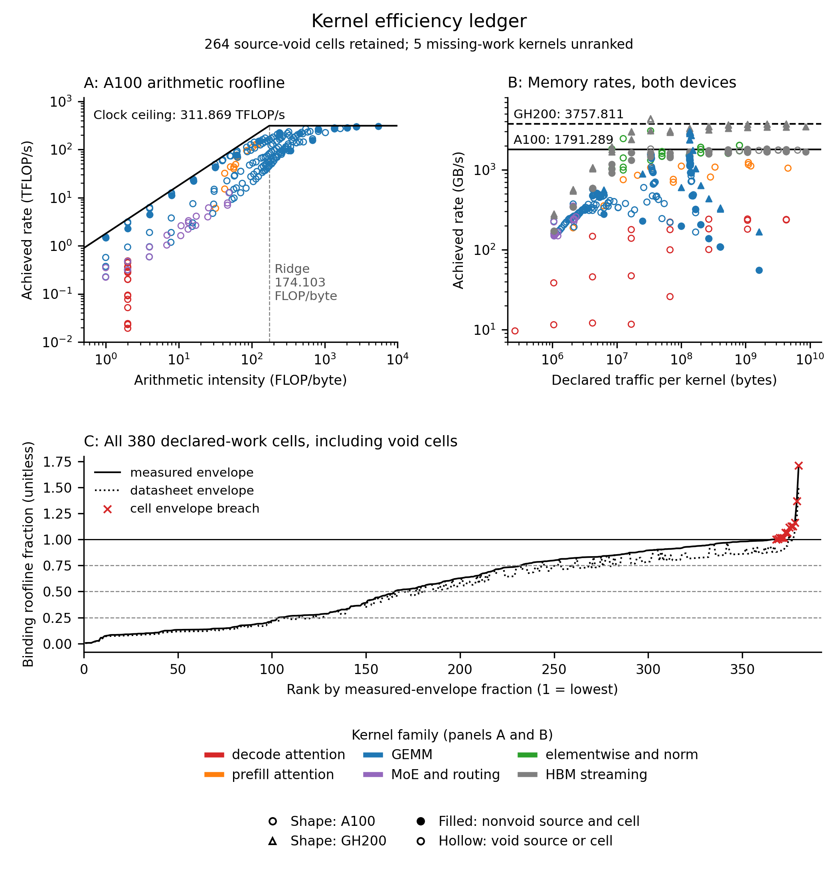

# Kernel efficiency ledger v1 results

What ran: the retained-evidence analysis ranked 380 kernels with declared work
and retained five Granite kernels whose work cannot be identified, across six
choices of memory envelope and diagnostic threshold. No hardware ran.

What came out: the six large decode-attention cells reach only **5.61 to
13.51 percent** of the measured memory roof, below the declared 50 percent
screen. Their source is void, so these are diagnostic findings. The complete
ledger is **VOID for calibration with findings**: all 264 constants-study
rows inherit that source's void state, and 13 cells additionally exceed the
selected measured memory envelope. The analysis itself completes with its
structural guards held. There is no aggregate behavioral score.

What it changes: COMP-46 gets a reproducible ranked diagnosis of its existing
decode kernel. COMP-45 gets an explicit ledger of which measurements cannot
support accepted constants. Both tasks stay open; neither acceptance bar is
met by reanalyzing void measurements, and no milestone closes. Registration
of the separate ledger task remains with the orchestrator.

What it does not change: no production kernel, calibration artifact, service
time, serving default, time to first token (TTFT), or time per output token
(TPOT) changes. This is component evidence, not an end-to-end serving study.

## Ranked ledger

The headline artifact is [the complete ranked table](results.csv), with one
row per source cell. It reports declared bytes and floating-point operations
(FLOPs), elapsed seconds, achieved bytes/s and FLOPs/s, shape, clocks, both
roofline fractions and ranks, launch classification, all six diagnostic flags,
evidence class, source void state and cell guard findings. Rows sort from the
lowest primary fraction upwards. Five missing-work rows follow with empty
rates, classes and ranks. Void rows stay visible; a rank is not an acceptance.

The first ten rows are below. All are boosted A100 constants-study cells and
all are **source VOID**. Percentages express useful declared work against the
binding roof, not utilization counters. The threshold predicate is strictly
`fraction < 0.5` and not launch-bound; equality does not trigger it.

| Rank | Cell ID, after `constants/boosted/` | Declared class | Time us | Measured roof % | Datasheet roof % | Diagnostic below 0.5 |
|---|---|---|---:|---:|---:|---|
| 1 | `attn_decode_b1_l128` | launch-bound | 27.200 | 0.538 | 0.473 | no |
| 2 | `attn_decode_b1_l512` | launch-bound | 91.093 | 0.643 | 0.565 | no |
| 3 | `attn_decode_b1_l8192` | HBM-bound | 1436.757 | 0.652 | 0.573 | yes, void |
| 4 | `attn_decode_b1_l2048` | HBM-bound | 346.709 | 0.675 | 0.593 | yes, void |
| 5 | `attn_decode_b4_l8192` | HBM-bound | 2590.805 | 1.446 | 1.270 | yes, void |
| 6 | `attn_decode_b4_l128` | launch-bound | 27.253 | 2.148 | 1.887 | no |
| 7 | `attn_decode_b4_l512` | HBM-bound | 91.733 | 2.553 | 2.242 | yes, void |
| 8 | `attn_decode_b4_l2048` | HBM-bound | 356.181 | 2.630 | 2.310 | yes, void |
| 9 | `attn_decode_b16_l2048` | HBM-bound | 673.536 | 5.562 | 4.886 | yes, void |
| 10 | `attn_decode_b16_l8192` | HBM-bound | 2670.336 | 5.612 | 4.930 | yes, void |

HBM means high-bandwidth memory. The large-decode relation uses the six cells
with at least 160 MiB of declared key/value traffic; it does not describe all
20 boosted decode cells. The primary inventory has 214 HBM-bound, 86
compute-bound, 80 launch-bound and five unclassifiable rows. Those are inventory
counts, not independent experiments or passes.



The [PDF figure](figures/ledger.pdf) has the same content at a seven-inch
print width. Rates divide declared work by measured elapsed time; TFLOP/s
means trillions of floating-point operations per second, and GB/s means
billions of bytes per second. Panel A shows every A100 cell with declared
arithmetic against the reference roof `min(1791.289e9 * intensity, 311.869e12)`
in FLOP/s. The clock-derived ceiling is theoretical, and the exact corner is
at 174.103 FLOP/byte. Panel B shows declared memory traffic rates for both
devices. Solid and dashed horizontal lines mark the measured A100 and GH200
HBM envelopes, respectively. Decode-attention cells lie roughly one to two
orders of magnitude below the A100 envelope, with extremes just outside that
range; large copies approach their device's envelope, while small transfers
can fall well below it. Colors denote kernel families in A and B: GEMM means
general matrix multiplication, MoE means mixture of experts, and HBM streaming
includes copy, read, write and triad operations. Circles denote A100, triangles
GH200; hollow markers flag a void source or cell guard, and filled markers
have neither flag. Fill does not establish calibration acceptance. Panel C
uses the same measured-fraction rank for both curves, so the dotted datasheet
curve need not rise monotonically; red crosses mark per-cell envelope breaches,
not kernel families. Gray dashed lines mark fractions 0.25, 0.50 and 0.75, and
the black horizontal line marks one. All 264 inherited source-void cells remain
in the applicable panels; the five missing-work kernels are unranked and unplotted.

## What the fractions mean

The chip must read operands before using them and spend cycles on arithmetic.
For declared bytes D, operations F, measured time t, memory rate R and arithmetic
ceiling P, this analysis computes `max(D/R, F/P)/t`. Its two components are
`(D/t)/R` and `(F/t)/P`. Arithmetic intensity `F/D` below the ridge `P/R` selects
memory; equality and above select arithmetic. No flat 0.7 derate is applied.
This is the same ideal max rule as `RooflineProvider`, analyzed at efficiency
one, with source-specific clocks and measured memory denominators.

| Device | Measured HBM GB/s | Nameplate HBM GB/s | Clock-derived arithmetic TFLOP/s | Primary ridge FLOP/B | Launch scale us |
|---|---:|---:|---:|---:|---:|
| A100 at 1410 MHz | 1791.289 | 2039.040 | 311.869 | 174.103 | 1.806 |
| GH200 at 1980 MHz | 3757.811 | 4022.784 | 1070.531 | 284.881 | 1.304 |

The primary memory anchors are the hardware studies' 4096 MiB A100 write and
4096 MiB GH200 read, selected over sizes at least 256 MiB. Arithmetic ceilings
remain theoretical, conditioned on clock; this is not a measured compute roof.
Each row uses its observed clock, including base-arm cells that actually
boosted. A GH200 endpoint clock transition uses the higher endpoint as the
conservative ceiling; both endpoints remain in the table.

The modeled `GPU_ENVELOPES['a100']` reference is 312 TFLOP/s and 2039 GB/s,
rounded relative to these clock-derived values. There is no GH200 entry. The
H100 reference, 989.5 TFLOP/s and 3350 GB/s, is reported in the machine-readable
[analysis audit](results.json) only as a comparison and never substituted.

The independently retained NVLink envelopes are context, not HBM denominators:
A100 ordered pairs reach 93.995 to 94.067 GB/s against 100, and per-GPU fan-out
reaches 281.651 against 300. GH200 pairs reach 133.241 to 133.272 against 150,
and fan-out reaches 398.707 against 450. These use payload nameplates, including
the GH200 source report's encoding correction. No local kernel row contains
network-transfer work, so no NVLink efficiency is assigned to one.

Launch-bound is a declared size screen: the primary ideal work time is at
most the retained pipelined launch period, doubled for prefill's two matrix
multiplications, or the source explicitly records host-issue limitation. It
does not mean the measured elapsed time has been explained by host launches.
For example, the first ranked cell takes 27.2 us despite a launch scale near
1.8 us. The rule deliberately withholds the inefficient-kernel diagnosis for
such small work; it does not attribute the remaining time.

Likewise, a non-launch row below 0.5 is an inefficient-kernel **screen under
this declared model**, not proof of poorly written code. Layout, cache reuse,
occupancy, synchronization, omitted scalar work and the timing instrument can
all affect it. The envelope sources themselves include small transfers whose
fixed timing costs can exceed the pipelined launch screen. Their flags do not
establish that their implementations need rewriting.

## Frozen relations and sensitivity

The final pre-run expectations-only commit is
`0f2fe42056a90465fe7f1b0c2cfa12cf4545e09a`, which precedes the analysis code and
first ledger run. The [freeze](expectations.md) explicitly uses already retained
measurements; none of this is a new blind hardware prediction. The input and
freeze digests are preserved in the audit. No expectation was edited after
observing this run, and no new measurement was collected.

| Relation family | Frozen relation | Observed finding |
|---|---|---|
| R1, six large decode cells | HBM-bound; fraction 0.04 to 0.16 | 0.056119 to 0.135120, all HBM-bound and below 0.25; source void |
| R2, five selected large matrix multiplies | compute-bound; fraction 0.8 to 1.0 | 0.849044 to 0.969052, all compute-bound; one source-void cell |
| R3, 15 large copies | HBM-bound; fraction 0.8 to 1.0 | 0.876878 to 0.941117, all HBM-bound; five source-void cells |
| R4, complete ranked orders | Spearman correlation at least 0.98 | 0.989894; 2234 inversions among 72010 comparable pairs |

These relations hold descriptively. They are not an accepted behavioral score
for the mixed-source, void-for-calibration study. The physical and source
guards never enter a behavioral denominator.

The decode percentages differ slightly from the source report's 5.5 to 13.3
because this ledger uses the independent accepted hardware-envelope bandwidth,
1791.289 GB/s, instead of the void run's own 1818.209 GB/s maximum. It does not
change a decode time. All six large-decode flags persist under both denominator
sources and all three thresholds.

| Envelope | Threshold | Diagnostic flags, including void | Flags with nonvoid source and cell |
|---|---:|---:|---:|
| measured | 0.25 | 26 | 1 |
| measured | 0.50 | 85 | 8 |
| measured | 0.75 | 152 | 25 |
| datasheet | 0.25 | 42 | 1 |
| datasheet | 0.50 | 95 | 10 |
| datasheet | 0.75 | 190 | 42 |

Threshold changes preserve each complete rank order exactly and only change
the flags. Switching envelopes changes 308 ranks, with a maximum displacement
of 60 places. The frozen correlation bound holds, but exact global stability
would be false. The audit names every changed rank and retains both orders.
Within each device, cells remaining non-launch and memory-bound preserve their
relative order exactly. Their fractions shrink by the ratio of measured to
nameplate bandwidth. For cells remaining memory-bound while compute peak is
multiplied by 0.5, 1 and 2, the primary fraction is exactly unchanged. These
algebraic checks are structural guards, not independent behavioral successes.

## Physical bounds and cell findings

Floor: the ideal declared work time is `max(D/R, F/P)` if the declared traffic
really reaches HBM; the stricter hardware-impossibility check credits the full
last-level cache and uses `max(F/P, max(distinct_bytes-L2_bytes,0)/R_nameplate)`.

Ceiling: an eligible nominal rate is at most its selected measured envelope,
and the binding fraction is at most one; hardware alone supplies no finite
upper limit on elapsed time. Cache-resident nominal traffic can break the
first ceiling without breaking silicon physics, so that interpretation is
voided rather than clipped or counted as a behavioral miss.

Three checks use different evidence: operand arithmetic, device clock and
bandwidth bounds, and agreement with independent retained hardware runs.

- The low end of R1 moves 268435456 declared bytes in 2670.336 us, or
  100.525 GB/s. Its measured-envelope floor is 149.856 us; even after crediting
  40 MiB of cache, its nameplate floor is 111.078 us. The elapsed time sits
  above both. The high end moves 1073741824 bytes in 4436.224 us, or
  242.040 GB/s, above its 599.424 us measured-envelope floor. These are slow
  declared work rates, not physically impossible rates.
- The A100 16384 square matrix multiply performs 8796093022208 operations.
  At its observed clock, arithmetic alone requires 28.204408 ms; the measured
  29.105152 ms is above that floor and below the ceiling of 311.869 TFLOP/s
  in rate terms, at 302.218 TFLOP/s. The lowest R2 fraction, GH200's 8192
  square, takes 1.209680 ms against a 1.027072 ms arithmetic floor.
- The R3 endpoints have measured-envelope floors of 142.868 us for the GH200
  256 MiB copy and 2397.696 us for the A100 2048 MiB copy. Their measured times
  are 162.928 and 2547.712 us, respectively. Thus the same accounting puts
  copies near the independently retained memory roof while putting the large
  decode cells far below it. No external deployment or serving rate is inferred.

All 13 per-cell findings are nominal byte-rate breaches. None falls below the
cache-credited hardware floor or exceeds the clock-derived arithmetic ceiling.
All remain void under the datasheet sensitivity variant too.

| Cell, abbreviated source/arm | Measured-envelope fraction | Interpretation to investigate |
|---|---:|---|
| constants/base `elem_rmsnorm_64mib_warm` | 1.001592 | nominal reread traffic differs from physical HBM traffic |
| constants/boosted `hbm_write_1024mib` | 1.004936 | independent envelope is empirical, not a universal hard maximum |
| constants/boosted `hbm_write_2048mib` | 1.015028 | same envelope-transfer limitation |
| envelope/a100 `hbm_read_32mib` | 1.016276 | buffer fits the 40 MiB cache |
| constants/boosted `elem_scale_4mib_warm` | 1.017454 | warm buffer fits cache |
| constants/boosted `elem_rmsnorm_64mib_warm` | 1.066905 | nominal activation rereads need not reach HBM |
| constants/boosted `elem_rmsnorm_64mib_rot` | 1.067337 | rotation does not force every intra-kernel reread to HBM |
| envelope/gh200 `hbm_copy_16mib` | 1.113928 | 32 MiB combined working set fits the 60 MiB cache |
| constants/boosted `elem_rmsnorm_256mib_rot` | 1.128132 | nominal reread accounting remains unvalidated |
| constants/boosted `elem_rmsnorm_256mib_warm` | 1.128132 | same nominal-traffic limitation |
| envelope/gh200 `hbm_read_32mib` | 1.160246 | buffer fits cache |
| constants/boosted `elem_add_4mib_warm` | 1.369120 | warm working set fits cache |
| constants/boosted `elem_scale_16mib_warm` | 1.712457 | warm buffer fits cache |

These interpretations are hypotheses informed by declared footprints, not
measured counter attribution. The 1.5 percent cross-run write difference and
the cache cases do not refute the original hardware studies' nonvoid state:
they refute treating their empirical large-buffer envelope as an unconditional
ceiling for these other cells. This study's frozen strict rule still voids each
listed cell's verdict. It does not enlarge the denominator after seeing data.

## Evidence limits and reproduction

The Granite lookup reconstructs its published record digest
`e495f3ca5d0858cf371b19205ae6b7747d633695020d10f58645c5f245086070`.
Its five rows retain both profiler elapsed times, streaming-multiprocessor and
memory clocks, partial coverage and `insufficient-replays`. Neither elapsed
cycles nor a utilization percentage identifies bytes or FLOPs. All five
therefore remain unrankable. Per-kernel operand shapes, routed expert work and
byte attribution are residual evidence needed before that path can diagnose
a production kernel; the orchestrator owns registering this residual.

Streaming and normalization rows preserve source-declared zero arithmetic,
marked `source-zero-scalar-work-uninventoried`. Their displayed zero FLOP rate
is an accounting zero, not a claim that no scalar instructions ran. Decode
counts dot products and value accumulation, not softmax work. Normalization
preserves the retained `3*buffer_bytes` declaration, which omits the weight
traffic mentioned in its original expectations. These are explicit limits on
what an inefficient-kernel flag can mean; no bytes are fabricated or corrected
silently. COMP-45 and COMP-46 remain the owning measurement and replacement
work, and no production integration is claimed.

Configure an external scratch directory in `SIMLLM_STUDY_OUTPUT`, then run:

```bash
.venv/bin/python examples/kernel_efficiency_ledger_v1/run_study.py \
  --output-dir "$SIMLLM_STUDY_OUTPUT"
.venv/bin/pytest -q tests/test_kernel_efficiency_ledger_study.py
```

The runner writes the small ledger, audit and plain PNG/PDF figure. It verifies
all frozen input digests before analysis and rejects duplicate identities,
invalid quantities or mismatched shape accounting. Its artifact regression
checks compare the complete CSV and JSON byte for byte, exercise both
sensitivity parameters, and inject invalid work, envelope and source evidence.
The figure was inspected visually; the orchestrator's separate figure pass
remains part of the wave handoff.
