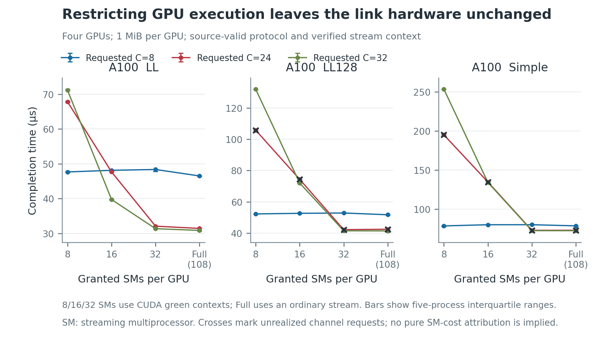

# Channel and GPU-resource identification on Merlin

The A100 capture shows that channel count and available GPU execution capacity
must be modeled separately. At 1 MiB with four GPUs and 32 active LL128
channels, changing the verified resource allocation from 8 to 32 streaming
multiprocessors (SMs) reduces measured completion from 132.076 to 41.431
microseconds. Its 90.644-microsecond difference exceeds the frozen repeat-spread
resolution threshold of 1.270 microseconds. The same link hardware carries
the same collective payload, protocol and active channel count.

The [six-page hardware review](figures/a100/hardware-controls-review.pdf)
plots requested/active channels, channel timing, SM restrictions, working
warps, the dense four-GPU residual window and paired timers. This is
identification evidence for TRAF-54's source/resource model and TRAF-43's
future calibration. It does not supply an independently validated fitted
model or close either task. The wider GH200 timing capture remains queued
for its original physical node; its already completed observers are shown
separately from A100 timing results.

## Capture, controls and evidence classes

The expectations-only identification commit is `c5c9a963`; the prior
process-boundary continuation amendment is `3615669d`. Both architectures
use the frozen 254-condition manifest, with five independent ordinary timing
processes per condition. A condition can contain several payloads, yielding
1,398 payload/control points and 6,990 maximum-rank timing observations per
architecture when complete. Each process also retains individual-rank rows.

| Evidence | A100 | GH200 |
|---|---|---|
| Original hourly allocation | `205237`, intentionally checkpointed with 287 successful timing records | `205238`, intentionally checkpointed with 233 successful timing records |
| Same-node continuation | `205466`, complete; 1,270 timing processes after joining the original records | `205467`, queued; no complete timing summary admitted |
| Separate selection observers | All 254 conditions in each A100 allocation | All 254 conditions in the original allocation; continuation repeats them |
| Resource capability pilot | Ordinary stream and requested 8/16/32 SM partitions pass the frozen pilot | Ordinary stream and requested 8/16/32 SM partitions pass the original pilot |
| Separate transport diagnostics | `205512`, complete under freeze `34e8170f` | `205513`, dependent on successful completion of `205467` |

The original allocations were deliberately stopped between processes because
the hourly allocations were too short. The checkpoint records verify no live
child and no remaining GPU process. Only successfully recorded processes are
reused. The continuation uses identical node/GPU identities, topology, driver,
CUDA toolkit, NCCL library, compiled probe, observer and condition schedule.
The original raw evidence and each record's originating allocation remain.

The A100 archive passes its global identity, correctness, complete
rank/repetition, positive-timer, topology, process-inventory and physical-floor
guards. No global fatal violation is scored as a lost point. Requested
channel controls are not realized at 420 payload/control points. Those
contrasts are unqualified, with raw observations retained and marked in the
plots. This is not a behavioral passing fraction.

Physical floor, declared before timing review: a Ring sends average useful
bytes `2(n-1)S/n` per rank; divide by 100 GB/s for the two-A100 direct pair
or 300 GB/s for the four-A100 aggregate directed capacity. At four GPUs and
1 MiB this application-byte floor is 5.243 microseconds. Protocol bytes and
specific channel routes can impose stronger limits. Every admitted event and
wall timer lies above its declared floor. There is no finite latency ceiling
without bounded stalls.

These controls fix float32 sum, Ring, initialized out-of-place 64-MiB buffers,
persistent CPU-pinned workers and ordinary launches. The primary loop has
20 warmup and 100 timed iterations. Correctness checks the final timed output
against the known sum. Separate families change only their declared channel,
SM, thread, count or buffer-offset controls. The actual algorithm, protocol,
channels and warps come from the separate profiler observer, never from an
assumption that an environment variable was honored.

The resource pilot samples SM identities on the same stream and verifies
that NCCL launches onto that stream. A100 grants exactly 8, 16 and 32 SMs;
its ordinary stream has 108 available SMs. The diagnostic sampling kernel is
not instrumentation of NCCL's own block placement or residency. Counts of
requested channels, working warps and granted SMs are distinct observations.

GPU clock locking was not permitted on A100. Both allocations' sampled SM
clocks range from 210 to 1,410 MHz, including idle intervals. These samples
are not joined to individual kernels and do not establish fixed or per-kernel
clock rates. No reported cycle cost is calibrated from an assumed locked
frequency. The per-allocation timing tables accompany the pooled medians.

## What the interventions establish

### Available SMs affect busy channel populations

At four GPUs, 1 MiB and 32 active channels, both endpoints of the following
contrasts use verified green contexts, which restrict available SM resources.
Every listed protocol, channel and warp control is realized. The stated
threshold is twice the sum of the two five-process interquartile ranges,
as frozen before measurement.

| Protocol | 8 SMs, median us | 32 SMs, median us | Reduction, us | Resolution threshold, us |
|---|---:|---:|---:|---:|
| LL | 71.127 | 31.365 | 39.762 | 1.290 |
| LL128 | 132.076 | 41.431 | 90.644 | 1.270 |
| Simple | 253.256 | 72.387 | 180.869 | 3.727 |

With only eight active LL128 channels, the medians at 8/16/32 available SMs
are 52.224, 52.603 and 52.818 microseconds. Additional SM capacity has a much
smaller effect once the small channel population already fits. This is why
channel count cannot substitute for available SM count in the model.

The main LL128 32-channel result also holds within each allocation: the
8-SM versus 32-SM medians are 132.285 versus 40.837 microseconds in the
original allocation and 131.922 versus 41.728 in the continuation. These
within-allocation summaries contain two and three process repetitions
respectively; they are provenance checks, not separate five-repeat studies.

This evidence supports finite GPU service/residency as a mechanism. It does
not show that the unrestricted 108-SM A100 exhausts its SM count at 24
channels, nor does it identify register occupancy, a particular barrier cost
or the entire four-GPU residual. Actual source work, buffer placement and
per-channel physical routes still determine that prediction.

### More working warps have protocol-dependent effects

At four GPUs, 1 MiB and 32 active channels, the observed default-resource
medians are:

| Protocol | Observed working warps | Median completion, us, in the same order |
|---|---|---|
| LL | 4, 8, 16 | 40.028, 31.201, 30.679 |
| LL128 | 8, 16, 20 | 34.642, 39.055, 41.687 |
| Simple | 5, 9, 17 | 61.983, 65.536, 72.028 |

LL benefits from the larger warp population in this slice, whereas LL128
and Simple become slower. Simple includes its extra synchronization warp.
This refutes a universal thread-count speedup rule. These points do not
separate instruction overlap, barriers, partial-warp work and block resource
footprint into independently measured constants. The full channel/thread
plots, including the eight-channel controls, retain the other shapes.

### Active partitions explain why a fixed channel request is insufficient

At four GPUs and 256 KiB, a 32-channel LL128 request produces 16 active
channels. At 1 MiB, requests 22, 23, 24 and 28 all produce 22 active LL128
channels. The same requested-versus-realized pattern appears in the GH200
observers. These points are retained as observations, but the intended
fixed-request causal contrasts are unqualified.

The residual sweep has 33 payloads from 3 to 3.5 MiB, spaced 16 KiB apart.
The active count changes within the nominally fixed-channel arms as NCCL
repartitions work cells. All four arms select LL128 here. The model must
consume actual partitions, partial work and channel peer maps. Fitting a
payload offset or interpreting the nominal channel budget as constant work
would obscure that mechanism.

### Timer boundaries matter, but do not supply a pure software constant

The host wall timer and GPU events surround the same invocation, with both
the individual ranks and maximum-rank reductions retained. The paired gap is
`max_rank(wall) - max_rank(event)`, not an isolated host-service measurement.
Both boundaries can include host issue gaps between GPU launches.

For four GPUs and 1 MiB, the 100-iteration timer controls have paired median
gaps from 0.081 to 0.143 microseconds; the 20-iteration controls range from
0.392 to 0.679 microseconds. These are descriptive observations. The LL128
and Simple timer arms requested 24 channels and realized 22, so those
fixed-request causal claims remain unqualified. This small paired gap does
not establish the cause of the larger difference between the old independent
benchmark and original harness, whose execution contexts also differed.
COMP-44 retains host-cost identification.

## Major finding: sender-side Simple buffers and channel peers

The separately frozen diagnostic runs after ordinary timing. It uses the
same A100 node, library, probe and observer and captures 70 configurations:
two/four ranks, seven channel budgets, three protocols, plus explicit Simple
read-placement off/on controls. It logs each communicator channel's Ring
permutation and directed connection, then checks those maps for consistency.
All 70 configurations complete with qualified placement and peer records.
Their debug-enabled timings are excluded from calibration.

The four-GPU default communicator constructs 24 channel Rings spanning all
six rank permutations rooted at rank zero. The two-GPU communicator has
one peer order across its eight channels. Thus the four-GPU model must bind
each channel to its observed peers instead of sending all channels around
one physical Ring. The active subset and byte partition are per-payload
work descriptors; communicator Ring logs alone do not identify that subset.

The A100 default connection has read capability. The pinned source maps
Simple's FIFO to sender memory in this mode; explicit
`NCCL_P2P_READ_ENABLE=0/1` selects write/read placement. LL and LL128 retain
receiver-side payload buffers even when their connection is read-capable.
This confirms the need to distinguish buffered Simple reads from registered
direct reads and from buffered writes. The first structural Simple path is
write-only, so default A100 Simple qualification awaits TRAF-93's live read
request/response dependency. This is a major structural finding, distinct from
the unresolved LL128 residual. A constant extra round trip is insufficient.
The [read-path freeze](../nccl_simple_read_v1/expectations.md) precedes its
implementation; TRAF-94 owns the separately
[standardized primitive experiment](../../docs/design/nccl-primitive-identification-v1.md).

## Reproduction and queued continuation

Compact medians, separate allocation summaries, observer-derived connection
maps and artifact digests live in `hardware_checks/`. Raw binaries, CSVs,
logs and source archives remain in externally configured evidence storage.
The analysis refuses incomplete campaigns. A GH200 partial prefix is never
pooled as if it contained all five repetitions.

The remote timing and source jobs are already submitted. Inspect the GPU
scheduler with `squeue -M gmerlin7 -j 205467,205513`; keep their same-node
constraint and the diagnostic's dependency. After completion, retain the
original and continuation trees, run `analyze_capture.py` with
`--capture gh200:205467`, and render `plot_hardware.py` from that audited
summary. Re-run the analysis with both architecture captures for the combined
review. These submitted jobs wait on scheduler availability. The restored SSH
connection has already been exercised successfully.

TRAF-54 now has a live source/resource implementation and A100 intervention
evidence, but its exact device-source traces, resource footprints, peer-read
execution and primitive cost probes remain. TRAF-43 retains the parameter
lock, propagated uncertainty and untouched accuracy validation. A100 versus
public NVIDIA figures also retains the
[matched-control comparison limits](../nccl_protocol_model_v1/public_comparisons.md).
This capture neither supplies a matched vendor curve nor closes the full
end-to-end inference/Pareto validation.
