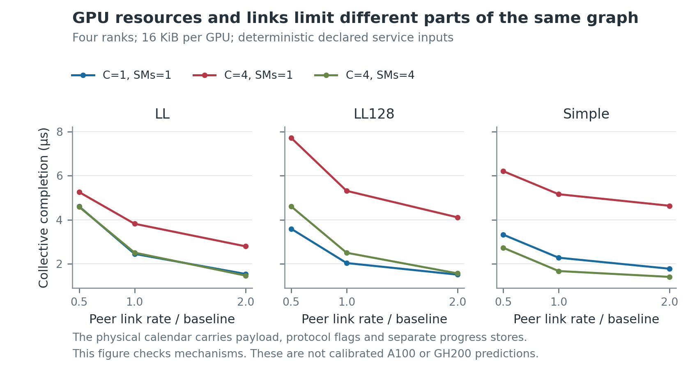

# Channel FIFO and shared GPU resource execution

The model executes each Ring channel's work on the same clock as its physical
packets. Adding a channel now adds its memory, instruction, protocol and
buffer-reuse work. The old maximum-channel calculation remains the explicit
compatibility path. The source implementation and controlled resource study
make steps 1 and 2 of the [design plan](../../docs/design/nccl-channel-fifo-model.md)
executable. They do not establish a calibrated A100 or GH200 prediction.

The study executes two/four-rank float32 Ring all-reduce with LL, LL128 and
buffered-write Simple. It also runs original prefill and decode graphs. In
all 36 graph configurations, each token metric equals the executed collective
time plus exactly 0.2 microseconds of fixed synthetic compute. This makes
TRAF-54's first source slice live in time to first token (TTFT) and time per
output token (TPOT), instead of leaving it in an isolated component probe.
TRAF-54 and TRAF-43 remain open for source/hardware qualification, cost
identification, further transport branches and fresh accuracy validation.

## Review figures



The [five-page model review](figures/channel-fifo-review.pdf) includes finite
block residency, software slots, partial protocol stripes, the retained A100
residual, a channel timeline and parameter sensitivity. The shaded area in
the residency fixture is a declared plus/minus 20 percent block-service
intervention. It is not a fitted hardware envelope or confidence interval.

The [A100 residual diagnostic](figures/a100-shared-work.pdf) compares the
retained measurement with source work counts. Across the old flat prediction
segment, partially filled channels add aggregate work even while the largest
channel's work remains fixed. The replacement executes that work; its GPU
service cost still requires identification. Previously inspected measurements
remain retrospective evidence for this revision.

## What the source path executes

| Source behavior | Executable model and observable |
|---|---|
| Ring primitive order, partial channels and per-channel peers | `NcclRingProgram` expands the two/four-rank sum program. Every channel can carry its own Ring permutation and explicitly supplied payload partition. |
| Shared connection progress | `NcclConnection` keeps producer reservation, consumer progress, returned head and cached head distinct. Successive protocols use the same directed connection identity. |
| Eight software steps | Reservations precede data arrival; address wrapping does not reset absolute sequence. LL/LL128 reserve one step, Simple reserves two per Ring slice. |
| Inline readiness | LL packs eight useful bytes into a 16-byte line. Each positive LL128 warp stripe sends 2,048 bytes for up to 1,920 useful bytes, including the partial stripe. |
| Explicit control operations | Simple publishes an eight-byte tail after its applicable data/fence dependency. Head returns travel in the reverse direction. Empty slices and constructor alignment retain their source control work. |
| Source-local memory work | Input vector masks, output bytes, shared staging and shared tail reads are separate operations. LL128 stages inactive non-output vectors in shared memory; they do not become global output. |
| Finite GPU capacity | Channel blocks consume block, warp, register and shared-memory capacity. Waiting blocks retain residency. Global-memory service is shared per GPU; shared-memory and instruction service are shared per SM. |
| Block launch minimum | Residency uses at least four allocated warps even when a descriptor has three working warps. Source work retains the descriptor's selected warp count. |
| One completion authority | GPU operations, peer stores, transport credits and protocol callbacks use `NvlinkCausalEngine`. The source path removes the aggregate analytic collective charge. |
| Auditable source-to-packet joins | Every emitted payload/control/cleanup extent has one `NcclTransferBinding`, carrying connection, primitive, sequence, byte range and applicable input masks. This is a read-only projection. |

LL means low latency. A streaming multiprocessor (SM) executes resident
blocks, whose threads issue work in groups of 32 called warps. A channel is
neither an SM nor a physical NVLink. Multiple channels may share both, and
different channels may use different peers. Waiting is performed inside the
existing collective kernel; no extra polling-kernel launch is added.

The narrow opt-in is `PeerPacketConfig.nccl`, containing a typed
`NcclExecutionConfig` and `NcclGpuProfile`. The direct program API accepts
explicit channel byte partitions. The graph convenience path uses a declared
balanced partition; it is not an automatic reconstruction of the hardware
chooser. Omission of the opt-in keeps the accepted analytic path unchanged.
The source path rejects unsupported connection modes before admission and
preflights both data routes and returned-capacity routes.

The code is a source-operation and resource-event model, not a GPU instruction
set simulator. Instruction groups have declared cycle costs. It does not yet
derive hardware register counts, shared-memory footprints, cache transactions,
coalescing, compiler scheduling or SM placement from an executable GPU binary.
The deterministic first-fit block policy is a model policy, not a claim about
CUDA's block placement.

## Physical bounds and independent checks

Floor: each directed attachment must spend at least its wire bytes divided
by its service rate, and required output cannot precede its data and control
dependencies. Ceiling: no finite collective bound exists without bounded
stalls; the closed-form fixtures explicitly bound their service and delays.

The independent checks are kept in separate evidence classes. Their counts
are not added into a single passing total.

| Evidence class | Instances | Frozen relation and result |
|---|---:|---|
| Block-residency oracle | 72 | Independent identical one-microsecond block jobs finish at exactly `ceil(C/M)` microseconds on a one-block-per-SM fixture. |
| Finite-window oracle | 72 | The ninth one-step reservation, or fifth two-step reservation, waits for returned capacity. The known reuse delay controls the next issue wave exactly. |
| Isolated physical serialization | 9 configurations | Each packet's service is `ceil(wire_bytes * 10^12 / rate)` picoseconds at half, baseline and double link rates. Propagation is not rescaled. |
| Shared-memory serialization | 18 configurations | Two blocks share one SM's declared memory rate, while different SMs have independent service. Byte service follows the independently rounded rate equation. |
| Original-graph metric relation | 36 configurations, each prefill and decode | TTFT and TPOT equal the two executed collective durations plus 200,000 picoseconds. The collective delta reaches the token metric exactly. |
| Protocol execution sweep | 216 configurations | Two widths, three protocols, two channel counts, two SM counts, three link rates and three payloads execute source work and validate required completion/byte joins. These are configurations, not independent closed-form timing oracles. |
| Source and state guards | Unscored | Partial masks, exact useful/encoded bytes, LL wrap, Simple empty slices/alignment, persistent sequence, source-to-packet membership and unsupported-path preflight are checked separately. |

As a post-specified shape review of the protocol sweep, increasing link
capacity never increased completion time in its 72 matched triplets;
increasing SM capacity never increased it in its 108 matched pairs. A
fourfold link-rate increase changes whole-collective time by factors from
1.338 to 3.925 because GPU service, polling and dependencies remain. Increasing
available SMs from one to four changes time by factors from 1 to 3.273.
These are this declared fixture's observations, not universal monotonicity or
speedup claims for arbitrary GPU scheduling.

The synthetic graph's token times span 1.225 to 7.973 microseconds. Its small
one-layer dimensions and fixed 0.2-microsecond compute intentionally isolate
the metric plumbing. These numbers are not an inference-performance claim
for a real language model.

## Cost decomposition and what remains identifiable

The GPU profile exposes kernel entry, block setup, warp work, barrier,
publication, polling issue and polling cadence, plus global-memory and
per-SM shared-memory rates. Protocol source work decides how often each is
used. None is a free offset indexed by payload or participant count.

The [sensitivity diagnostic](figures/parameter-sensitivity.pdf) varies these
nine inputs independently over 24 protocol/width/channel/SM settings. The
normalized response matrix has numerical rank nine, but a condition number
of 866.7. Publication and polling-issue responses have cosine similarity
0.9960. Their near alignment makes separate estimates sensitive to noise.
Full numerical rank does not identify nine independent physical costs.

This is a post-specified finite-intervention diagnostic. Each change is the
larger of one parameter unit and a rounded five-percent increment; for small
integer cycle costs, the actual change can be 25 or 50 percent. The CSV
records the actual fractional change. The matrix is not presented as a
noise-free infinitesimal derivative or a hardware confidence calculation.

TRAF-54 still needs source-faithful ready-peer/delayed-peer, copy/reduction,
memory and publication probes. Keep indistinguishable terms as named joint
intervals until those observations separate them. TRAF-43 then freezes a
candidate and an uncertainty rule before collecting untouched validation.
Widening a band around already inspected data would not meet that obligation.

## Transport placement is an explicit qualification boundary

The first live slice uses `connection_mode="buffered"` to mean buffered peer
writes. This must not be interpreted as all buffered NCCL transport paths.
The pinned [`p2pGetInfo` and connection setup](https://github.com/NVIDIA/nccl/blob/7b83616df3ae082a1f32bb74c27458bfe8153a13/src/transport/p2p.cc)
enable read placement for direct Ampere NVLink by default. In that mode,
Simple's FIFO resides on the sender and the receiver reads it after progress
becomes visible. LL and LL128 still use receiver-side buffers.

A buffered peer read is distinct from the registered-user-buffer `DirectRead`
primitive branch. Both need the correct source and physical request/response
dependencies. The existing write-only structural Simple curve does not
qualify default A100 Simple. Adding a single unconditional round-trip constant
would not implement that dependency. Conversely, this distinction does not
explain the four-GPU A100 residual, whose selected protocol is LL128.

The [separate transport-observer freeze](transport_observer_expectations.md)
captures actual Ring peers and read/write placement, including explicit
Simple placement controls, after ordinary timing measurements. Its debug
timings are excluded from calibration. Broader registered, proxy, grouped
launch, switched-fabric and RCCL branches remain explicit TRAF-54 work.

## Chronology and reproducibility

| Commit | Role |
|---|---|
| `e7afffe9` | Expectations-only source, resource, physical and metric freeze before the first implementation/run. |
| `c5c9a963` | Separate expectations-only Merlin identification and capability freeze. |
| `ad855506` | Initial live channel/resource implementation. |
| `1cb7429c` | Normalize the public observer's protocol spelling for comparisons. |
| `0929a8b8` | Expectations-only correction after source review refuted the first shared-staging accounting. |
| `3615669d` | Freeze process-boundary continuation before checkpointing the hourly captures. |
| `38ce1f63` | Correct shared staging/service and implement capture continuation. |
| `053b09a7`, `6e41f33d` | Freeze and implement per-channel physical Ring peers. |
| `97eacb45`, `745f7f16` | Freeze and implement minimum block residency; complete read-only source-to-packet bindings. |
| `34e8170f`, `41271595` | Freeze and implement separate transport placement/peer diagnostics. |

The initial source-work run is **void for source qualification**. Its output
store accounting omitted inactive LL128 vectors staged in shared memory and
mixed partial shared work into global output service. The original evidence
is retained. Source review identified the error after that run; the correction
freeze precedes the corrected implementation and run. No history was reordered
to present the discovery as a prior prediction. The independent isolated
resource/window oracles do not establish LL128 source conformance on their own.

For a positive aligned LL128 warp stripe with `u <= 1920` useful bytes, the
corrected source requires `1920 - 16 * floor(u/16)` shared store bytes and
`u % 16` shared tail-read bytes. Global output remains exactly `u`. Unused
staged vectors are real shared work but never extra application or network
payload. The source warp synchronization remains even at zero shared bytes.

The corrected 216-configuration results use the shared-staging correction.
Later peer-map defaults and minimum-four-warp guards preserve these fixtures,
which use the common Ring order and at least four working warps. Source-only
read-only binding fields do not add service or a second clock. The original
freeze names the older `src/enqueue.cc` path; the pinned tree's host launcher
is `src/enqueue/enqueue.cc`. The freeze is retained unchanged and the source
cross-reference is corrected here.

Use an external output directory configured in local environment settings:

```bash
PYTHONPATH=. python examples/nccl_channel_fifo_v1/run_study.py --output "$NCCL_FIFO_OUTPUT"
python examples/nccl_channel_fifo_v1/plot_results.py --data "$NCCL_FIFO_OUTPUT" --output "$NCCL_FIFO_FIGURES"
python examples/nccl_channel_fifo_v1/analyze_capture.py --root "$NCCL_FIFO_CAPTURE_ROOT" --capture "$NCCL_FIFO_CAPTURE" --output "$NCCL_FIFO_ANALYSIS"
python examples/nccl_channel_fifo_v1/plot_hardware.py --data "$NCCL_FIFO_ANALYSIS" --output "$NCCL_FIFO_HARDWARE_FIGURES"
```

Raw packet traces, hardware CSVs, binaries, source archives and logs stay
outside Git. The compact tables, figures and digest manifest accompany this
report. The hardware report records its allocation membership, realized
controls and timing limits separately. No independently fitted envelope,
full collective/RCCL coverage, GPU-plus-packet additive critical-path report,
or end-to-end model Pareto frontier is claimed by this component study.
