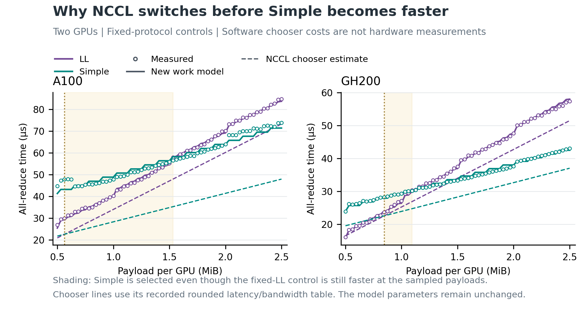
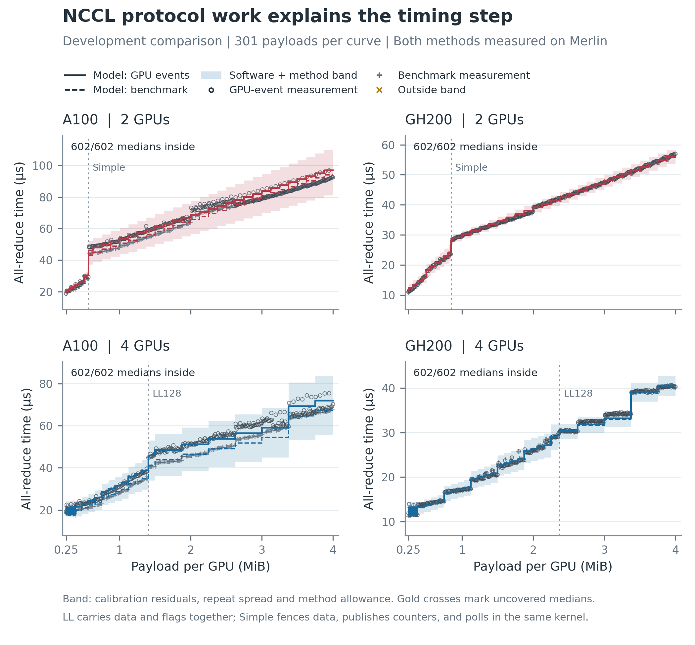
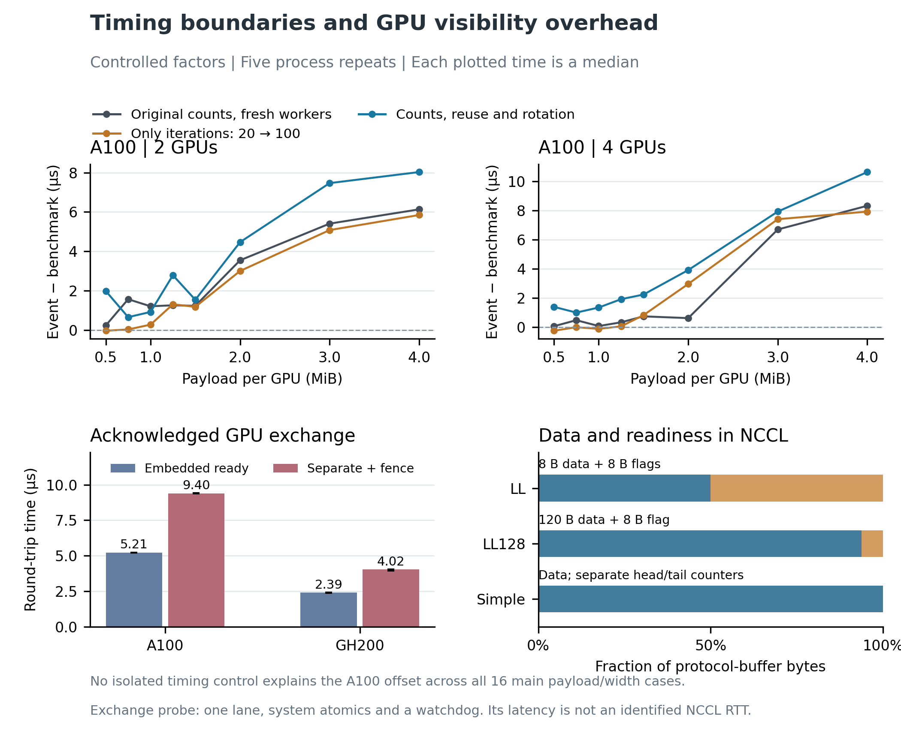

# Protocol work and the Merlin collective timing envelope

The new model covers all **480 measured medians in an independent validation
capture**, including the protocol discontinuities, with parameters fixed before
their capture. Merlin
ran 60 new payloads, two and four GPUs, A100 and GH200, two timing methods,
and five independent process repetitions. No capture integrity guard failed.

The original GPU-event prediction stays within 12.25 percent of every new
median. The four-GPU A100 reference prediction reaches 11.04 percent error,
and its full band reaches 47.09 percent of the measured time. These exceed
the frozen 10 percent reference-error and 40 percent band-width limits.
TRAF-43 gains an executable protocol model and independent coverage evidence,
but remains open for precision and the full payload range. TRAF-54's packetized
collective protocol and COMP-44's host-cost identification remain open. This
result does not validate an end-to-end inference frontier or a general NVLink
packet model.


## What changes in the model

The GPU must move data, make it visible, advertise readiness, and wait until
its peer can consume it. The old smooth interpolation omitted the change in
that work when the NVIDIA Collective Communications Library (NCCL) switches
protocol. The new model represents those operations and the source-derived
channel partition. It retains calibrated effective costs for GPU work; it
does not use one independent timing fit at every payload.

Low latency (LL) stores eight application bytes and eight readiness-flag bytes
in each sixteen-byte line. LL128 stores 120 application bytes and an eight-byte
flag in each 128-byte line. Simple has no embedded data flags: it uses separate
head/tail counters, memory-visibility fences and polling inside the existing
collective kernel. It does not launch an additional polling kernel. Both
protocol families check buffer-reuse credits. Their software buffer formats
are distinct from NVLink's physical packet format. The
[source audit](source_audit.md) identifies the exact implementation and owners.

For a selected protocol and payload, the reference time is

```text
T_ref = apparent_startup + max(encoded_endpoint_bytes / link_capacity,
                               effective_GPU_data_work)
        + synchronization_slices * slice_cost
        + nonempty_publications * publication_cost
```

GPU data work includes maximum-channel encoded bytes and source-derived
instruction work rounds. The `max` represents pipelined overlap of GPU supply
and link service. Empty Simple slice bodies still incur synchronization work;
nonempty data publication additionally performs a visibility fence. Thread,
channel and chunk changes generate the staircase structure. The physical link
rates remain the measured machines' one-direction capacity ceilings.

The source geometry matches 3,044 retained compatible Ring callback cells,
including forced channel-count controls, with no channel or warp disagreement.
Separately, 780 logged software timing estimates reconstruct NCCL's chooser
costs to within 0.000006 microseconds, and the resulting chooser matches all
964 automatic protocol observations. Those software estimates select a path;
they never become the model's hardware service times. These source checks are
unscored structural evidence, not additional timing-accuracy samples.

## Why the switch causes the dip

NCCL selects the protocol with its lowest estimated latency plus byte-service
cost. The library's estimate switches to Simple before the fixed-protocol
measurements show Simple becoming faster than LL. At two GPUs, the recovered
selection starts are 592,016 bytes on A100 and 888,000 bytes on GH200. The
first sampled Simple result no slower than LL occurs later, at 1,568 KiB and
1,120 KiB respectively. The four-GPU selection changes to LL128 at 1,474,256
and 2,488,016 bytes.

At 1 MiB, fixed LL and Simple measure 40.29 and 47.84 microseconds on A100,
and 27.15 and 29.37 microseconds on GH200. NCCL has already selected Simple
at those sizes. This explains why a simulator must follow the chosen protocol
rather than selecting the fastest measured curve. The fixed-protocol hardware
comparisons are retrospective development evidence from the earlier capture.



The original 1-MiB GPU-event point is also reproduced closely. These are
known development points, not part of the independent score above.

| Two-GPU case | Measured original method | New model | Signed error |
|---|---:|---:|---:|
| A100, 1 MiB | 52.019 microseconds | 51.803 microseconds | -0.42% |
| GH200, 1 MiB | 29.448 microseconds | 29.116 microseconds | -1.13% |

## What the shading and round-trip term mean

The original GPU-event estimate adds a protocol-specific method offset to the
reference estimate. Each offset has a nonnegative intercept and a coefficient
on physical byte service. The reference is the dashed curve; the original
method is the solid curve. Both are deterministic.

For each architecture, width and protocol, the empirical radius is the maximum
absolute calibration residual normalized by reference time, plus the 90th
percentile relative interquartile repeat spread. The band is the union of the
two method estimates expanded by that radius, with its lower edge bounded by
startup plus physical byte service. Its parameters use development captures
only. This is a software and measurement-method uncertainty envelope, not a
confidence interval or a separately identified polling distribution. Coverage
refers to process medians, not every raw iteration or repetition.

An assumed visibility round-trip time (RTT) explicitly partitions the composite
synchronization cost. If `k` nonempty publications assume RTT `r`, their
attributed cost is `k*r`; the remaining polling/fence budget is nonnegative.
Only an assumed RTT contribution larger than the identified composite budget
extends total service. This prevents counting the same acknowledgement twice.
At 1 MiB and two GPUs, Simple has four nonempty publications. A 1-microsecond
RTT attribution assigns 4 microseconds of the 22.95-microsecond A100 or
14.79-microsecond GH200 synchronization budget to round trips. The remaining
18.95 or 10.79 microseconds is still composite software/visibility work.
Collective timings do not uniquely separate those components.

The independent exchange probe checks acknowledged data delivery for 4,096
round trips per process after 256 warmups, with five processes per architecture.
Embedded-ready exchange medians are 5.213 microseconds on A100 and 2.390 on
GH200. Data, fence and separate-ready exchange medians are 9.397 and 4.023.
This illustrates an additional ordering cost, but includes atomic, polling and
watchdog work. It is not a direct measurement of NCCL's internal RTT and does
not enter the model fit or uncertainty band.

## Independent comparison and chronology

Signed error is `100 * (prediction / measured_median - 1)`. Each timing method
is compared with its own prediction. Full band width is `(upper-lower)` divided
by that method's measured median. Every curve contains 60 distinct new payloads.

| Architecture | GPUs | Measurement method | Covered medians | Worst signed error | Largest full band |
|---|---:|---|---:|---:|---:|
| A100 | 2 | Original GPU events | 60/60 | -7.11% | 31.74% |
| A100 | 2 | nccl-tests reference | 60/60 | -8.33% | 34.71% |
| A100 | 4 | Original GPU events | 60/60 | -12.24% | 42.10% |
| A100 | 4 | nccl-tests reference | 60/60 | -11.04% | 47.09% |
| GH200 | 2 | Original GPU events | 60/60 | +5.51% | 23.22% |
| GH200 | 2 | nccl-tests reference | 60/60 | +7.64% | 23.69% |
| GH200 | 4 | Original GPU events | 60/60 | -4.94% | 20.44% |
| GH200 | 4 | nccl-tests reference | 60/60 | -4.42% | 20.74% |

The original dense capture at `25ba229e` was already observed before model
development. The initial expectations-only commit is `bb0edcb8`, followed by
pre-implementation amendments `679a9f94`, `d97e26b1` and `0c64d2c2`. Early
additive and startup candidates were refuted by development checks; their raw
outputs remain retained. Candidate parameters were committed at `0e44eca3`;
a build-only probe fix at `f783970a` preceded successful capture.

The first independent campaign, jobs 204938 and 204940, used 60 sizes from
264 KiB in 64-KiB steps. It validly refuted that candidate: four-GPU A100
original-method coverage was 57/60, and each two-GPU GH200 method covered
58/60. Its coarse selection bracket also produced large midpoint error inside
the A100 transition. These were accuracy failures, not fatal capture failures.
The old parameters and predictions remain in `calibration/candidate_v4.json`
and `measurements/first_candidate_*`.

The final revision follows expectations-only commit **`14070e87`** and retains
all GPU-work coefficients and apparent startup unchanged. It replaces the
observed protocol bracket with the source chooser, identifies per-protocol
method offsets, and calibrates the same radius rule using the original dense
capture, forced controls and first validation. All of those are now explicitly
development data for this revision. The development figure shows all 301
payloads per method and all covered medians; it is not independent validation.



Final parameters and the implementation were locked at
**`b3aa02b46e627c1f11aadde8b27f27498c06b03f`** before jobs 205023 and 205024.
Those jobs measured the second grid, 280 KiB through 4 MiB minus 40 KiB in
64-KiB steps. It overlaps neither previous grid. No second-grid value enters
calibration or changes the band. The parameters reproduce byte-identically
from the permitted inputs. Their SHA-256 is
`f605e7bcce9e9d1fc19b076a2a7c32e122f482f5ec5b8dcb774f97eb46ab76ce`.

`validation_v2.json` supplies the second capture grid and its `phase_expectations`
points to `14070e87`. The v5 prose amendment governs final fitting and scoring;
older descriptive fitting fields inherited in the JSON describe the earlier
candidate and are not consumed by the capture or validation runner. No public
preregistration is claimed. The reproducibility record preserves this actual
chronology without rewriting any earlier expectation or outcome.

## The A100 timing gap and public examples

The original harness and nccl-tests do not measure identical execution
boundaries. The original uses GPU events, five warmups, twenty timed iterations,
fresh host workers per payload and fixed buffers. The pinned reference defaults
to host elapsed time through stream completion, twenty warmups, one hundred
iterations, persistent workers and rotating offsets. Their allocation and data
initialization also differ. This corrects the earlier dense report's description
of both as event spans; it does not alter its measured numbers.

The first campaign varied warmups, iteration counts, worker reuse and buffer
rotation, with both timers on the same block. A qualifying isolated effect
must halve the gap and exceed twice the pooled interquartile spread. Across
the sixteen A100 width/payload cases, warmups qualify once, iteration count
twice, worker reuse never, buffer rotation never, and the joint change once.
GH200 has only one qualifying iteration-count case. Tiny diagnostic payloads
are recorded separately. The controls do not identify a general explanation
for the A100 offset. It remains a method-scoped uncertainty, not a proven
host-thread or polling constant.



The [public example audit](public_comparisons.md) checks NVIDIA examples and
paper controls independently of this calibration. A100's advertised 600 GB/s
is aggregate bidirectional bandwidth, not Merlin's one-direction peer capacity.
Public DGX A100 results typically use NVSwitch and different participant counts
or launch methods. An exact percentage comparison requires those conditions to
match. The reference points in this study are NVIDIA's benchmark run locally
on Merlin, not values copied from a vendor-published latency curve.

## Physical sanity and live token metrics

The pre-run floor is `2(n-1)S/n` application endpoint bytes over the capacity
ceiling: 100 GB/s for a two-GPU A100 peer and 300 GB/s aggregate at four GPUs;
GH200 has 150 and 450 GB/s respectively. Protocol encoding can only increase
those bytes. There is no finite physical latency ceiling without a stall bound.
The smallest independent measured/application-floor ratios are 2.215 on A100
and 2.031 on GH200. The measurements stay above the physical floor.

The final parameter checks vary physical rate by 0.5, 1 and 2, width by two
and four, and payload by 512 KiB and 2 MiB. Encoded byte service scales inversely
to rate within one picosecond of rounding. Reference time cannot decrease when
capacity falls. It can plateau when GPU work dominates because the two overlap.
The source chooser and software coefficients are fixed in this counterfactual.
RTT values of 0, 0.25 and 1 microsecond verify the separate nonnegative budget.
These are unscored physical and ownership guards.

`run_live.py` passes the opt-in profile through the supported original graph,
`HtsimStepSink`, `StepResult` and request-metric reducer. Prefill and consecutive
decode steps vary payload and participant width. Across 48 metric rows, changes
to time to first token (TTFT) and time per output token (TPOT) equal exactly
twice the changed collective service, since the graph has two all-reduces.
Compute service is a declared fixed 200 microseconds per operation so the
experiment isolates collective timing. These are integration checks, not an
inference performance forecast. Profile absence preserves the existing path;
unsupported shapes and mixed-fabric use fail before runtime state publication.
The analytic profile and physical peer-packet timing are mutually exclusive.

The pinned htsim tree contains no NVLink/NCCL implementation to change. The
SimLLM NVLink runtime owns the physical calendar, while the native NVSwitch
C++ kernel owns switch-port arbitration. Merlin's direct meshes bypass that
switch. This model therefore changes the existing analytic collective path.
TRAF-54 still owns emitting actual protocol packets into the physical runtime.

## Reproduction and verification

The compact tables, provenance hashes and plotted parameters are committed;
raw process logs, binaries, source snapshots and full timing repetitions remain
in the external evidence bundle. Set `NCCL_MODEL_CAPTURE_A100` and
`NCCL_MODEL_CAPTURE_GH200` to the second capture directories, and
`NCCL_MODEL_OUTPUT` to an external output directory. Then run:

```bash
python examples/nccl_protocol_model_v1/analyze_capture.py \
  "$NCCL_MODEL_CAPTURE_A100" "$NCCL_MODEL_CAPTURE_GH200" \
  --expectations examples/nccl_protocol_model_v1/validation_v2.json \
  --models examples/nccl_protocol_model_v1/calibration/models.json \
  --output "$NCCL_MODEL_OUTPUT"
python examples/nccl_protocol_model_v1/plot_results.py \
  --models examples/nccl_protocol_model_v1/calibration/models.json \
  --predictions examples/nccl_protocol_model_v1/measurements/independent_predictions.csv \
  --output "$NCCL_MODEL_OUTPUT/protocol-model-validation" \
  --label 'Independent validation | 60 new payloads per curve | Parameters locked before capture'
python examples/nccl_protocol_model_v1/run_live.py \
  --models examples/nccl_protocol_model_v1/calibration/models.json \
  --output "$NCCL_MODEL_OUTPUT/live"
```

Capture guards verify library, benchmark and parameter identities; complete
process/size/repetition inventories; correct returned data; unchanged topology;
absence of foreign GPU processes; finite timings; and physical floors. The
reference executable is byte-identical across the three captures on each
architecture. The original harness changes only the payload grid between the
first and second validation. Calibration reproduction has no dependency on
second-grid data. GPU clocks are observed without changing them; five-second
samples cannot identify the clock of each individual timed collective. Repeated
payloads within a process share execution context, so the 480 median points are
not 480 statistically independent trials. Independence here means fresh capture
and unseen payloads after the final parameter lock.

The final repository gate passes: **6,471 tests passed, 32 skipped** in
1,813.21 seconds. Repository lint, documentation format and diff checks pass.
`measurements/verification.json` records the exact commands and the superseded
source-changing gate attempt. Figures are inspected at their rendered size.
No benchmark count is added to a test or structural-guard count. No shipped
default, old measurement, historical interpolation figure, or public inference
claim changes. TRAF-43 retains the residual precision and full-range work;
TRAF-44 retains selectable full-range direct-mesh profiles; TRAF-54 retains
packetized collective execution; COMP-44 retains host-cost identification.
