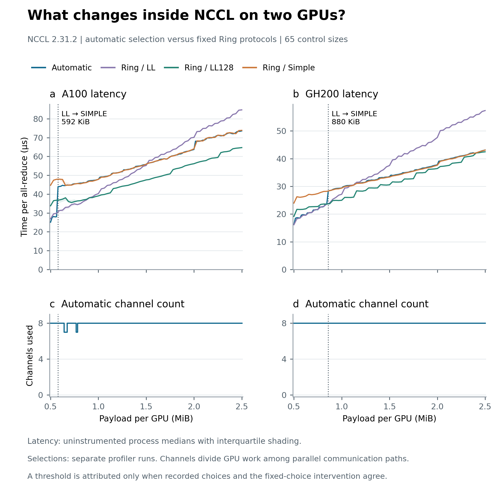
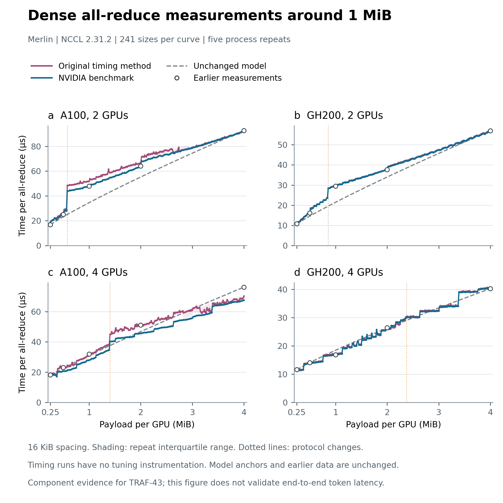
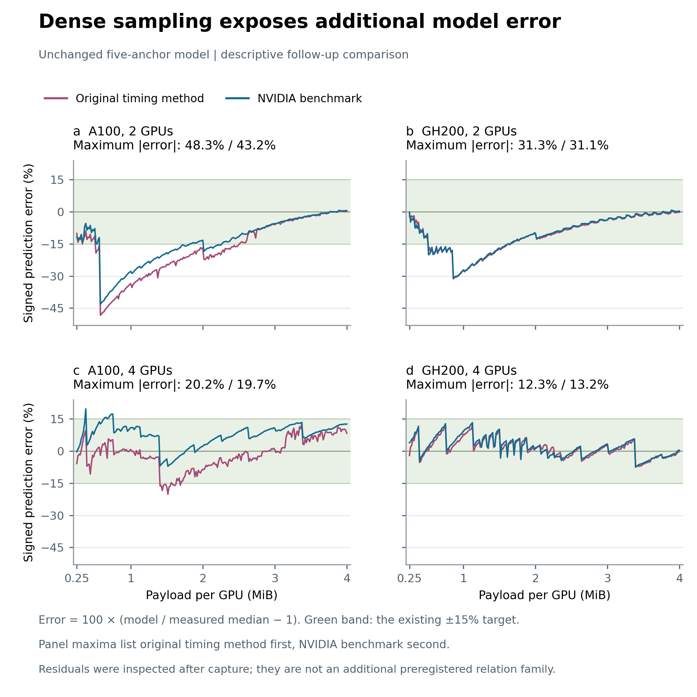

# Dense Merlin collective timing and NCCL protocol transitions

The two-GPU latency discontinuity is a switch from the low-latency (LL)
protocol to Simple inside the NVIDIA Collective Communications Library
(NCCL). It occurs before 1 MiB on both machines. The unchanged model
interpolates across that discontinuity and therefore predicts a collective
that finishes too early.

The single-node NVLink study on Merlin measured 241 payloads from 256 KiB to
4 MiB, every 16 KiB, at widths two and four on A100 and GH200. Each curve has five independent process
repetitions using both the original event-timing harness and NVIDIA's
nccl-tests. Eleven controlled arms cover 65 payloads from 512 KiB to 2.5 MiB,
every 32 KiB, with three process repetitions. Every timing and observer
allocation completes successfully, with no violated fatal guard.

## The two-GPU mechanism

| Machine | Last LL payload | First Simple payload | NVIDIA benchmark time across those adjacent samples | Increase |
|---|---:|---:|---:|---:|
| A100 | 576 KiB | 592 KiB | 27.994 to 43.979 microseconds | 57.10% |
| GH200 | 864 KiB | 880 KiB | 23.624 to 28.363 microseconds | 20.06% |

Both keep the Ring algorithm and eight communication channels at the switch.
The recorded work size changes from 16 to 17 warps per channel, equivalent
to 512 to 544 GPU threads. Simple uses an additional synchronization warp in
the Ring path. The exact public implementation of
[channel and thread selection](https://github.com/NVIDIA/nccl/blob/7b83616df3ae082a1f32bb74c27458bfe8153a13/src/tuning/tuning_general.cc#L140)
describes that extra warp. NCCL's
[selection routine](https://github.com/NVIDIA/nccl/blob/7b83616df3ae082a1f32bb74c27458bfe8153a13/src/tuning/tuning.cc#L152)
chooses the candidate with the lowest predicted time; the observed boundaries
are consequences of that selection, rather than an assumed fixed 1 MiB rule.

Holding the protocol fixed largely removes the step. The following comparison
uses identical endpoints from the coarser control grid, so its percentage
differs slightly from the adjacent 16 KiB samples above.

| Machine | Control interval | Automatic increase | Fixed Ring/LL increase | Fixed Ring/Simple increase |
|---|---:|---:|---:|---:|
| A100 | 576 to 608 KiB | 57.28% | 4.89% | 0.13% |
| GH200 | 864 to 896 KiB | 20.64% | 1.75% | 0.91% |

These interventions exceed the frozen 50 percent excess-step reduction bar
with stable repetitions. Direct callback records identify the same selections
in the inherited harness and nccl-tests at every one of the 964 shared
architecture/width/payload configurations. Thus the mechanism transfers to
the measurement method used by the original figure. The inherited harness
itself shows increases of 65.50 percent on A100 and 20.73 percent on GH200
across the adjacent boundary samples.



## Four GPUs and the accuracy consequence

At four GPUs, A100 switches from Ring/LL to Ring/LL128 between 1424 and
1440 KiB, with a 15.70 percent adjacent-sample increase in nccl-tests.
Its channel count changes from 24 to 23 and its warp count from 16 to 20.
Fixed Ring/LL and Ring/LL128 controls reduce the corresponding control-grid
step from 16.83 percent to 1.23 and 0.20 percent. Both meet H4.

GH200 switches from Ring/LL to Ring/LL128 between 2416 and 2432 KiB, with
24 to 22 channels and 16 to 20 warps. Its adjacent-sample time decreases
0.39 percent. The control-grid increase is only 2.32 percent, below H4's
5 percent minimum, so this switch is observed but is not a supported
explanation for a large latency jump. Four-GPU curves also contain channel
count changes within a fixed protocol; the full history is retained in
the timing and tuning tables.



The following residuals are a **post-specified descriptive comparison** made
after capture and visual inspection. They do not add a sixth acceptance
family to the frozen experiment. The five-anchor model, its old measurements
and its original validation artifact remain unchanged. Error is
`100 * (model_time / measured_median_time - 1)`.

| Machine and width | Worst signed error, original timing method | At payload | Worst signed error, NVIDIA benchmark | At payload |
|---|---:|---:|---:|---:|
| A100, 2 GPUs | -48.33% | 592 KiB | -43.16% | 592 KiB |
| A100, 4 GPUs | -20.20% | 1552 KiB | +19.69% | 384 KiB |
| GH200, 2 GPUs | -31.34% | 880 KiB | -31.05% | 880 KiB |
| GH200, 4 GPUs | +12.28% | 1152 KiB | +13.24% | 1152 KiB |

The earlier four-GPU A100 pass applies to its original sparse holdout set.
It does not generalize to the dense follow-up. GH200 at four GPUs remains
within 15 percent on the dense grid for both timing methods.



## Frozen relations, uncertainty and physical checks

- **H1, historical reproduction:** every 512 KiB, 1 MiB and 2 MiB comparison
  is within 10 percent. The largest difference is 8.78 percent, A100 at
  two GPUs and 1 MiB. This does not assert agreement at every old payload.
- **H2, timing-method agreement:** refuted on A100. Two of 241 two-GPU
  shapes and 89 of 241 four-GPU shapes exceed the larger of 10 percent or
  2 microseconds. Worst relative differences are 12.35 and 16.05 percent.
  Both GH200 widths meet the bound at every shape. The timing methods remain
  separate; these are local event durations per call, not common-clock
  collective phase spans or isolated device service times.
- **H3, recorded selection:** the full history is available. A100's main
  two-GPU protocol switch lies before the initially named 768 to 1280 KiB
  neighborhood. That neighborhood contains channel changes, so the broad
  H3 window predicate alone would not locate the main discontinuity.
- **H4, intervention:** supports both two-GPU LL-to-Simple transitions and
  A100's four-GPU LL-to-LL128 transition. GH200's four-GPU protocol transition
  is below the frozen minimum step. Tree controls are retained but do not
  count as compatible Ring interventions. Every tested transition and
  intervention is present in `measurements/analysis.json`.
- **H5, launch-mode sensitivity:** refuted on A100 at 58 of 65 two-GPU
  shapes and 16 of 65 four-GPU shapes. Graph replay is up to 20.17 percent
  faster while its recorded choices remain identical. Both GH200 widths
  meet the frozen bound. This identifies launch-mode sensitivity; it does not
  isolate a host-initiation constant from all other timing effects.

All repetitions are retained. Seven point summaries have an interquartile
spread above 10 percent of their median and are flagged in the analysis.
They are not discarded, and unstable cells cannot support H4. The plotted
shading is an interquartile range across independent process blocks, not a
confidence interval. Five-second clock samples include idle GPUs and gaps
between processes; they do not identify the clock of each timed collective.

Before measuring, the freeze bounded time from below by `2(n-1)S/n` endpoint
bytes over 300 GB/s aggregate one-direction NVLink egress on A100 or 450 GB/s
on GH200. The smallest measured-to-floor ratios are 3.218 and 2.863.
Bandwidth arithmetic is independently reconstructed from bytes and time.
No finite physical upper latency bound is asserted without a stall bound.
The separate checks of byte-rate limits, independent timing methods and
recorded choices with interventions provide different evidence for the result.
Correctness and integrity guards are unscored and are never added to a
behavioral pass denominator.

## Chronology and reproducibility

The timing expectations-only commit is `c68b07541196656063beb5c3efa438ac74b056a2`.
Capture implementation `a1cbd6e413d4c97cdce3ef805e9bd5613f676d40` precedes the
first run. These are local prospective freezes informed by the earlier
observations; no public preregistration is claimed.

The initially pinned nccl-tests summary profiler loads its v7 interface but
returns unavailable selection fields for all 3,824 diagnostic payload rows.
Those summaries supply no mechanism evidence. The subsequent
[observer amendment](observer_expectations.md), commit `5cb2bc0c`, precedes
direct observer implementation `249e354f170eb455ff521545aa23f9306ba187d6`
and both observer runs. Each architecture supplies 162,342 collective
callbacks with complete rank/payload coverage and no ambiguous choice cell.
Both observers use exactly the same GPU identities and NVLink mesh as their
respective timing capture. Instrumented durations are excluded from timing
summaries and figures.

| Architecture | Timing job | Direct observer job | Mesh | CUDA toolkit | NCCL |
|---|---:|---:|---|---|---|
| A100 | 204703 | 204707 | 4 GPUs, NV4 between each pair | 12.2.2 | 2.31.2 |
| GH200 | 204704 | 204709 | 4 GPUs, NV6 between each pair | 12.9.1 | 2.31.2 |

The benchmark source is pinned to
[nccl-tests b4d5beeb](https://github.com/NVIDIA/nccl-tests/tree/b4d5beebca8a76cf01335f724d154b9b9d394d96).
Library hashes, GPU identities, repetition summaries, all interventions and
observer audits are retained in the analysis artifact. Raw process results,
callback logs, clock samples and binaries stay outside Git. Local paths are
supplied through environment variables.

```bash
python examples/nccl_transition_v1/analyze.py \
  "$NCCL_A100_CAPTURE" "$NCCL_GH200_CAPTURE" \
  --observers "$NCCL_A100_OBSERVER" "$NCCL_GH200_OBSERVER" \
  --expectations examples/nccl_transition_v1/expectations.json \
  --repo . --output "$NCCL_TRANSITION_ANALYSIS"

python examples/nccl_transition_v1/plot_results.py \
  --data examples/nccl_transition_v1/measurements \
  --repo . --output "$NCCL_TRANSITION_PLOTS"
```

## Effect on the project

TRAF-43 now has measured protocol boundaries and intervention evidence for
the two-GPU discrepancy. It stays open for a replacement model with a new
freeze, held-out accuracy checks and its exact identity bypass. The dense
A100 four-GPU miss withdraws an extension of the sparse pass to arbitrary
intermediate payloads. TRAF-44's selectable calibration and TRAF-54's
collective implementation still require their own acceptance evidence.
The A100 launch-mode result does not close COMP-44's host-cost identification.

No simulator behavior, calibrated default or accepted historical measurement
changes. These are component measurements of NCCL software choices and timing;
they do not identify NVLink packet formats. Time to first token (TTFT) and
time per output token (TPOT) accuracy, and an end-to-end Pareto frontier, are
not established by this study.
