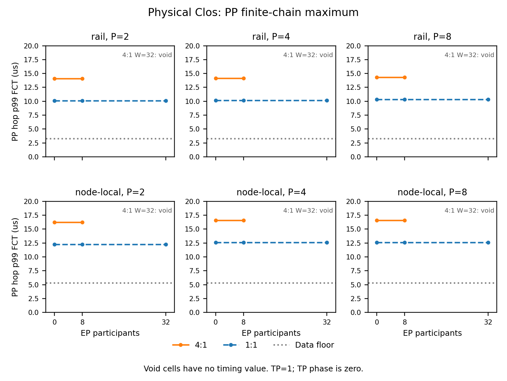
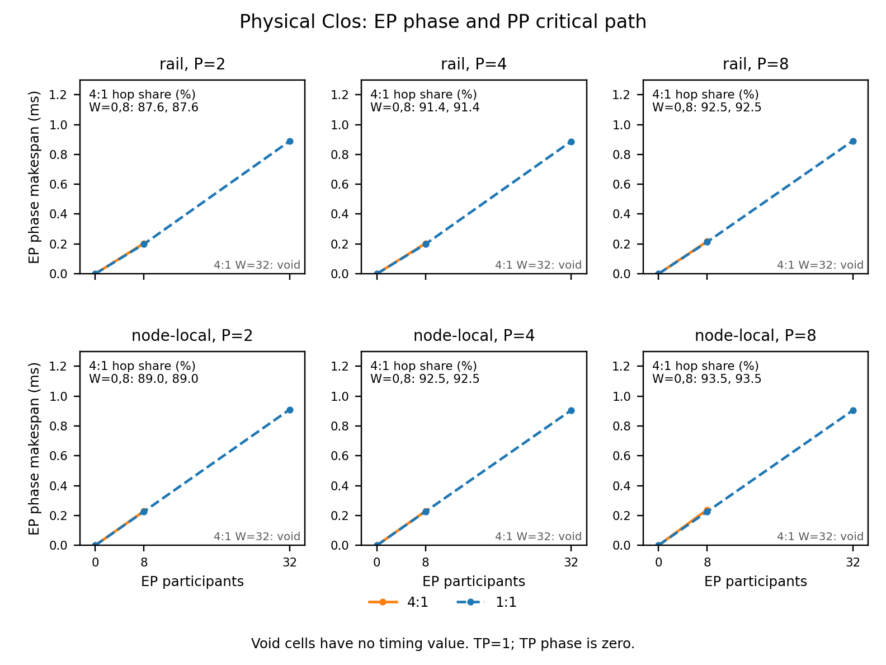

# Oversubscribed rail contention: result

The frozen sweep completed 66 clear cells. All six physical cells with two
spines and 32 EP participants aborted on fatal control-lifecycle loss. The
surviving physical PP tails change by exactly 0 ps from EP width zero to
eight. The required load-dependent node-local contention penalty is therefore
not established, and TRAF-88 remains open. The production topology extension,
full-bisection identity checks and the complete failed-cell evidence are delivered.

## What ran

The 72-cell grid crosses attachment {rail, node-local}, spine count {8, 2},
pipeline width P {2, 4, 8}, concurrent expert-parallel (EP) participants
W {0, 8, 32}, and packet profile {rnic-nn, rnic-cn}. Endpoints and uplinks
are declared at 400 Gbit/s. Eight leaves each connect once to every spine;
eight spines give 1:1 and two give 4:1. Each physical link has 1,000 ns
propagation and each switch has zero added latency.

The frozen expectations commit is
`94b7f1fb126ee5c295b39b52d7d7f322b737fb05`. It precedes all implementation,
tests and native runs. The workload and its reduction reuse the accepted
pp_rail_topology_v1 driver, whose LF-normalized source, expectations and result
digests are pinned in this driver. The backend build is `617ce20`; executable
SHA-256 identities match the accepted study exactly and are recorded in
[results.json](results.json). The physical PRBS seed is explicitly one.

Stage s occupies node s on NIC zero, at semantic rank 8s. Each stage computes
for a synthetic 1 us and each forward boundary sends 65,536 bytes. Increasing
P adds stage service; it is not a fixed-model speedup experiment. EP starts
at time zero on separate endpoint links, with NIC-major placement across
eight nodes. W=8 emits 56 remote messages; W=32 emits 896. Each directed pair
sends 1 MiB. Local pairs are excluded, and there is no reverse combine.
Tensor parallelism (TP) is one, so its phase makespan is zero and unscored.

The study-local `ContentionStepSink` specializes `HtsimStepSink` to execute
one concurrent GOAL program and pass the frozen native seed. The ordinary
sink's ordered-artifact planner would change PP/EP overlap. This adapter uses
the production binary conversion and packet runner but does not extend the
production sink's general graph interface. The last PP completion projects
through its final 1 ns GOAL gate and 1 us compute to a `CompletionEvent`,
then a live `StepResult` and one-token request TTFT. No second runtime
reschedules packet timings. This is a narrow declared singleton-stage metric
projection, not adapter-captured serving integration or a TPOT measurement.

## Physical bounds before precision

At the declared rate, serialization costs 20 ps/byte. A PP payload requires
1,310,720 ps; adding its forward links gives data-arrival floors of
3,310,720 ps on rail and 5,310,720 ps on node-local. Loose unloaded data-only
store-and-forward ceilings are 4,621,440 and 9,242,880 ps. Sender-visible FCT
also includes control and acknowledgments, so those data ceilings do not
bound FCT. There is no finite unconditional FCT ceiling from payload alone.

Two uplinks limit a leaf's shared throughput to 800 Gbit/s, or 100 GB/s.
For Q directional payload bytes crossing that cut, drain time is at least
Q*10 ps; eight uplinks give Q*2.5 ps. These per-cell counts and bounds were
written to bulk storage before the first backend invocation:

| Attachment | W | Busiest EP leaf cut bytes | 4:1 cut drain floor (us) | 4:1 EP phase floor (us) |
|---|---:|---:|---:|---:|
| Rail | 0 | 0 | 0 | 0 |
| Rail | 8 | 0 | 0 | 148.800640 |
| Rail | 32 | 176,160,768 | 1,761.607680 | 1,765.607680 |
| Node-local | 0 | 0 | 0 | 0 |
| Node-local | 8 | 7,340,032 | 73.400320 | 148.800640 |
| Node-local | 32 | 117,440,512 | 1,174.405120 | 1,178.405120 |

The phase floor takes the larger of endpoint serialization plus two link
delays and cut drain plus four link delays. At W=8 the endpoint needs 7 MiB
of service; at W=32 it needs 28 MiB. Rail W=8 stays inside one EP leaf and
cannot exercise an uplink. Rail PP uses a different, reserved leaf in every
cell. At node-local W=32, each PP source leaf has 112 MiB of potentially
competing outgoing EP bytes; at W=8 it has 7 MiB.

Those whole-phase bytes do not all precede the tagged PP hop. The pre-run
guaranteed EP byte count ahead of PP is zero, giving a zero unconditional
added queue-delay floor. The physical PP floors above apply in every cell.
The result table separately records temporal overlap and potentially shared
flow payload, without calling either an observed queue occupancy. A positive
q measured ahead of the hop would imply q*10 ps of two-uplink service; this
experiment has no packet queue trace establishing q. Reporting a whole-phase
drain floor as a PP hop FCT floor would be invalid.

At P=8, compute plus hop-arrival floors are 31.175040 us rail and
45.175040 us node-local. Shares are bounded by zero and one; the corresponding
non-compute share floors are 74.338% and 82.291%. EP background service is
never added to the PP serial chain. Every clear physical cell satisfies its
serialization, path, phase-cut and causal bounds. Fatal cells have no usable
completion number to compare with these floors or with a throughput ceiling.

## What came out

Each p99 is the nearest-rank quantile of P-1 hops, hence the maximum of one,
three or seven samples. It is not a population tail estimate. The following
physical rows are identical at W=0 and W=8. All quantities are in microseconds
except the final percentage, which is sum(PP hop FCT)/PP step completion.
The hop data floors are 3.310720 us rail and 5.310720 us node-local throughout.

| Attachment | Spines | P | PP p50 (us) | PP p99 (us) | PP step (us) | PP hop critical share |
|---|---:|---:|---:|---:|---:|---:|
| Rail | 8 | 2 | 10.0870 | 10.0870 | 12.089 | 83.439% |
| Rail | 8 | 4 | 10.0870 | 10.1692 | 34.348 | 88.338% |
| Rail | 8 | 8 | 10.1692 | 10.3356 | 79.282 | 89.893% |
| Rail | 2 | 2 | 14.0806 | 14.0806 | 16.082 | 87.555% |
| Rail | 2 | 4 | 14.0806 | 14.1628 | 46.329 | 91.353% |
| Rail | 2 | 8 | 14.1628 | 14.3292 | 107.237 | 92.528% |
| Node-local | 8 | 2 | 12.2534 | 12.2534 | 14.255 | 85.959% |
| Node-local | 8 | 4 | 12.5820 | 12.5852 | 41.426 | 90.331% |
| Node-local | 8 | 8 | 12.4956 | 12.5852 | 95.020 | 91.566% |
| Node-local | 2 | 2 | 16.2470 | 16.2470 | 18.249 | 89.030% |
| Node-local | 2 | 4 | 16.5724 | 16.5788 | 53.404 | 92.499% |
| Node-local | 2 | 8 | 16.4860 | 16.5788 | 122.969 | 93.483% |

Reducing the spine count adds exactly 3,993,600 ps to p99 on every clear
physical chain, including the unloaded rail. That is 48 packet serialization
slots of 83,200 ps, far above the frozen one-packet tolerance. The native
manifest's ring window also changes by exactly 3,993,600 ps, from 6,572,800
to 10,566,400 ps. This is an observed association, not a resolved causal
breakdown. It cannot be attributed to EP queueing because it exists at W=0.
The backend source is unchanged; isolating that topology-dependent control
calibration is remaining work.

For P=8, W=8, EP completes at 212.5344 and 216.4704 us on rail with eight
and two spines; node-local gives 225.1232 and 238.6688 us. All exceed the
148.800640 us endpoint-plus-propagation floor. Across P, the measured two-
versus eight-spine EP ratios range from 1.0185 to 1.0248 on rail and 1.0125
to 1.0602 on node-local. The effective serialization floor ratio at W=8 is
one, so that candidate holds. The stronger raw nonempty-cut ratio of four
is refuted on node-local W=8, whose phase remains endpoint limited.

At P=8, W=32 the valid 1:1 EP phases are 890.4032 us rail and 904.0672 us
node-local, above the common 589.202560 us endpoint-plus-propagation floor.
The 4:1 phases are void. No achieved shared throughput, EP makespan ratio,
PP p99 or critical-path share is reported for those six failed cells.

All 36 null-profile cells are clear. Unloaded PP p99 is 3.4144 us on every
attachment, spine count and P, with a 1.310720 us payload serialization floor.
At W=8 or W=32 it is 3.4950 us, again identical across all four fabrics.
This profile bypasses the topology and its small load response is not physical
uplink evidence. At P=8 its unloaded step is 31.914 us; loaded steps are
32.453 us. TP phase remains exactly zero in all cells.

The non-compute share includes GOAL gate/quantization in addition to hop FCT.
For P=8 at W=0 or W=8 it is 89.909% and 92.540% on 1:1 and 4:1 rail,
and 91.581% and 93.494% on node-local. The table's slightly smaller hop shares
exclude that overhead. Every live request metric conserves compute, hop
service and GOAL overhead exactly; TTFT equals the PP final-stage boundary.
Background-inclusive job completion is stored separately in the result table.



The [PP PDF](figures/pp_tail.pdf) shows clear cells only. At EP width 32,
each 4:1 curve ends without a timing point because its backend run is void.



The [phase PDF](figures/phase_share.pdf) reports EP completion separately from
the PP share. Share annotations cover W=0 and W=8 only. These are plain
matplotlib figures, inspected for clipping and label overlap.

## Frozen relations and fatal evidence

| Relation family | Outcome |
|---|---|
| R1 unloaded null equality | Holds for all three P values, exact to 0 ps |
| R2 accepted 1:1 p50 and p99 | All twelve scalar comparisons hold exactly |
| R3 node-local load growth and share | Unscored at every P because W=32 is void; W=0 to 8 changes by 0 |
| R4 rail within one packet of 1:1 | Refuted in six clear W=0/8 comparisons; three W=32 comparisons unscored |
| R5 effective EP floor ratio | Holds in six W=8 comparisons; six W=32 comparisons unscored |
| R5 stronger raw-cut ratio | Refuted in three node-local W=8 comparisons; six W=32 comparisons unscored |

The six native errors are `rnic-cn fabric dropped control lifecycle`, at
P=2,4,8 on both 4:1 attachments with W=32. Control loss is fatal in the
pinned model. Partial native completion files do not produce timing claims,
request metrics, or relation scores. Their byte accounting remains valid,
but no guard was frozen as survivable for a failed cell's timing claims.
The aggregate fatal status is **void** while the other 66 cells remain
individually interpretable. There is no pass fraction combining guards,
configuration counts and hypotheses.

An initial attempt used the native default seed because the ordinary sink
does not expose a seed option. The seed guard rejected its physical cells;
the attempt was stopped and retained under a separate bulk directory. The
study adapter then supplied the frozen seed one and reran the unchanged grid.
No load, topology, timing, packet parameter or expectation was revised. Final
postprocessing added portable error classes and bounds to the six error rows
and adjusted figure layout; it changed no successful-cell timing.

## What it changes and what it does not change

TRAF-88 now owns the exact remainder: resolve fatal control loss at 4:1 W=32
without disabling its guard, separate the unloaded ring-window effect from
contention, and obtain independently justified ahead-of-PP byte evidence
under a fresh freeze. The full-bisection manifest, topology text and endpoint
permutation remain exact golden-byte regressions. Two/four/eight spine counts
and separate uniform uplink rates are available through the opt-in production
builder; four-spine and unequal-rate variants have deterministic projection
tests but are not native study claims.

TRAF-8 is unchanged: captured stages, overlapping microbatches and general
packet-backed serving metrics remain open. This study adds no calibrated
TTFT/TPOT claim, GPU evidence, backward traffic, flow-hash routing, general
fabric discovery or default-path change. No new stable task ID is registered.

## Reproduction

Configure the gitignored local environment, then run:

```bash
. ./.env.local.sh
.venv/bin/python examples/pp_rail_contention_v1/run_study.py
.venv/bin/python examples/pp_rail_contention_v1/run_study.py --plot-only
```

`SIMLLM_DATA_ROOT` selects bulk storage and `--out` can override it with an
external directory. `SIMLLM_HTSIM_RNIC` and `SIMLLM_TXT2BIN` select the pinned
executables; the local environment derives them from `SIMLLM_HTSIM_BUILD`.
`--cell ATTACHMENT SPINES P EP PROFILE` selects a frozen cell. Bulk evidence
contains all pre-run bounds, manifests, semantic graphs, endpoint maps, GOAL,
completions, final-stage events, live step results and native errors. Tracked
text accepts raw/LF-normalized input digests and is written as LF bytes.

## Validation gates

The final ordinary unit-test environment completed `.venv/bin/pytest -q`:
`4361 passed, 29 skipped in 315.62s (0:05:15)`. The optional native executable
variables were omitted for this gate; native study execution is the separate
72-cell evidence class above. An earlier full-suite attempt with those
variables exported ended with signal 15 at about 41 percent and no assertion
report; its incomplete log is retained without a pass claim.

`.venv/bin/ruff check .` reports `All checks passed!`, and
`.venv/bin/python scripts/check_docs_format.py` reports
`OK: 11 module doc(s) match docs/modules/FORMAT.md`. All 36 full-bisection
GOAL digests also match the accepted study exactly. Task text has LF line
endings, no em dashes and no personal absolute paths. The native failure
classifications and figure layout changes did not alter any successful-cell
timing.
