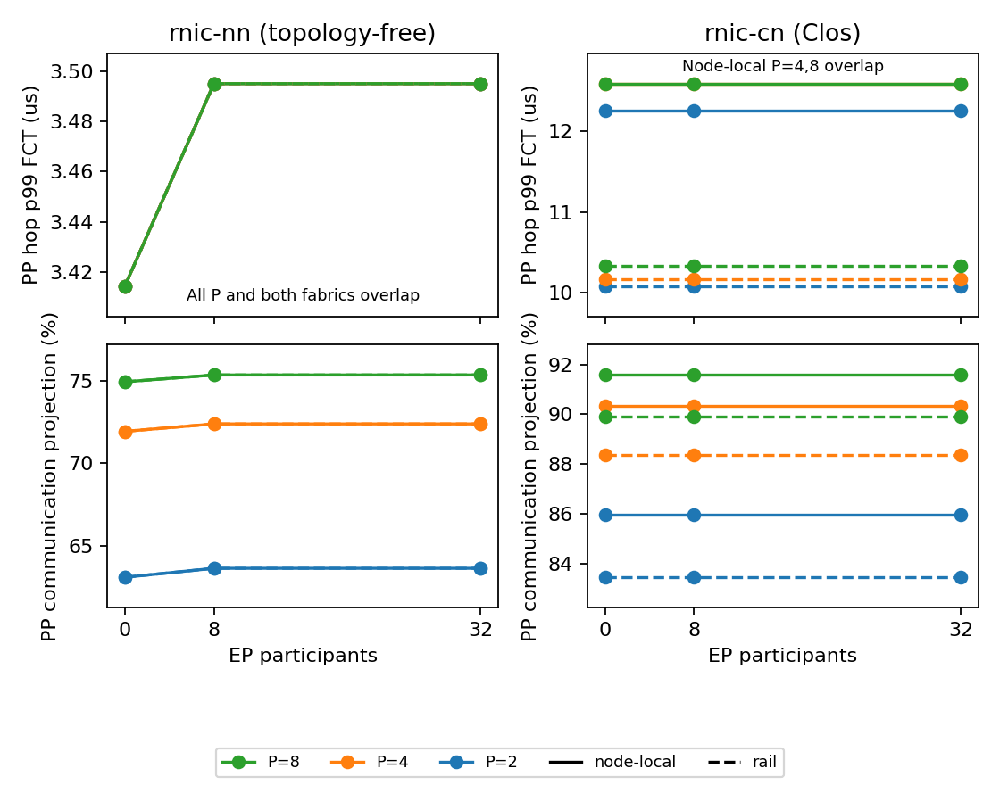

# Pipeline activations and rail topology: result

The 36-cell packet sweep emits forward pipeline activations on both declared
fabrics. On the eight-stage physical chain, the node-local fabric raises PP
hop p99 from **10.3356 to 12.5852 microseconds**, a 21.8 percent increase.
Increasing concurrent EP participants from zero to 32 changes that p99 by
**0 ps** on either physical fabric. The path-length benefit is demonstrated;
the proposed shared-uplink congestion explanation is refuted by this workload.

TRAF-8 gains declared forward-stage composition, exact width-one identity,
and execution-graph to request-metric reachability on the coarse runtime.
It remains open for captured stage attribution, concurrent microbatches and
packet-backed request metrics. PLACE-1 gains the two fixed fabric manifests
and their validated backend endpoint projection; general discovery remains
open. No milestone or task closes, and this study does not establish calibrated
serving time to first token (TTFT) or time per output token (TPOT).

## What ran

The input grid is fabric `{rail, node-local}`, pipeline parallel (PP) width
`{2, 4, 8}`, expert parallel (EP) group width `{0, 8, 32}`, and profile
`{rnic-nn, rnic-cn}`, all at 400 Gbit/s. Every chain starts on rank zero;
stage s occupies node s on network interface controller (NIC) zero. Each
boundary sends 65,536 activation bytes and each stage computes for a declared
1,000 ns. This synthetic service input is not a graphics processor (GPU)
calibration or a fixed-model pipeline speedup experiment.

EP uses separate endpoint links on NICs 1 through 4. Widths eight and 32
produce 56 and 896 directed remote messages, each 1,048,576 bytes, with seven
and 28 remote peers per endpoint. Local pairs stay off the external fabric.
This is a background network phase, not a complete mixture-of-experts layer.
Tensor parallelism (TP) is one in the selected chain, so its phase makespan
is zero and unscored. All PP sends and the background EP phase execute in
one GOAL program, preserving their overlap.

The two fabric manifests retain eight leaves, eight spines, 128 links,
400 Gbit/s link rates, 1,000 ns per-link propagation and zero switch latency.
Only NIC attachments change. A bijective endpoint permutation expresses
those attachments in htsim's contiguous leaf numbering; completion records
are mapped back to semantic GPU ranks before comparison. No schema extension
or old-reader change is needed.

The frozen expectations commit is
`8356fa6cf4fe10f77757227eb59856830084adff`. It precedes implementation and every
run. The backend build is `617ce20`; executable SHA-256 identities and the
sanitized backend manifests are in [results.json](results.json). The physical
profile uses `-rnic_cn_prbs_seed 1`. The null-network profile has no random-seed
option and refuses physical topology arguments; its fixed 2 us propagation
and central packet calendar are explicitly topology-free.

## Physical bounds before precision

A 65,536-byte payload on a 400 Gbit/s link needs at least **1.310720 us** to
serialize. Adding the forward path gives data-arrival floors of **3.310720 us**
for two links through one leaf, and **5.310720 us** for four links through the
spine. Loose unloaded data-only store-and-forward ceilings are **4.621440 us**
and **9.242880 us**, respectively. These bounds were written before running.

The physical PP FCTs lie above both data-arrival floors. They also exceed the
data-only ceilings, which do not bound sender-visible control completion.
The manifest declares in-band control, declaration gating, acknowledgment
feedback, retirement and a 10 us control deadline. FCT is consequently not
just payload serialization plus forward propagation. The study does not
measure each control component separately and does not assign its residual
to a particular control message.

The null-network unloaded FCT is 3.414400 us. A post-specified accounting
check explains its 103,680 ps excess over the requested oracle: 16 packet
headers of 64 bytes cost 20,480 ps, and one 4,160-byte packet slot costs
83,200 ps. This matches the packet geometry and central-calendar mechanism
reported by the backend; it is not an additional pre-registered oracle.

A shared-link byte budget cannot guarantee contention. Each leaf has eight
400 Gbit/s endpoint links and eight 400 Gbit/s uplinks, with equal aggregate
capacity. The physical backend uses per-packet path round-robin routing.
For width 32 the deliberately loose four-link payload queue envelope is
75,198,627,840 ps at P=8. The measured load-induced physical PP p99 change,
0 ps, is inside that envelope but fails the frozen strict-growth hypothesis.
No control-inclusive finite FCT ceiling follows from payload bytes alone.

A separate, post-specified EP sanity check uses the endpoint bottleneck: at
width 32 every receiver consumes 28 MiB, giving a payload phase floor of
587.202560 us. Serializing all 896 remote messages one at a time over four
links gives a loose data-work ceiling of 75.161928 ms, before per-message
propagation and control. The measured 0.887 to 0.909 ms physical phase range
lies between those data-work scales. A sender-completion ceiling still needs
control progress assumptions, as stated above. This extra accounting check
is not counted as a frozen oracle or a behavioral pass.

For P=8 the declared compute plus data-arrival floors are 31.175040 us on
the rail and 45.175040 us on the node-local fabric. Packet-program step
completion is 79.282 and 95.020 us respectively, above those floors. This
third check uses the serial causal chain, independently of per-flow matching
and link-inventory checks. The declared 1 us stage service is not a plausible
whole-model GPU estimate, and these numbers make no claim about real serving
throughput.

## Packet results

Each p99 is the nearest-rank quantile of only P-1 hops, hence the maximum
of one, three or seven samples. It is not a population tail estimate.

| Physical profile | PP stages | PP p50 (us) | PP p99 (us) | Step completion (us) | Communication and GOAL overhead share |
|---|---:|---:|---:|---:|---:|
| Rail | 2 | 10.0870 | 10.0870 | 12.089 | 83.456% |
| Node-local | 2 | 12.2534 | 12.2534 | 14.255 | 85.970% |
| Rail | 4 | 10.0870 | 10.1692 | 34.348 | 88.354% |
| Node-local | 4 | 12.5820 | 12.5852 | 41.426 | 90.344% |
| Rail | 8 | 10.1692 | 10.3356 | 79.282 | 89.909% |
| Node-local | 8 | 12.4956 | 12.5852 | 95.020 | 91.581% |

Every entry above is unchanged at all three EP widths. At P=8 and EP width
32, the background EP phase completes at 890.4032 us on the rail fabric
and 904.0672 us on the node-local fabric. Those background-inclusive times
are not PP step completion times and are not added to the PP critical path.
Across all P, EP-width-32 phase completion ranges from 887.3536 to 890.4032 us
on rail and from 904.0672 to 909.2224 us on node-local.

The null-network profile produces the same PP values on both fabrics:
p99 is 3.4144 us with no EP and 3.4950 us with EP width eight or 32. Its
80.6 ns increase is a central packet-calendar effect, not evidence of a
physical shared uplink: this profile has no physical switch graph. The
backend manifest identifies the calendar and the absence of fabric queues;
the study does not resolve which calendar event causes every added slot.

Only the first PP boundary has aligned starts between profiles. Its physical
to null-network FCT ratios range from 2.8861 to 3.5887, all above one. Later
boundaries start at model-dependent times, so their per-flow ratios are
omitted. Full per-hop timings, phase makespans and request-chain completion
projections remain in the small result table.



The [PDF figure](figures/pp_rail.pdf) is the same plain matplotlib rendering.
Colors identify P and line styles identify attachment layout. Coincident
curves are labeled. Both plots use simulator measurements and projections.

## Frozen relations and evidence classes

| Frozen relation | Result | Consequence |
|---|---|---|
| R1: rail FCT exactly 3,310,720 ps | Refuted on both profiles, in every rail configuration | The requested data-arrival oracle does not describe packet FCT |
| R2: rail p99 independent of EP load | Holds for all three physical PP widths; refuted for all three null-network widths | Physical isolation holds in this probe; null packet scheduling is not physical contention evidence |
| R3: node-local p99 strictly grows from EP 0 to 32 | Refuted on all three physical PP widths | Shared-uplink congestion is not demonstrated by this full-capacity Clos workload |
| R4: unloaded fabrics agree to 0 ps on rnic-nn | Holds for all three PP widths | Equality follows the topology bypass and does not validate physical path equality |
| R5: added-stage service equals compute plus the first isolated hop within 2 ns | Refuted on both profiles | Packet-calendar phase and GOAL gates prevent that constant-hop model |
| R5: node-local communication share grows with EP load | Refuted physically; grows only on the null network | No physical load-induced critical-path penalty is established |

The final grid contains **36 run configurations**. Its fatal status is
**clear**, with exact completion inventory, byte conservation, causality,
serialization and physical propagation floors, and backend quiescence checked
separately. Oracle candidates and behavioral relations are not pooled into a
pass score. Hypothesis refutations do not void an otherwise interpretable run.
The earlier attempt containing rejected null-profile topology arguments is
**void** and retained as diagnostic evidence, without a behavioral score.

Separate coarse-runtime integration checks run P=1, 2, 4 and 8 through
`ExecutionGraph`, runtime `CompletionEvent`, `CompletionReducer`, `StepResult`
and request TTFT. Their TTFTs are exactly 1,000,000; 3,310,720; 7,932,160; and
17,175,040 ps. Each equals P times the declared compute plus P-1 payload
serializations. This runtime has no physical propagation term. These four
component checks establish live request-metric reachability without replaying
packet timings through a second timing authority. They do not validate the
physical study's request metrics or TPOT.

## Chronology and metric reduction

The initial probe rejected an unsupported generic seed option before producing
measurements. The first grid then ran the physical cells but rejected the
null-profile topology option. The repaired grid ran all 36 cells. No sweep,
load, packet parameter, routing policy or hypothesis changed in those fixes.

A post-specified reduction correction accounts for the final `calc(0)` gate.
The existing backend convention charges `max(calc_ns, 1)`. The final PP receive
therefore completes its 1 ns gate before the declared 1,000 ns final compute.
Step completion is `floor(last_transfer_completion_ps / 1000) * 1000 + 1001000`.
This read-only projection agrees to 0 ps with backend whole-job completion
in all 12 isolated cells. The final rerun retained identical GOAL hashes and
PP flow rows in every cell. The 1 ns correction and its agreement check are
post-specified regression evidence, not new frozen assertions.

The plotted share is `(step_completion - P*compute) / step_completion`.
It includes the chain's communication, control and GOAL scheduling overhead.
The JSON separately reports the sum of nonoverlapping PP FCTs and the remaining
GOAL-gate/quantization term, 1,600 to 13,800 ps in this grid. EP service and
per-resource wait sums never enter that additive chain decomposition.

## Reproduction and remaining scope

Configure the pinned executables and bulk root in a gitignored local shell
file, then run:

```bash
.venv/bin/python examples/pp_rail_topology_v1/run_study.py
.venv/bin/python examples/pp_rail_topology_v1/run_study.py --plot-only
```

`SIMLLM_HTSIM_RNIC`, `SIMLLM_TXT2BIN` and `SIMLLM_DATA_ROOT` supply local paths.
`--out` selects a different external bulk root. Each cell retains the logical
placement, fabric manifest, endpoint permutation, semantic graph, pre-run
bounds, GOAL, raw completions and backend manifest. Tracked artifacts contain
no machine-specific paths. The graph API is explicit opt-in: construct
`PipelineStepLowerer(dims, P, pp_group, stage_lowerers)` from existing stage
lowerers, or compose already lowered stages with `compose_pipeline_graph`.

TRAF-8 still needs adapter-captured stage and microbatch identities, overlap
scheduling and packet-backed completion events reaching serving TTFT/TPOT.
Multi-rank stage barriers remain explicit; direct concurrent GOAL rendering
is used here only for singleton stages. The ordered projection may serialize
causal levels, so it cannot be substituted silently for the concurrent probe.
PLACE-1 still owns general NIC inventory and nonfixed topology discovery.
The orchestrator owns registration of a revised topology experiment with
explicit oversubscription or a routing/collision hypothesis and a fresh freeze.
No backend source, default traffic path, existing schema, README or milestone
claim is changed by this study.
