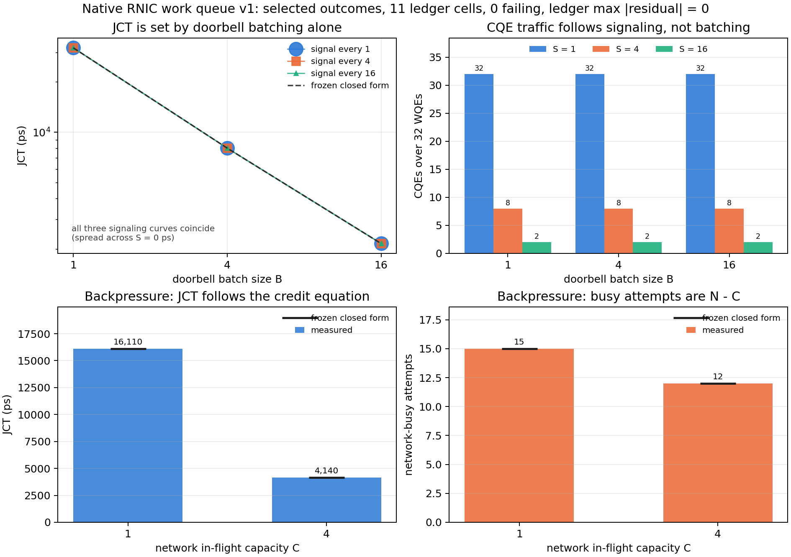

# RNIC WQ v1 results

All 11 post-specified regression cells pass exactly. The dependency-free
native unit harness also passes every directed SQ/CQ/network-port boundary
check. The expectations, implementation and results first entered public
history together in `98746ff`, so this study does not claim publicly auditable
preregistration.

## Method

The study builds the SimLLM-owned C++17 `simllm::rnic` library and its fake
network port, runs CTest, then executes the parameter grid frozen in
[expectations.md](expectations.md). The fake network is only a deterministic
credit and completion oracle. It does not claim to model wire packets or
htsim behavior.

Reproduce from the repository root:

```bash
python examples/rnic_wq_v1/run_rnic_wq_v1.py
```

Raw rows are in [results.csv](results.csv). Render the figure with:

```bash
uv run --extra plot python examples/rnic_wq_v1/plot_rnic_wq_v1.py
```



The four panels show JCT against doorbell batching with the three signaling
curves coincident, CQE traffic against signaling at each batch size, and the
two backpressure cells. The JCT and backpressure panels include their frozen
closed-form references. Doorbell and CQE counts remain fully tabulated in
[results.csv](results.csv). Both figure formats are under [plots/](plots/).

## Sweep A: doorbell batching and signaling

All nine `B x S` cells match their closed forms with zero residual.

| Doorbell batch B | Measured doorbells | Measured JCT (ps) | Expected JCT (ps) |
|---:|---:|---:|---:|
| 1 | 32 | 32010 | 32010 |
| 4 | 8 | 8040 | 8040 |
| 16 | 2 | 2160 | 2160 |

For every B, signaling intervals `{1, 4, 16}` produce exactly `{32, 8, 2}`
CQEs and leave JCT unchanged. This is the expected result because the study
polls at every event, CQ never overruns, and CQE-write latency is zero.
Doorbell count is exactly `32 / B`; JCT is exactly
`(32 / B) * 1000 + B * 10` ps.

The important separation is visible: batching changes hardware publication
work, while signaling changes completion traffic. The model does not use a
single per-WQE delay to stand in for both.

## Sweep B: network backpressure

Both credit cells match the fixed queueing equation exactly.

| Network capacity C | Measured busy attempts | Expected | Measured JCT (ps) | Expected (ps) |
|---:|---:|---:|---:|---:|
| 1 | 15 | 15 | 16110 | 16110 |
| 4 | 12 | 12 | 4140 | 4140 |

The exact form is `100 + C * 10 + (16 / C) * 1000` ps. A busy return stalls
the SQ head until the network advertises its next retry time. No later WQE
bypasses that head.

## Conservation and evidence

Every sweep row reports:

- posted WQEs = delivered WQEs = reclaimed WQEs;
- SQ high watermark equal to the offered WQE count;
- zero controlled error evidence;
- zero CQ overruns and no fatal state.

The native directed harness separately proves:

- accepted-prefix behavior when a three-WR chain reaches an SQ of depth two;
- all-unsignaled SQ exhaustion and later-signaled reclamation;
- ordered retirement under out-of-order network callbacks;
- deterministic network-busy retry without head bypass;
- an RX-boundary injected drop producing a controlled error CQE even when the
  WQE was unsignaled;
- CQ overrun identifying the first undeliverable CQE without overwriting the
  owned entry, then freezing later CQ publication and reclaim without
  exposing a schedulable event that can spin the event loop;
- CQ slot wrap with owner generation `{0, 0, 1, 1}`;
- a policy retry gate surviving an unrelated network completion;
- serialized CQE-write service, no skipped older CQE, and explicit host-first
  same-time polling;
- distinct network-acceptance/outcome timestamps without fabricated packet
  issue timestamps;
- controlled immediate rejection and rejection of contradictory or
  out-of-range drop evidence;
- rejection of unknown network tokens and timestamp overflow.

## What this closes and what remains

This validates the first structural mechanism of BACK-8/BACK-9: one finite SQ
and CQ bound to one QP, WR-chain accepted-prefix posting, doorbell batches,
absolute producer/reclaim sequencing, signaled and unsignaled completion,
controlled queue failures, and an engine-neutral network-side ABI. The ABI
preserves GOAL flow/tag identity and an opaque policy-context token while the
network retains its own completion token; no CC implementation owns WQ, CQ or
QP state.

BACK-8 remains open for the live `AtlahsFlowRuntime` wrapper and versioned run
records. BACK-9 remains open for RQ/SRQ, multiple SQs sharing CQs, mlx5 WQEBB
encoding, fences, inline/BlueFlame paths, CQE compression/moderation and
interrupt delivery. PCIe/QPC/packet/retry behavior remains BACK-10 through
BACK-12. No physical latency parameter has been fitted from these synthetic
runs.

## Post-specified status after the Tier B gate

The BACK-8 sentence above records the state when this standalone component
study ran. The later frozen Tier A and Tier B gates connected the ABI-v1
`AtlahsFlowRuntime` composition and carried native timing through the core
metric chain for the isolated `rnic_live_v1` fixture. BACK-8 and the
demonstrated CORE-15 live-seam clauses closed on that evidence. CORE-21 retains
the same-contended-graph bypass-versus-composed comparison, BACK-31 retains the
unlinked-native executable negative, and HTSIM-9 retains packet-issue evidence
under BACK-25 and BACK-26. This later status does not broaden the standalone
component claims in this report.
