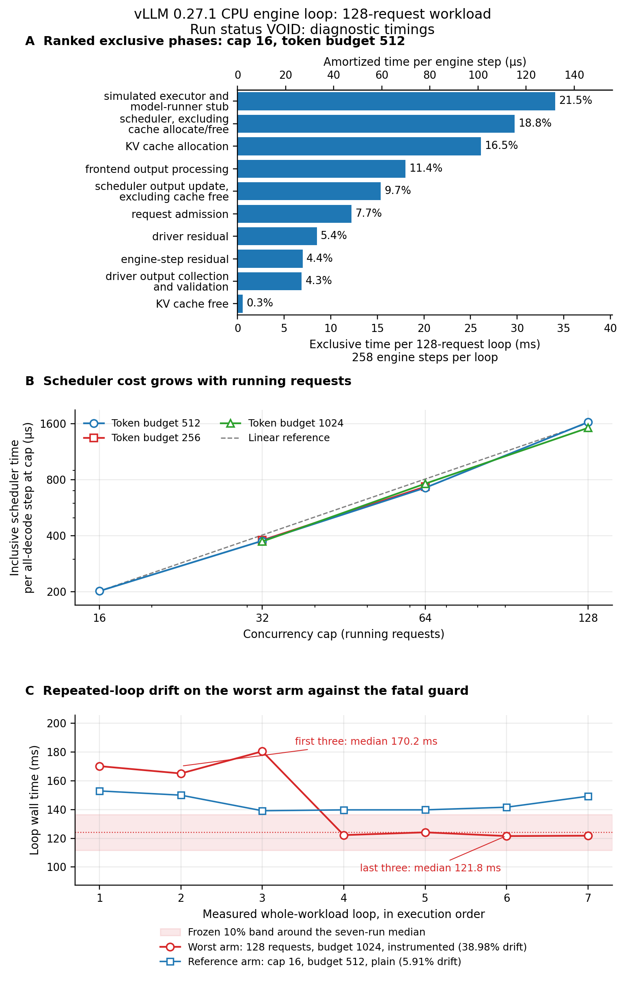

# Controlled vLLM step-loop cost attribution result

**VOID: repeated-run drift reaches 38.98%, above the unchanged 10% fatal
limit, despite the controlled-host protocol passing.** The guard could not
be met on this host under this protocol. No behavioral score is assigned.
The historical 139,552,358 ns describes a complete 128-request workload with
258 engine steps, not one scheduler step.

## What ran

Attempt `attempt-005-controlled` ran the unchanged conformance live driver
on vLLM distribution `0.27.1+cpu`, module `0.27.1`. The grid retained the
reference cap 16, budget 512, plus the nine cells at caps {32, 64, 128} by
token budgets {256, 512, 1024}. Each arm and cell used two discarded warmups
then seven measured complete loops, plain before instrumented. All 40
warmups, 140 measured loops and one separate reference cProfile pass finished.
No repetition was dropped, replaced or retried.

The exact original 128 requests, 64-token prompts, 32-token outputs, arrivals
and priorities remained fixed. Each workload emitted 4,096 tokens with the
frozen token identity. Construction, shutdown and file capture stayed outside
timing; admission, driver bookkeeping and output collection stayed inside.
The simulated executor and synthetic pricing stayed unchanged. Detokenization
was disabled and no device computation or allocation occurred.

The expectations-only controlled amendment is
[`controlled_expectations.md`](controlled_expectations.md), committed at
`becdddc65852b3b4d988238ad723f807f4f25af0` before implementation or measurement.
It retains the original freeze `3c7d2a090bfa12f747087c66e22612ebe4e4e8ca` and
CPU-distribution amendment `c7a0da5fad517135f0e40f500ad32db2b3b34c17`.
The measured runner commit is `8b7d71c30cc61871cf676ee4d5c645dcbe95b633`.
Scheduler, driver, configuration, model revision and workload hashes are in
[controlled_results.json](controlled_results.json).

### Host control and sanity bounds

Before the freeze, `taskset -p $$` reported mask `ff000000` and `nproc` reported
8. The measurement process retained CPUs 24 through 31 at both boundaries;
its saved `taskset -p` output reported the same mask and `nproc` again reported
8. The inventory command removes OpenMP count overrides only in its child
environment, because `nproc` otherwise honors that one-thread override.
OpenMP, MKL, OpenBLAS and NumExpr each used one thread, as did PyTorch intra-op
and inter-op execution. No local suite, plot or other study ran during timing.

The host was an AMD Ryzen 9 3950X with 32 logical CPUs, Python 3.10.18 and a
monotonic host clock with nominal 1 ns resolution. One-, five- and
fifteen-minute load averages were 10.37, 10.68 and 10.78 before timing and
13.04, 11.47 and 11.03 after the profile. The orchestrator assigned other wave
workers different cores; other users' background jobs remained unpinned.
Affinity does not control shared resources, frequency or preemption. The
snapshots verify boundary state, not exclusive CPU ownership throughout.

Floor, frozen before timing: a scheduler visiting N running requests needs at
least N Python attribute accesses. Seven independent million-access batches
gave a minimum of 27.595 ns per access, an operational floor of 441.516 ns at
N=16. Python loop overhead makes this a sanity reference, not a universal
hardware lower bound. Observed scheduler costs appear below, after this floor.

Ceiling, frozen before timing: each nonnegative exclusive phase is bounded by
its enclosing interval, and a per-request or per-block quotient by that
interval divided by the actual count. No finite whole-loop host ceiling
exists under arbitrary preemption. Nonoverlapping profile self times fit the
profiled interval; nested cumulative times cannot be added. Token conservation
bounds the reference between 256 and 12,160 nonempty steps with positive
progress; its 258 steps fit. The final contexts require at most 768 blocks,
below the unchanged 2,048-block capacity.

### Retained evidence and reproduction

The fresh bulk directory is `SIMLLM_DATA_ROOT/attempt-005-controlled`; its log
is `SIMLLM_DATA_ROOT/attempt-005-controlled.log`. The compact controlled
publication contains checksums for its raw result and profile and links the
unchanged [attempt-004 record](results.json) by both raw and LF-normalized
SHA-256. The [earlier PNG](figures/phase_cost.png) and
[PDF](figures/phase_cost.pdf) remain byte-identical. No prior attempt was
modified. Attempts 001 through 003 remain preflight or harness failures;
attempt 004 remains void at 29.53% drift. The orchestrator's reported 30.89%
independent reproduction is context, not a measurement produced by this run.

Configure the supplied interpreter, pinned local model and external bulk root
in the gitignored local environment file. A fresh independent attempt uses:

```bash
. ./.env.local.sh
.venv/bin/python examples/vllm_step_loop_cost_v1/run_study.py run \
  --attempt attempt-fresh --no-concurrent-local-suite
.venv/bin/python examples/vllm_step_loop_cost_v1/run_study.py publish \
  --attempt-dir "$SIMLLM_DATA_ROOT/attempt-fresh" --output results-fresh.json
.venv/bin/python examples/vllm_step_loop_cost_v1/run_study.py plot \
  --results results-fresh.json --output figures-fresh
```

The run exits 2 after a completed void attempt; publication is a separate
command and refuses to overwrite an existing result. The supplied environment
was not modified, no assets were fetched and bulk evidence stayed outside Git.

## What came out

### Fatal drift and attribution allowance

Host control and every other evaluated fatal guard held: source and model
pins, resolved settings, admission identity, completion, correct tokens,
byte-identical records and outputs between arms, absent device work and
exclusive accounting. Four arm-level drift violations make the entire
attempt void. These are fatal guards, not a behavioral pass fraction.

| Cell | Arm | Frozen median-deviation statistic % |
|---|---|---:|
| 64 requests, budget 1024 | Plain | 31.732 |
| 64 requests, budget 1024 | Instrumented | 24.911 |
| 128 requests, budget 512 | Instrumented | 31.611 |
| 128 requests, budget 1024 | Instrumented | 38.976 |

The worst arm's first-three median was 170.206 ms, its last-three median
121.813 ms and its seven-run median 124.161 ms. Their separation, divided by
the seven-run median, was 38.98%. The reference itself was stable at 5.91%
plain and 1.30% instrumented, but its medians were 141.636 and 158.403 ms,
respectively, an 11.84% difference. All ten cells exceeded the separate 5%
absolute-attribution allowance, with differences from 6.72% to 23.09%.
Arm drift can contribute to these differences; they do not isolate timer cost.

### Ranked reference phases

The phase medians sum to 158.454189 ms, 0.051223 ms above the measured
instrumented median of 158.402966 ms, a 0.032337% residual. The largest
individual instrumented-loop reconstruction error is 0.005191%, within the
5% structural allowance. Sum-of-medians and per-loop residuals are distinct
quantities. These accounting identities do not rescue the failed timing
calibration or certify a partition of the historical 139.552 ms.

Rows are medians of seven exclusive complete-loop totals. The per-step
column divides each by 258, an amortized average including driver work,
not the median duration of an individual engine step. Shares divide by the
sum of phase medians. Nested cache work is removed from scheduler and
output-update totals. The phase ranking matches the retained void attempt.

| Rank | Phase | Median loop ms | Amortized microseconds per step | Share % |
|---|---|---:|---:|---:|
| 1 | Simulated executor and model-runner stub | 34.092 | 132.140 | 21.52 |
| 2 | Scheduler, excluding cache allocation/free | 29.723 | 115.204 | 18.76 |
| 3 | KV cache allocation | 26.101 | 101.168 | 16.47 |
| 4 | Frontend output processing | 18.024 | 69.862 | 11.38 |
| 5 | Scheduler output update, excluding free | 15.371 | 59.578 | 9.70 |
| 6 | Request admission | 12.237 | 47.429 | 7.72 |
| 7 | Driver residual | 8.508 | 32.978 | 5.37 |
| 8 | Engine-step residual | 6.985 | 27.073 | 4.41 |
| 9 | Driver output collection and validation | 6.872 | 26.636 | 4.34 |
| 10 | KV cache free | 0.540 | 2.095 | 0.34 |



The [PDF](figures/controlled/phase_cost.pdf) contains the same plain Matplotlib
figure. Panel A projects the table above; its upper axis divides loop cost by
258. Panel B plots median inclusive scheduler time at actual all-decode caps
on logarithmic axes. Its proportional reference is anchored at cap 16,
budget 512. Budget 256 stops at 64 because no all-decode step reaches 128.
The figure is diagnostic throughout, including cells with intact drift guards. Panel C shows the seven measured whole-workload loops of the arm with the largest frozen drift statistic (128 requests, budget 1024, instrumented: the first three loops sit near 170 ms and the last four near 122 ms, a 38.98 percent separation against the 10 percent band drawn around the seven-run median) next to the reference plain arm at 5.91 percent, so the reason for the void status is visible: a level shift between consecutive loops, not a trend or a single spike.

### Per-request scheduler and per-block KV costs

Against the pre-stated 27.595 ns attribute-access reference, the observed
all-decode scheduler median at N=16 is 202,053 ns per pass, or 12,628.3 ns per
running request, 457.6 times the operational floor. This inclusive timer
contains cache work. The weighted mean over all scheduled request visits is
13,656.9 ns per visit; it also includes prefill and partial batches.

| Cap | Token budget | Steps | Plain median ms | Instrumented median ms | Scheduler at cap, microseconds | Scheduler ns per running request |
|---|---|---:|---:|---:|---:|---:|
| 16 | 512 | 258 | 141.636 | 158.403 | 202.053 | 12628.3 |
| 32 | 256 | 137 | 121.323 | 139.831 | 379.123 | 11847.6 |
| 32 | 512 | 132 | 118.183 | 145.473 | 376.333 | 11760.4 |
| 32 | 1024 | 130 | 125.094 | 142.640 | 373.108 | 11659.6 |
| 64 | 256 | 84 | 123.408 | 131.707 | 735.022 | 11484.7 |
| 64 | 512 | 72 | 109.909 | 126.574 | 725.282 | 11332.5 |
| 64 | 1024 | 68 | 129.106 | 156.214 | 763.180 | 11924.7 |
| 128 | 256 | 74 | 136.619 | 165.153 | unavailable | unavailable |
| 128 | 512 | 50 | 110.214 | 135.309 | 1634.008 | 12765.7 |
| 128 | 1024 | 40 | 107.210 | 124.161 | 1522.711 | 11896.2 |

Available R1 scheduler observations grow 1.927x to 2.253x per request-count
doubling, within the frozen (1, 3] band. The 64-to-128 comparison at budget
256 is unevaluated. Available per-request costs remain roughly level while
pass cost grows. These are observations without a behavioral score.

Reference KV groups below pool call observations across the seven measured
instrumented loops. Blocks count actual allocations or frees, not capacity.
A per-block entry divides that group's median call cost by its fixed block
count; zero-new-block calls have no such quotient.

| Operation | Blocks per call | Calls | Median ns per call | Median ns per block |
|---|---:|---:|---:|---:|
| Allocate | 0 | 26005 | 5629 | unavailable |
| Allocate | 1 | 1792 | 7820 | 7820 |
| Allocate | 4 | 896 | 13070 | 3267.5 |
| Free | 6 | 896 | 3720 | 620 |

Allocation call cost increases 1.671x from one to four blocks, within the
frozen (1, 8] band, while cost per block decreases as fixed work is amortized.
The other frozen allocation comparisons also lie inside their bands.
Every free call releases six blocks, so free-cost scaling is unidentifiable.
KV work here manages metadata, not tensor copies. Disabled detokenization
is an inactive path, not evidence of fast text decoding.

### Dominant function and the 139 ms interpretation

`Scheduler.schedule` is the dominant function by profile self time. The single
profile reports 349.002 ms cumulative in `_drive_live`; profiling changes
runtime, so these observations are separate from phase timers. Cumulative
entries nest and must not be summed.

| Function | Calls | Self ms | Cumulative ms |
|---|---:|---:|---:|
| `Scheduler.schedule` | 258 | 22.166 | 117.109 |
| `Scheduler.update_from_output` | 258 | 20.310 | 45.776 |
| `KVCacheManager.allocate_slots` | 4099 | 13.431 | 60.645 |
| Conformance driver `_observe_outputs` | 258 | 11.474 | 20.569 |
| `get_num_blocks_to_allocate` | 4227 | 9.701 | 18.736 |

The historical 139 ms is mixed workload cost: `Scheduler.schedule` performs
real scheduling while `_observe_outputs` adds conformance-driver inefficiency,
so it cannot be called inherent scheduler cost.

The unchanged driver checks each cumulative token prefix at every output,
revisiting `128 * (1 + ... + 32) = 67,584` token IDs to retain 4,096 final tokens.
The profile's 71,680 generator calls match those visits plus one terminal
call for each of the 4,096 iterations. This source-backed inefficiency is in
the conformance driver, not vLLM detokenization. Removing it would change the
historical timed workload and requires separate validation; no removable
fraction or optimization speedup is certified here.

## What it changes for the project

VLLM-51 remains open with a narrower, measured remainder: repeated medians
must meet the 10% fatal guard on a suitable host, and instrumented versus
plain loop cost must meet the 5% allowance. This eight-core, single-thread,
no-local-suite protocol still produced 38.98% drift. Absolute attribution
also remains unresolved at 6.72% to 23.09% arm differences. The retained
phase ranking, per-request and per-block diagnostics and dominant function
need not be rediscovered, but fresh evidence must validate their absolute
costs while retaining the frozen workload and all identity guards. No new
stable task ID is registered.

## What it does not change

DEPLOY-21, the surrogate's frozen speedup requirement and its certification
verdict are unchanged. No production function, output token, step record,
simulated timestamp, pricing rule or default changed. The study does not
establish metric-live GPU service, time to first token, time per output token,
or an optimization's speedup. Matching phase rankings across void attempts
cannot establish unavoidable scheduling cost, and this failed protocol does
not prove that every possible host-control method must fail.
