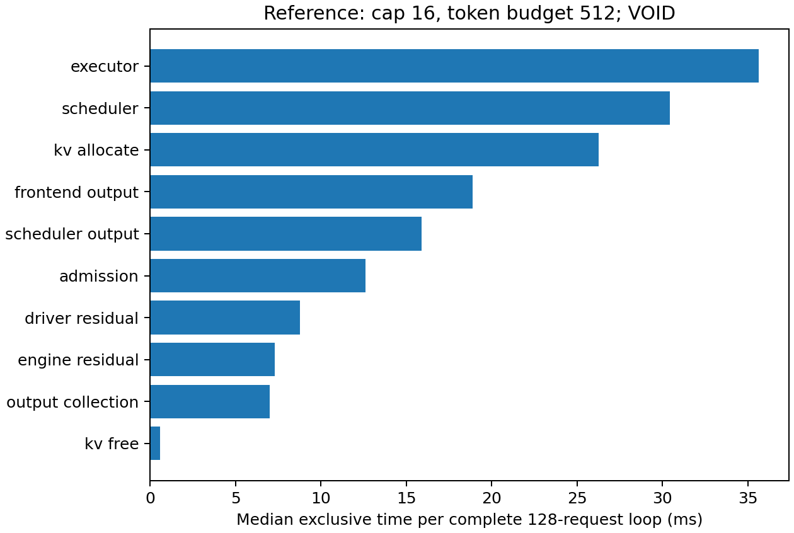

# vLLM step-loop cost attribution result

**VOID: repeated-run drift reaches 29.53%, above the frozen 10% fatal limit.**
The historical 139,552,358 ns is a complete 128-request workload, containing
258 engine steps, rather than the cost of one scheduler step.

## What ran

The unchanged conformance live driver ran on the supplied CPU build of
vLLM 0.27.1 over the reference configuration and nine concurrency-cap by
scheduled-token-budget cells, with two warmups and seven repetitions per
plain and instrumented arm, followed by one reference cProfile pass.

## What came out

Attempt `attempt-004` is void, with no behavioral score. The largest stability
deviation is 29.53%. All other evaluated fatal guards hold: source and model
pins, resolved settings, admission identity, 4,096 correctly identified output
tokens per workload, byte-identical step records and token outputs between
arms, completion, no device work, and exclusive phase accounting.

The plain reference median is 147.537 ms over 258 steps. The instrumented
median is 163.385 ms, 10.74% higher. This exceeds the separate 5% attribution
allowance even though this reference's own stability guard holds. The
instrumented phases below are diagnostic measurements, not a calibrated
partition of the historical 139.552 ms. Host drift can contribute to the arm
difference, so it is not an isolated measurement of timer overhead.

## What it changes for the project

DEPLOY-21 stays open. Its live comparison unit is now explicit: a complete
workload, with admission and output validation inside the timing boundary.
The retained profile identifies scheduler and cache-management work, simulated
worker work and driver validation separately. The next attribution attempt
needs controlled host timing and a demonstrated instrumentation cost within
5%. The orchestrator owns registration of that residual; no new task ID is
registered here. No milestone or projected precision claim becomes literal.

## What it does not change

The surrogate's frozen speedup requirement and previous certification verdict
remain unchanged. No production function, decision, simulated timestamp,
output token or default was modified. These CPU measurements do not establish
GPU service, time to first token, time per output token, or an optimization's
speedup. They do not prove the observed scheduler cost unavoidable.

## Ranked reference phases

Rows are medians of seven exclusive complete-loop totals. The per-step column
is each loop total divided by 258, an amortized average that includes driver
work; it is not the median duration of an individual step. Percentages use
the sum of the phase medians, 163.353 ms. Their difference from the enclosing
163.385 ms median is 0.020%. Nested cache work is removed from the scheduler
and output-update rows before addition.

| Rank | Phase | Median loop ms | Amortized microseconds per step | Share % |
|---|---|---:|---:|---:|
| 1 | Simulated executor and model-runner stub | 35.643 | 138.151 | 21.82 |
| 2 | Scheduler, excluding cache allocation/free | 30.422 | 117.916 | 18.62 |
| 3 | KV cache allocation | 26.261 | 101.786 | 16.08 |
| 4 | Frontend output processing | 18.878 | 73.171 | 11.56 |
| 5 | Scheduler output update, excluding free | 15.889 | 61.585 | 9.73 |
| 6 | Request admission | 12.604 | 48.851 | 7.72 |
| 7 | Driver residual | 8.769 | 33.990 | 5.37 |
| 8 | Engine-step residual | 7.293 | 28.268 | 4.46 |
| 9 | Driver output collection and validation | 6.991 | 27.097 | 4.28 |
| 10 | KV cache free | 0.603 | 2.336 | 0.37 |

Key/value (KV) cache allocation manages token-storage metadata here; it does
not copy model tensors. Detokenization is disabled by the unchanged driver's
`SamplingParams(detokenize=False)`. Its absent work is an inactive-path fact,
not a scored performance result.



The first plain matplotlib figure is also available as
[PDF](figures/phase_cost.pdf). Axis labels, units and clipping were inspected;
the orchestrator's figure pass remains separate.

## Function-level finding

The 139 ms is not an inherent single-step scheduler cost: `Scheduler.schedule`
is a real hot function, while `_observe_outputs` adds repeated cumulative-token
validation in the driver; the complete-loop number combines those costs with
the simulated worker and output pipeline, and no removable fraction is certified.

The single profile totals 358.876 ms for `_drive_live`. Profiling changes
runtime, so its values are kept separate from monotonic-timer measurements.
Cumulative entries nest and must not be summed.

| Function | Calls | Self ms | Cumulative ms |
|---|---:|---:|---:|
| `vllm/v1/core/sched/scheduler.py:439`, `schedule` | 258 | 22.599 | 118.774 |
| `vllm/v1/core/sched/scheduler.py:1670`, `update_from_output` | 258 | 20.499 | 46.740 |
| `vllm/v1/core/kv_cache_manager.py:344`, `allocate_slots` | 4,099 | 13.723 | 61.282 |
| Conformance driver `_observe_outputs` | 258 | 11.592 | 20.601 |
| `simllm/adapters/vllm/executor.py:577`, `translate` | 258 | 10.430 | 18.980 |

A post-specified source audit explains one concrete driver inefficiency:
`_observe_outputs` converts and checks each cumulative token prefix on every
output. With 128 requests and 32 tokens, this revisits
`128 * (1 + ... + 32) = 67,584` token IDs to retain 4,096 final tokens. The
profile's 71,680 generator calls equal those visits plus one terminal call for
each of 4,096 generator iterations. This is intentional conformance checking
inside the historical timed region, not evidence of a vLLM detokenization
problem. Removing it would change that region's work and would require its
own validation; it cannot be silently subtracted from DEPLOY-21's baseline.

## Physical sanity and swept relations

Floor, specified before timing: visiting N requests requires at least N Python
attribute accesses. The separate benchmark's minimum is 27.816 ns per access,
so the operational floor at N=16 is 445.052 ns. Loop overhead makes this a
sanity reference rather than a universal hardware bound.

Ceiling, specified before timing: each exclusive phase lies within its
parent interval; an arbitrary operating-system pause prevents a finite
first-principles ceiling on the whole host loop.

The observed inclusive scheduler median on all-decode reference steps is
203,623.5 ns, or 12,726.5 ns per running request, 457.5 times the operational
floor. Across all scheduled request visits, its weighted cost is 13,786.7 ns
per visit. These differ because the latter includes prefill and partial
batches. The largest per-loop reconstruction error across the sweep is
0.005123%, within the structural 5% allowance. This accounting identity is
unscored and does not validate the absolute phase costs.

The historical loop average is `139,552,358 / 258 = 540,900.6` ns per step;
this includes admission and driver work. A separate token-conservation check
bounds the reference's step count below by `4096 / 16 = 256`. With positive
progress and sufficient cache capacity, scheduling its 12,160 prompt and
continuation tokens one at a time gives a loose ceiling of 12,160 nonempty
steps. Its 258 steps fit those bounds. These step-count checks are
post-specified source arithmetic, not newly scored frozen expectations.

| Concurrency cap | Token budget | Steps | Plain median ms | Instrumented median ms | All-decode scheduler at cap, microseconds |
|---|---:|---:|---:|---:|---:|
| 16, reference | 512 | 258 | 147.537 | 163.385 | 203.624 |
| 32 | 256 | 137 | 141.619 | 147.082 | 379.798 |
| 32 | 512 | 132 | 129.402 | 145.967 | 377.948 |
| 32 | 1,024 | 130 | 124.676 | 141.348 | 371.313 |
| 64 | 256 | 84 | 124.976 | 134.239 | 737.361 |
| 64 | 512 | 72 | 116.972 | 161.432 | 844.233 |
| 64 | 1,024 | 68 | 162.271 | 126.175 | 701.433 |
| 128 | 256 | 74 | 113.313 | 156.539 | unavailable |
| 128 | 512 | 50 | 134.618 | 154.642 | 1,607.398 |
| 128 | 1,024 | 40 | 109.610 | 125.314 | 1,425.894 |

R1 expected increasing scheduler time and a ratio in (1, 3] per doubling of
running requests. Available observations range from 1.889 to 2.234. The
128-cap, 256-budget cell never supplies an all-decode sample at its cap; its
64-to-128 comparison remains unevaluated. No behavioral score is assigned.

R2 expected increasing allocation/free call cost when nonzero block counts
increase at least twofold, bounded above by twice the block-count ratio. In
the reference, one-block allocation has a 7,939.5 ns median and four-block
allocation 13,049.0 ns, a 1.644 ratio within the frozen (1, 8] band. Allocation
observations satisfy their bounds, but are unscored because the run is void.
Every free call releases six blocks, so free-cost growth is unidentifiable.
The 2,048-block pool exceeds the 768 blocks needed for all 128 final contexts.

The fatal stability findings are listed individually, not converted into a
pass fraction. Other cells' intact guards cannot rescue these violations.

| Cell | Arm | Frozen median-deviation statistic % |
|---|---|---:|
| 32 requests, budget 256 | Plain | 12.005 |
| 64 requests, budget 256 | Instrumented | 10.778 |
| 64 requests, budget 512 | Plain | 19.015 |
| 64 requests, budget 512 | Instrumented | 23.464 |
| 128 requests, budget 512 | Instrumented | 11.346 |
| 128 requests, budget 1,024 | Plain | 29.535 |

## Provenance, chronology and reproduction

The final pre-run expectations-only amendment is
`c7a0da5fad517135f0e40f500ad32db2b3b34c17`; the original expectations-only commit
is `3c7d2a090bfa12f747087c66e22612ebe4e4e8ca`. The measured runner commit is
`23ffa15`. Both frozen source files remain unchanged. Distribution
`0.27.1+cpu`, module `0.27.1`, scheduler and model hashes are recorded in
[results.json](results.json). The host is an AMD Ryzen 9 3950X with 32 logical
processors, affinity 0 through 31, Python 3.10.18 and a monotonic host clock
with nominal 1 ns resolution. Affinity does not imply exclusive CPU access.

All 40 warmups, 140 measured complete loops and the single function profile
remain under `SIMLLM_DATA_ROOT/attempt-004`. The raw profile and raw result
have checksums in the published record. No run data or model cache enters Git.
Earlier retained attempts are: `attempt-001`, stopped before measurement by
the CPU distribution suffix; `attempt-002`, void after an observer-signature
error; and `attempt-003`, void after the harness incorrectly required an
absent device attribute rather than the source's explicit `None`. The fixes
precede fresh attempts; no speed-based retry or stability threshold change
was made. Only the last attempt completed the sweep and profile.

The publication fixes a profile-name projection that shortened project
adapter paths to `vllm/worker.py`. It re-reads the same saved cProfile file and
preserves `simllm/adapters/vllm/worker.py`; no timing, call count, sweep row or
verdict changes, and no second profile run occurs.

Configure the supplied interpreter, pinned local model snapshot and external
bulk directory through the gitignored local environment file. A complete
independent reproduction uses:

```bash
source .env.local.sh
.venv/bin/python examples/vllm_step_loop_cost_v1/run_study.py run --attempt attempt-new
.venv/bin/python examples/vllm_step_loop_cost_v1/run_study.py publish \
  --attempt-dir "$SIMLLM_DATA_ROOT/attempt-new" --output results-new.json
.venv/bin/python examples/vllm_step_loop_cost_v1/run_study.py plot \
  --results results-new.json --output figures-new
```

The runner exits 2 on a completed void run and retains its results. Publication
is append-only. No supported baseline or acceptance clause is relaxed.
